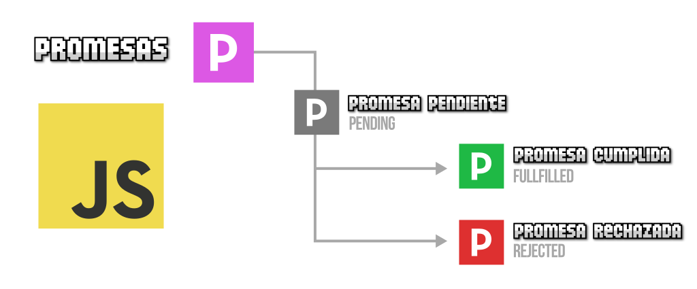

<!-- _class: cover -->
<style scoped>
section {
  --cover: url(../assets/img_00030_.png);
}
</style>
#  Javascript (Asincronía)
## Contenidos
- Promesas
- Async / Await
- Promesa en grupo
- Peticiones y APIs


> Inspirado en el bootcamp de <br><strong>Manz.dev</strong> todos los créditos a el.

---

## ¿Que son las promesas?


<split-slide>
<div>

- Concepto existente en la vida real → [Promesas](https://lenguajejs.com/asincronia/promesas/que-son/)
- 3 estados de una promesa
  - Pendiente
  - **Cumplida** (fullfilled)
  - **Rechazada** (rejected)
- Ejemplos donde son útiles promesas:
  - Descargar un fichero
  - Reproducir un mp3 remoto
  - Acceder a API de sintetizador de voz
  - Realizar un proceso costoso que tardará
</div>
<div>

  
</div>
</split-slide>

---

## Thennables

- ¿Como consumir promesas en Javascript?

<steps>
<step>

```js
// Función asíncrona devuelve siempre una promesa
const promise = fetch("/robots.txt");

// Esa promesa se activa cuando se cumple con un .then()
promise.then((data) => {
  console.log(data);
});

// Esa promesa se activa cuando se rechaza con un .catch()
promise.catch((data) => {
  console.log(data);
});
```
</step>
<step>

```js
// Para simplificar, esto se suele unir y escribir todo junto, sin guardar en una variable...
fetch("/robots.txt")
  .then((data) => {
    /* Cuando se cumple la promesa */
  }).catch((data) => {
    /* Cuando se rechaza la promesa */
  });

// NO BLOQUEANTE: Si la promesa está pendiente, se continúa con el resto del código
```
</step>
<step>

```js
// En algunos casos podemos necesitar ejecutar lógica tanto si se cumple como si se rechaza
fetch("/robots.txt")
  .then((data) => { /* ... */ })
  .catch((data) => { /* ... */ })
  .finally(() => {
    /* Se ejecuta cuando se sale de estado "pendiente" y termina el then() o catch() */
  });

// Si la promesa está pendiente, se continúa con el resto del código
```
</step>
<step>

```js
// Algunas funciones (como fetch) pueden requerir tratar varias promesas encadenadas...
fetch("/robots.txt")
  .then((data) => funcion_async())         // funcion_async devuelve otra promesa
  .then((data) => { /* ... */ })           // Se procesa la promesa anterior

```
</step>
</steps>

---
## Crear nuestras propias promesas
- Para usuarios avanzados

<steps>
<step>

```js
// Ahora mismo es una función síncrona
const doTask = () => {
  const data = 42;    // Lógica de mi función
  /* ← Necesitamos hacer una operación asíncrona */
  return data;
}

// Ejecución de la función
doTask();
```
</step>
<step>


```js
// Ahora es una función asíncrona (devuelve una promesa)
const doTask = () => {
  /* ↓ Vamos a convertirla en asíncrona */
  const promise = new Promise( (resolve, reject) => {
    const data = 42;  /* La lógica de mi programa */
    /* Lógica de la promesa (ver siguiente paso) */
  } );
  return promise;  // Devolvemos la promesa
}

// Ejecución de la función
doTask().then((data) => {
  // data es lo que devuelve la lógica de la función asíncrona
});
```

</step>
<step>

```js
const doTask = () => {
  const promise = new Promise( (resolve, reject) => {
    const data = 42;  /* La lógica de mi programa */
    // Estas ejecuciones se establecen donde se necesite de nuestra lógica:
    resolve(42);  // La promesa se cumple y devuelve 42
    reject(0);    // La promesa se rechaza y devuelve 0
  } );
  return promise;  // Devolvemos la promesa
}

// Ejecución de la función
doTask().then((data) => {
  // data es lo que devuelve la lógica de la función asíncrona
});
```
</step>
<step>

```js
// Simplificamos para hacerlo más breve:
const doTask = () => {
  return new Promise( (resolve, reject) => {
    const data = Math.ceil(Math.random() * 6);

    if (data == 6) resolve(42);   // Cumplimos si sale 6
    reject(0);                    // Rechazamos otro caso
  } );
}

// Ejecución de la función
doTask().then((data) => {
  // data es lo que devuelve la lógica de la función asíncrona
});
```
</step>
<step>

```js
// Podemos usar la nueva api Promise.withResolvers() para simplificar aún más
const doTask = () => {
  const { promise, resolve, reject } = Promise.withResolvers();
  const data = Math.ceil(Math.random() * 6);

  if (data == 6) resolve(42);   // Cumplimos si sale 6
  reject(0);                    // Rechazamos otro caso
  return promise;
}

// Ejecución de la función
doTask().then((data) => {
  // data es lo que devuelve la lógica de la función asíncrona
});
```
</step>
</steps>

---
<!-- _class: cover -->
<style scoped>
section {
  --cover: url(../assets/img_00031_.png);
}
</style>

# Async / Await


---

## Async/Await
- ✅ La sintaxis del código con async/await es más natural y menos confusa
- ✅ El await es fácil de entender: «pausa» las funciones hasta salir de «pendiente»
- ❌ Ergo, a diferencia de .then(), son bloqueantes (para el ámbito actual)

<steps>
<step>

```js
// Utilizando thennables
doTask().then((data) => {
  // Lógica usando data
});

// Utilizando async/await
const data = await doTask();
// Lógica usando data
```
</step>
<step>

```js
// A la hora de crear funciones
const doTask = async () => {
  const data = Math.ceil(Math.random() * 6);
  if (data == 6) return 42;   // Cumplimos si sale 6
  throw 0;                    // Rechazamos otro caso
}

try {
  const data = await doTask(); // Se cumple la promesa...
} catch (error) { /* Se rechazó la promesa... */ }
```
</step>
<step>

```js
// ✅ await funciona si está en el ámbito global (top await, en módulos ESM)
// ✅ await funciona si el await está envuelto en una función async
const doTask = () => {
  const data = await fetch("/robots.txt");    // ❌ No funcionará
}

const doTask = async () => {
  const data = await fetch("/robots.txt");    // ✅ Funciona
}
```
</step>
<step>

```js
// Híbrido combinado (Recuerda: fetch necesita resolver dos promesas)
const response = await fetch("/robots.txt");
const data = await response.text();

// Esto es lo mismo que:
const data = await fetch("/robots.txt").then(response => response.text());
```
</step>
</steps>

---
<!-- _class: cover -->
<style scoped>
section {
  --cover: url(../assets/img_00032_.png);
}
</style>
# Promesas en grupo


---

## Promesa de control
- Los ``.map()`` (y otras funciones) no esperan los ``await``
- Alternativas: Usar ``for`` con ``await``, ``for of`` o promesas en grupo

<steps>
<step>

```js
const task1 = fetch("/robots.txt");    // Devuelve una promesa
const task2 = fetch("/index.css");     // Devuelve una promesa
const task3 = fetch("/index.js");      // Devuelve una promesa

const tasks = [task1, task2, task3];  // Array de promesas

// Código teóricamente correcto...
const responses = tasks.map(async (promise) => {
  return await promise;
});
// responses = [Promise, Promise, Promise]    // ❌ pero no funciona
```
</step>
<step>

```js
const task1 = fetch("/robots.txt");    // Devuelve una promesa
const task2 = fetch("/index.css");     // Devuelve una promesa
const task3 = fetch("/index.js");      // Devuelve una promesa

const tasks = [task1, task2, task3];  // Array de promesas

// ✅ Alternativa 1: Bucle for + await
const responses = [];
for (let i = 0; i < tasks.length; i++) {
  responses[i] = await tasks[i];
}
```
</step>
<step>

```js
const task1 = fetch("/robots.txt");    // Devuelve una promesa
const task2 = fetch("/index.css");     // Devuelve una promesa
const task3 = fetch("/index.js");      // Devuelve una promesa

const tasks = [task1, task2, task3];  // Array de promesas

// ✅ Alternativa 2: Bucle for..of
const responses = [];
for (const promise of tasks) {
  responses.push(await promise);
}
```
</step>
<step>

```js
const task1 = fetch("/robots.txt");    // Devuelve una promesa
const task2 = fetch("/index.css");     // Devuelve una promesa
const task3 = fetch("/index.js");      // Devuelve una promesa

const tasks = [task1, task2, task3];  // Array de promesas

// ✅ La mejor alternativa: promesas en grupo
const responses = await Promise.all(tasks);
```
</step>
</steps>

---

## Promesas en grupo
- ``.all()`` (todas cumplidas) / ``.allSettled()`` (todas: cumplidas o no) → <a href="../assets/promise.png" target="_blank">Métodos de promesas en grupo</a>
- ``.any()`` (la primera que se cumpla)
- ``.race()`` (la primera, cumplida o no)

```js
const responses = await Promise.all(tasks);       // [Response, Response, Response]
const results = await Promise.allSettled(tasks);  // [{ status, value, reason }, ...]
const response = await Promise.any(tasks);        // Response (o promesa rechazada si fallan todas)
const response = await Promise.race([task1, task2, task3]); // Promise (cumplida o rechazada)

// Devuelve directamente una promesa cumplida/rechazada
Promise.resolve(value);
Promise.reject(value);
```


---
<!-- _class: cover -->
<style scoped>
section {
  --cover: url(../assets/img_00033_peticiones.png);
}
</style>
# Peticiones HTTP


---

## Fetch
- Prioriza el uso de ``fetch``: Nativo, de la plataforma
- Alternativas
  - ``XHR`` (antiguo, anterior a 2015)
  - ``axios`` (librería externa)
  - ``superagent`` (librería externa)
  - ``ofetch`` (librería externa)
- Operación asíncrona


---

## Trabajo con URLs
- En general se usan simples ``String`` → <a href="../assets/url-parts.png" target="_blank">Partes (I)</a> → <a href="../assets/url-parts-optionals.png" target="_blank">Partes (II)</a> → <a href="../assets/query-strings.png" target="_blank">Partes (III)</a>
- Si quieres acceder a partes concretas, usa ``new URL()`` o ``new URLSearchParams()``
- Para comprobar coincidencias con una o varias URL, usa ``new URLPattern()``

<steps>
<step>

```js
const url = new URL("https://avotz.com/no/?tech=react&debug=yes");

url.pathname;                                 // '/no/'
url.searchParams.get("tech");                 // 'react'
url.search;                                   // '?tech=CSS&debug=yes'

const sp = new URLSearchParams(url.search);
sp.get("debug");                              // 'yes'
```
</step>
<step>

```js
const url = new URLPattern({
  hostname: "app.avotz.com",
  pathname: "/:path/"
});

url.test("https://avotz.com/no/")              // ❌ false
url.test("https://app.avotz.com/no/")          // ✅ true
url.test("https://lenguajejs.com/no/")         // ❌ false
```
</step>
</steps>

---

## Uso de fetch
- Documentación: [API de JSdelivr](https://cdnjs.com/api)
- Mejoras: Controlar errores de red/conexión, de servidor, de timeout

<steps>
<step>

```js
const response = await fetch("https://api.cdnjs.com/libraries/snarkdown");
const data = await response.json();

data.name           // Nombre de la librería
data.version        // Versión de la librería
data.description    // Descripción de la librería
data.latest         // Enlace al .js de la última versión
data.authors        // Array de autores { name, email }
data.keywords       // Array de tags
data.license        // Licencia de la librería
```
</step>
<step>


```js
// Gestionar los errores con un try/catch y sacar la URL
const URL = "https://api.cdnjs.com/libraries/snarkdown";

try {
  const response = await fetch(URL);
  const data = await response.json();
} catch (error) {
  console.error("Error al obtener los datos: ", error);
}
```
</step>
<step>

```js
const URL = "https://api.cdnjs.com/libraries/snarkdown";
try {
  const response = await fetch(URL);
  if (!response.ok)
    throw new Error(`HTTP Error: ${response.status}`);  // Server error: lo envía al catch
  const data = await response.json();
} catch (error) {
  console.error("Error al obtener los datos: ", error);
}
```
</step>
<step>

```js
const doRequest = async (URL, TIMEOUT = 5000) => {
  const controller = new AbortController();
  const timeoutId = setTimeout(() => controller.abort(), TIMEOUT);
  try {
    const response = await fetch(URL, { signal: controller.signal });
    if (!response.ok) throw new Error(`HTTP Error: ${response.status}`);
    return await response.json();
  }
  catch (error) { /* ... */ }
  finally { clearTimeout(timeoutId); }
}
```
</step>
</steps>

---

## Partes de la comunicación
- Petición → ``Request``
- Cabeceras → ``Headers``
- Respuesta → ``Response``


---
## Petición: Request

- <a href="../assets/request-response.png">Request / Response</a>
- Puede ser ``String`` o puede ser un objeto ``Request``

<split-slide>

```js
// Opción 1: String/Request al fetch
const request = new Request(URL);
const response = await fetch(request);

// Opción 2: Opciones al fetch (o al Request)
const opts = {
  method: /* ... */,
  headers: /* ... */,
}
const request = new Request(URL); /* o aquí */
const response = await fetch(request, opts);
```
<div>
<table>
<thead>
<tr>
<th>Propiedad</th>
<th>Descripción</th>
</tr>
</thead>
<tbody>
<tr>
<td><code>body</code></td>
<td>Stream del cuerpo de la petición.</td>
</tr>
<tr>
<td><code>method</code></td>
<td>Método HTTP de la petición (<code>GET</code>, <code>POST</code>...).</td>
</tr>
<tr>
<td><code>headers</code></td>
<td>Objeto de cabeceras de la petición.</td>
</tr>
<tr>
<td><code>signal</code></td>
<td>Señal para cancelar la petición.</td>
</tr>
<tr>
<td><code>credentials</code></td>
<td>Control de credenciales.</td>
</tr>
<tr>
<td><code>url</code></td>
<td>URL de la petición.</td>
</tr>
</tbody>
</table>
</div>
</split-slide>

---
## Cabeceras: Headers
- Sirven para informar al servidor o cliente
- En la Request se pueden añadir en el ``fetch`` o ``Request``

<split-slide>

```js
// Se pueden añadir como un objeto normal
const opts = {
  headers: {
    "Content-Type": "application/json",
    "Content-Encoding": "zstd, br, gzip"
    /* Otras cabeceras */
  },
  body: JSON.stringify({ name: "ManzDev" });
}
const response = await fetch(request, opts);
```
```js
// Se pueden añadir como un objeto Headers
const headers = new Headers({
  "Content-Type": "application/json",
  "Content-Encoding": "zstd, br, gzip"
});

// O añadir posteriormente
headers.append("Header-Name", "value");

const response = await fetch(request, {
  headers,
  body: JSON.stringify({ name: "ManzDev" });
});
```
</split-slide>

---
## Respuesta: Response
- <a href="../assets/request-response.png">Request / Response</a>
- Normalmente nos lo envía de vuelta el ``fetch()``

<split-slide>

```js
const response = await fetch(request);

// Formas de tratar la respuesta
response.json()     // Object o primitivos
response.text()     // String (texto plano)
response.blob()     // Blob (imágenes)
response.bytes()    // Uint8Array (binarios)
response.formData() // FormData (formularios)
```
<div>
<table>
<thead>
<tr>
<th>Propiedad</th>
<th>Descripción</th>
</tr>
</thead>
<tbody>
<tr>
<td><code>body</code></td>
<td>Stream del cuerpo de la respuesta.</td>
</tr>
<tr>
<td><code>headers</code></td>
<td>Objeto de cabeceras de la respuesta.</td>
</tr>
<tr>
<td><code>ok</code></td>
<td><code>true</code> si es error HTTP <code>200-299</code>.</td>
</tr>
<tr>
<td><code>redirected</code></td>
<td>Se trata de una redirección.</td>
</tr>
<tr>
<td><code>status</code></td>
<td>Código de error HTTP.</td>
</tr>
<tr>
<td><code>statusText</code></td>
<td>Texto asociado al código de error HTTP.</td>
</tr>
<tr>
<td><code>url</code></td>
<td>URL de la respuesta.</td>
</tr>
</tbody>
</table>
</div>
</split-slide>

---
<!-- _class: cover -->
<style scoped>
section {
  --cover: url(../assets/img_00034_.png);
}
</style>
# Ejercicio

---


## Ejercicio
- Utilizaremos la API [TVMaze](https://www.tvmaze.com/api) → [Busca ID por nombre](https://api.tvmaze.com/search/shows?q=name)

```bash
📁 tv-shows                      # Carpeta del proyecto
 ├── 📁 src                      # Código editable y ficheros relacionados
 │    ├── 🟧 index.html          # HTML principal
 │    ├── 🟪 index.css           # CSS global
 │    └── 🟨 index.js            # Javascript principal
 ├── 📄 README.md                # Instrucciones o presentación del proyecto
 ├── 📄 .gitignore               # Ficheros o carpetas a ignorar para git
 └── 📄 package.json             # Fichero de información del proyecto
```


---

## Obtener datos de una serie por su ID
```js
const ID = "2993";
const PLACEHOLDER_IMAGE = "https://placehold.co/210x295";

const getShowData = async (id) => {
  const URL = `https://api.tvmaze.com/shows/${id}`;
  const data = await fetch(URL).then(res => res.json());

  return {
    name: data.name,
    rating: data.rating,
    image: data.image?.medium ?? PLACEHOLDER_IMAGE
  }
}
```

---

## Obtener episodios por temporada

```js
const getEpisodeList = async (id) => {
  const URL = `https://api.tvmaze.com/shows/${id}/episodes`;
  const episodes = await fetch(URL).then(res => res.json());

  const episodeList = episodes.map(episode => ({
    number: episode.number,
    season: episode.season,
    rating: episode.rating.average
  }));

  const episodesBySeason = Object.groupBy(episodeList, (episode) => episode.season);
  return episodesBySeason;
}
```

---
## Página principal (HTML)

```html
<div class="content">
  <header></header>
  <article class="episodes"></article>
</div>

<script type="module">
import { getShowData, getEpisodeList } from "./services/tvmaze.js";

const show = await getShowData(ID);         // { name, rating, image }
const seasons = await getEpisodeList(ID);   // { 1: [ { number, season, rating }, ... ], 2: ... }
</script>
```

---
## Prototipo del HTML de los componentes

<split-slide>

```html 
<!-- Los datos de la serie -->
<header>
  
  <h1>...</h1>
</header>

<!-- Las temporadas de la serie -->
<article class="episodes">
  <article class="season"> <!-- ... --> </article>
  <article class="season"> <!-- ... --> </article>
  <!-- ... -->
</article>
```
```css
.episodes {
  display: grid;
  place-items: start;
  place-content: center;
}

.season {
  display: flex;
}
```
</split-slide>

---
## Estilos CSS

<split-slide>

```html
<!-- Por cada temporada -->
<article class="season">

  <!-- Titular -->
  <header class="season-header">T##</header>

  <!-- Por cada episodio -->
  <div class="episode episode-## rating-##">##</div>
  <div class="episode episode-## rating-##">##</div>
  <!-- ... -->

</article>
```
```css
.season-header,
.episode {
  --size: 2rem;
  width: var(--size);
  height: var(--size);
  background: var(--color);
  display: grid;
  place-items: center;
  margin: 2px;
  border-radius: 25px;
  corner-shape: squircle;
  color: #fff;
}
```
</split-slide>

---
## Colores para las valoraciones (rating)
```css
.rating-0 { --color: #2b0a27 }
.rating-1 { --color: #451010 }
.rating-2 { --color: #922323 }
.rating-3 { --color: #c53030 }
.rating-4 { --color: #c53030 }
.rating-5 { --color: #c53030 }
.rating-6 { --color: #dd6b20 }
.rating-7 { --color: #f6e05e; color: #333 }
.rating-8 { --color: #48bb78 }
.rating-9 { --color: #2f855a }
.rating-10 { --color: #4CAF50 }
```

---
## Renderizar DOM
```js

const $header = document.querySelector("header");
const $episodes = document.querySelector(".episodes");
$header.setHTMLUnsafe(/* html del header */);

// Cada episodio
const createEpisodeHTML = (episode) => /* html */;

// Cada temporada (data = array de episodios, number = temporada)
const createSeasonHTML = (data, number) => /* html */;

// Recorre cada temporada y llama a createSeasonHTML
const list = Object.values(seasons).map((season, index) => createSeasonHTML(season, index + 1));
$episodes.setHTMLUnsafe(list.join(""));
```

---
## Referencias

- [CheatSheet Javascript](https://lenguajejs.com/javascript/cheatsheets/)
- [bootcamp.manz.dev](https://bootcamp.manz.dev/)
- [MDN Web Docs - Promises](https://developer.mozilla.org/es/docs/Web/JavaScript/Reference/Global_Objects/Promise)
- [MDN Web Docs - async function](https://developer.mozilla.org/es/docs/Web/JavaScript/Reference/Statements/async_function)
- [MDN Web Docs - await](https://developer.mozilla.org/es/docs/Web/JavaScript/Reference/Operators/await)
- [MDN Web Docs - Fetch API](https://developer.mozilla.org/es/docs/Web/API/Fetch_API)
- [javascript.info - Promises, async/await](https://es.javascript.info/async)


<script src="../assets/steps.js"></script>
<script src="../assets/image-modal.js"></script>
