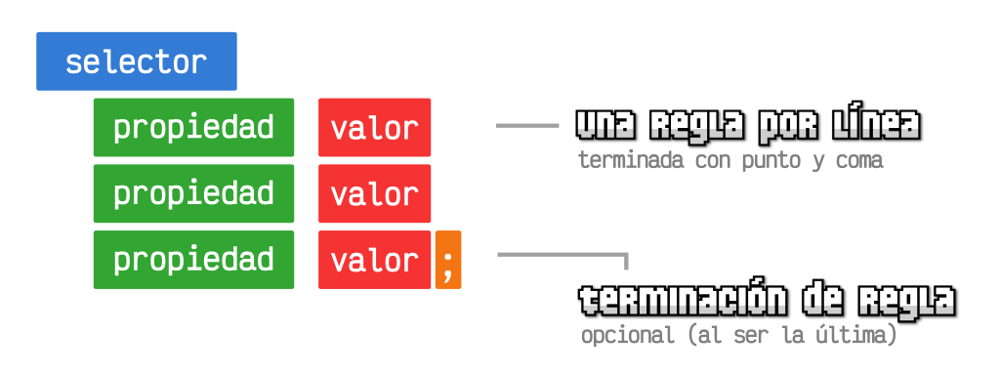
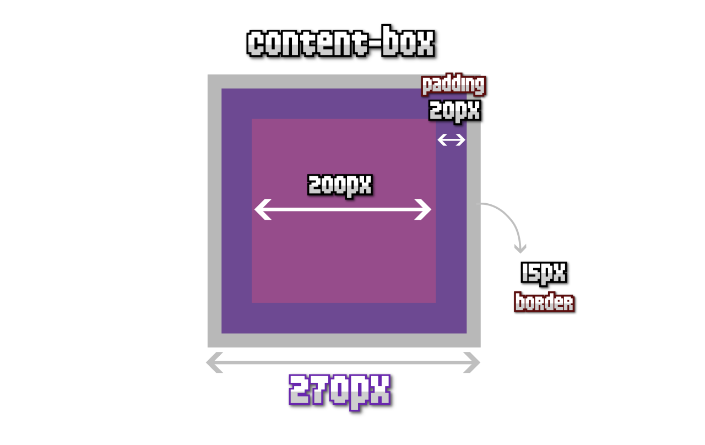
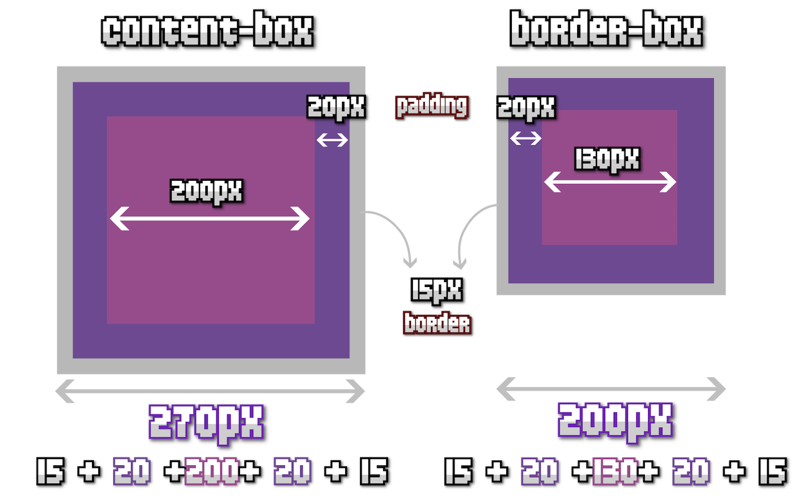

<!-- _class: cover -->
<style scoped>
section {
  --cover: url(../assets/img_00057_.png);
}
</style>
# Bases CSS
## Contenidos

- Modelo de cajas
- Colores / Imagenes / Gradientes
- Tipografía
- Selectores CSS avanzados

> Inspirado en el bootcamp de <br><strong>Manz.dev</strong> todos los créditos a el.

---

## ¿Que es CSS?

- Aplicar diseño (CSS) a estructura y contenido (HTML)
- Normalmente se escribe en un fichero a parte
- Históricamente, CSS era global. **Pero ya no tiene que serlo**.
- **CSS**: Lento de desarrollar, eficiente, alta personalización.
- **Frameworks**: Rápido de desarrollar, menos personalización. Ideal si quieres "patrones frecuentes".




---
## Recomendación para aprender CSS en 5 pasos

- Paso 1: Tener una idea de lo que existe en CSS → [Básica](https://lenguajecss.com/css/introduccion/guia-css/) → [CheatSheet](https://lenguajecss.com/css/cheatsheets/)
- Paso 2: Aprender Bases y Selectores
- Paso 3: Aprender a organizar código
- Paso 4: Aprender Layouts
- Paso 5: Aprender Cascada CSS

---
<!-- _class: cover -->
<style scoped>
section {
  --cover: url(../assets/img_00056_.png);
}
</style>
# Modelo de cajas

---

## Overflow (Desbordamiento)

- Norma 1 de CSS: Entiende CSS → no lo intentes cambiar

- Overflow: Gestionar el desbordamiento
- Entender el modelo de cajas (en siguientes slides)

<div class="grid">

```html
<div class="avatar">
  
</div>

<style>
.avatar {
  width: 150px;
  height: 150px;
  background: indigo;
  padding: 1rem;
}
</style>
```
```html
<div class="avatar">
  
</div>

<style>
.avatar {
  width: 150px;
  height: 150px;
  background: indigo;
  padding: 1rem;
  overflow: hidden;   

  img { width: 100% }  
}
</style>
```

</div>

---
## Realmente, no se hace en el mismo documento

- Separa siempre en un fichero ``.css`` a parte
- Evita los ``<style>`` (salvo casos concretos)
- Evita el atributo ``style`` (salvo casos concretos)

```html
<html>
<head>
  <!-- ... -->
  <link rel="stylesheet" href="/css/global.css">
</head>
<body>
  <!-- ... -->
</body>
</html>
```

---
## Variables CSS

- Variable definida en el elemento
- Variable definida en el padre
- Variable definida en el HTML
- Uso de fallbacks
- Ámbitos de variables de CSS

```css
.element {
  --size: 50px;

  width: var(--size);        /* No usa fallback */
  height: var(--size, 50px); /* Usa fallback */
}
```

---
## Unidades

- [Unidades CSS](https://lenguajecss.com/css/unidades-css/que-son/): Absolutas (px, cm, in...) y relativas (em, rem, vw, vh...)
- Unidades relativas al elemento padre: em, ex, ch
- Unidades relativas a la raíz: rem, rlh
- Unidades relativas a la ventana: vw, vh, vmin, vmax

<div class="grid">

```css
.element {
  --size: 50px;   /* Se va a usar +1 vez */
  --space: 1rem;  /* Más limpio luego */

  width: var(--size);
  height: var(--size);
  padding: var(--space);
}
```
```css
.element {
  width: max-content;   /* Tamaño máximo */
  width: min-content;   /* Tamaño mínimo */
  width: auto;          /* Browser calcula */

  background: indigo;
  padding: 1rem;
}
```

---
## Box Model (Modelo de cajas)
- ``margin`` → espacio exterior
- ``padding`` → espacio interior → margin/padding
- ``border`` → intermedio
- contenido (Ojo, el tamaño dado en dimensiones)


```css
.element {
  width: 200px;
  height: 200px;
  padding: 20px;
  border: 15px solid white;
  background: indigo;
}
```

---
## Modificar el modelo de cajas
- La propiedad ``box-sizing`` permite cambiar el modelo de cajas.
- El modelo por defecto es ``content-box``
- El modelo ``border-box`` es un modelo alternativo.
- Se pueden usar ambos en una página.
- Mucha gente usa resets (y se saltan entender esto)



---
## Bordes CSS
- La propiedad border
- La propiedad border-image (incompatible con border-radius)
- Bordes con gradientes con border-image
- La propiedad border-radius
- La propiedad corner-shape (round, bevel, notch, squircle)

```css
.element {
  --colors: indigo, purple, hotpink;
  --gradient: linear-gradient(var(--colors));

  width: 200px;
  height: 200px;
  border: 3px solid black;
  border-image: var(--gradient) 1 / 2rem;
  border-radius: 50px;
  corner-shape: scoop;
}
```


---
<!-- _class: cover -->
<style scoped>
section {
  --cover: url(../assets/img_00058_.png);
}
</style>
# Colores y fondos

- Esquemas de colores
- Imágenes de fondo
- Gradientes CSS

---
## Colores

- Propiedades: ``color`` y ``background-color``
- Palabras clave: ``indigo``, ``deeppink``, ``white``, ... → keywords
- Esquema de colores RGB
- Función RGB: ``rgb(25% 40% 80% / 50%)`` ❌ rgba()
- ⭐ Hexadecimal: ``#558899`` → ``#589``
- Función HSL: ``hsl(0.75turn 45% 35% / 100%)`` ❌ hsla()
- Funciones avanzadas: ``oklab()`` y ``oklch()``


---
## Fondos

- Fondos: background-image con función ``url("imagen.jpg")``
- Gradientes: ``linear-gradient()``, ``radial-gradient()`` y ``conic-gradient()``
- Se pueden combinar y añadir múltiples fondos
- Otras y la propiedad de atajo: ``background``

```css
.element {
  width: 800px;
  min-height: 300px;
  background-color: red;
  background-image: url("imagen.jpg");
}
```

---
## Fondos

```css
.element {
  width: 800px;
  min-height: 300px;
  background-color: red;
  background-image: linear-gradient(indigo, deeppink, black);
  background-image: radial-gradient(circle 50px at 50% 50%, indigo, deeppink, black);
  background-image: conic-gradient(from 0.5turn at 50% 50%, indigo, deeppink, black);
}
``` 
<div class="grid">

```css
.element {
  width: 800px;
  min-height: 300px;
  background-color: red;
  background-image:
    linear-gradient(black, transparent),
    url("imagen.jpg");
}
```
```css
.element {
  width: 800px;
  min-height: 300px;
  background-color: red;
  background-image: url("imagen.jpg");
  background-position: 35px 50px;
  background-repeat: repeat-x;
  background-size: cover;
}
```
</div>


---
## Tipografías

- La propiedad ``font-family`` establece la fuente
- Se suele establecer una lista de fuentes (de 2 a 3, aprox.)
- Se termina con una fuente segura.
- Propiedades relacionadas: tamaño, peso, estilo...

```css
.element {
  font-family: Outfit, "Victor Mono", serif;
  /* Fuentes seguras → serif, sans-serif, monospace, fantasy, cursive, math */
  font-size: 18px;
  font-weight: 400;     /* Peso: 100-1000 */
  font-style: italic;   /* italic, normal, oblique */
}
```
Las tipografías sólo se ven si el usuario las tiene instaladas

---
## Formatos de tipografías

- Alternativa cómoda: [Google Fonts](https://fonts.google.com/) → CDN
- Alternativa eficiente: [FontSource](https://fontsource.org/) → Self-host
- Formatos: ✅ WOFF2, ✅ WOFF, ❌ TTF, ❌ EOT, ❌ SVG → [DaFont](https://www.dafont.com/es/)
- [Transfonter](https://transfonter.org/): Generador de código para cargar tipografías

```css
@font-face {
  font-family: "EnterCommand";
  font-display: swap;
  src:
    url("/fonts/entercommand.woff2") format("woff2"),
    url("/fonts/entercommand.woff") format("woff"),
    url("/fonts/entercommand.ttf") format("truetype");
}
```

---
<!-- _class: cover -->
<style scoped>
section {
  --cover: url(../assets/img_00059_.png);
}
</style>
# Selectores CSS

- Selectores básicos
- Pseudoselectores
- Selectores avanzados

---
## Selectores CSS: Básicos
- Obligatorios: ``#id`` y ``.class`` (sobre todo ``.class``)
- Otros selectores como ``>`` (hijo directo) y ``+`` (siguiente)
<div class="grid">

```html
<div class="container">
  <h1>Título</h1>
  <p>Primer <strong>párrafo</strong>.</p>
  <p>Segundo <strong>párrafo</strong>.</p>
  <footer>
    <p>Último <strong>párrafo</strong>.</p>
  </footer>
</div>
```
```css
.container { /* ... */ }
.container p { /* ... */ }
.container > p { /* ... */ }
.container h1 + p { /* ... */ }
```
</div>

---
## CSS Nesting
- Permite agrupar código de forma más entendible
- Simplifica los selectores
- No tienes que aplicar nesting siempre (ideal: con grupos relacionados)
<div class="grid">

```css
.container { /* ... */ }
.container .item { /* ... */ }
.container > p { /* ... */ }
.container:hover { /* ... */ }

.menu .container { /* ... */ }
```
```css
.container {
  /* ... */
  .item { /* ... */ }
  > p { /* ... */ }
  &:hover { /* ... */ }
  .menu & { /* ... */ }
}
```
</div>

---
## Selectores CSS: Atributos

```html
<a href="https://alons.dev/">alons.dev</a>
<a href="https://alons.dev/document.pdf">Descargar</a>
<a href="https://alons.dev/audio.mp3">Descargar</a>
<a href="http://alons.dev/insecure/">Acceder a la página</a>

<style>
a[href] { /* ... */ }
a[href="https://alons.dev/"] { /* ... */ }
a[href^="http://"] { /* ... */ }
a[href$=".pdf" i] { /* ... */ }
</style>
```

---
## Selectores CSS: Pseudo

<div class="grid">

```css
/* Pseudoclases */
input:hover { /* ... */ }
input:focus { /* ... */ }
input:disabled { /* ... */ }
input:checked { /* ... */ }
input:placeholder-shown { /* ... */ }
input:valid { /* ... */ }
input:invalid { /* ... */ }
input:required { /* ... */ }

/* Pseudoelementos */
p::first-letter { /* ... */ }
```
```html
<!-- HTML -->
<h2 data-author="Alons">Tema 1</h2>
<h2 data-author="Luis">Tema 2</h2>
<h2 data-author="Carlos">Tema 3</h2>

<!-- Pseudoelementos -->
<style>
  h2::after {
    content: "» Autor: " attr(data-author);
    color: indigo;
  }
</style>
```
</div>

---
## Combinadores Lógicos CSS (Avanzado)
- Combinador ``:is()``
- Combinador ``:has()`` → [Ejemplo de botón de selección sin Javascript](https://codepen.io/alons182/pen/NPRpBEa)
- Combinador ``:not()``

<div class="grid">

```css
.parent .item-1,
.parent .item-2,
.parent .item-3 {
  /* ... */
}

/* Simplifica grupos */
.parent :is(.item-1, .item-2, .item-3) { /* ... */ }
```
```css
/* Enlaces sin atributo href */
a:not([href]) { /* ... */ }

/* Estilar .parent solo si contiene <code>... */
.parent:has(code) {
  /* ... */
}
````

</div>

---
## Referencias
- [Guía CSS](https://lenguajecss.com/css/introduccion/guia-css/)
- [CheatSheet CSS](https://lenguajecss.com/css/cheatsheets/)
- [bootcamp.manz.dev](https://bootcamp.manz.dev/)

