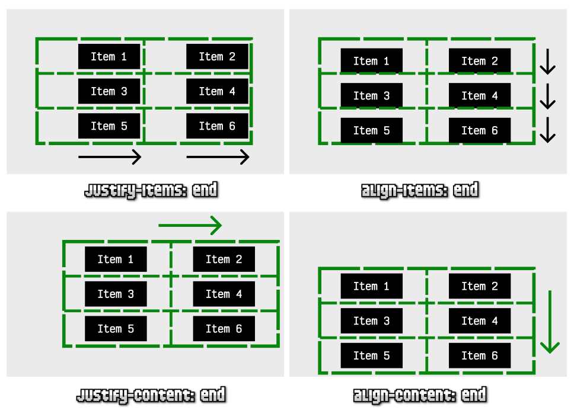

<!-- _class: cover -->
<style scoped>
section {
  --cover: url(../assets/img_00057_.png);
}
</style>
# CSS Avanzado
## Contenidos
- Trucos de CSS
- Responsive Design
- Cascada CSS
- Máscaras y recortes CSS
- Lógica CSS


> Inspirado en el bootcamp de <br><strong>Manz.dev</strong> todos los créditos a el.

---

## Utilidades para imágenes

- Uso de fallbacks con ``image-set`` (si soporta, no descarga el resto)

<div class="grid">

```css
.element {
  background: image-set(
    url("image1.avif") type("image/avif"),
    url("image1.webp") type("image/webp"),
    url("image1.jpg") type("image/jpeg")
  );
}
```
```html


<style>
img {
  width: 256px;  /* Cambiar a 128px */
  height: 256px;
  /* object-fit: cover; /* cover / contain */
  /* object-position: top right; */
  /* object-view-box: inset(15%); */
  /* &:hover { object-view-box: inset(0); } */
}
</style>
```

</div>

---
<style scoped>
   .resize {
    width: 256px;
    height: 256px;
    &.pix {
      image-rendering: pixelated;
    }
  }
</style>
## Renderización de imágenes

- Imagen original tamaño 18x18
- Imagen redimensionada 256x256

<div class="grid">

```html


<style>
  img {
    width: 256px;
    height: 256px;
    image-rendering: pixelated;
  }
</style>
```
<div>


</div>

</div>

---
<!-- _class: cover -->
<style scoped>
section {
  --cover: url(../assets/img_00066_.png);
}
</style>
# Flex

---

## Flex CSS

- Sistema de una sola dimensión [Flex](https://lenguajecss.com/css/flex/que-es-flex/)
- Propiedad flex-direction:

  - row (por defecto)
  - column
  - *-reverse

<div class="grid">

```html
<div class="parent">
  <div class="item">1</div>
  <div class="item">2</div>
  <div class="item">3</div>
  <div class="item">4</div>
  <div class="item">5</div>
  <div class="item">6</div>
</div>

```
```css
.parent {
  display: flex;
  flex-direction: row;
  background: #999;

  .item {
    --size: 100px;

    background: indigo;
    border: 5px solid gold;
    color: gold;
    width: var(--size);
    height: var(--size);
  }
}
```

</div>

---
## Gaps (Huecos)

- Propiedad ``gap`` → para añadir huecos entre items (no globales)
- No es lo mismo ``gap`` (sólo entre items) que ``padding`` o ``margin``
<div class="grid">

```css
.parent {
  display: flex;
  flex-direction: row;
  gap: 1rem;
  background: #999;

  .item {
    /* ... */
  }
}
```
<div class="grid">

- Añadimos un ``padding`` para border exteriores
- Ponemos líneas con ``column-rule: 3px solid black``
- Aumentamos el ``gap`` a ``2rem`` para dar más espacio
- Ajustamos: ``border: 3px solid black`` y ``width: max-content``
- ⚠ Ajustamos las lineas con ``column-rule-inset: -1rem``
**Pro-tip:**
- Añadimos un ``--offset: 2rem``
- Mutamos ``column-rule-inset: calc(var(--offset) * -1)``
- Mutamos ``padding: var(--offset)``
- Mutamos ``gap: calc(var(--offset) * 2)``
</div>

</div>

---
## Variables CSS

- Variable definida en el elemento
- Variable definida en el padre
- Variable definida en el HTML
- Uso de fallbacks
- Ámbitos de variables de CSS

```css
.element {
  --size: 50px;

  width: var(--size);        /* No usa fallback */
  height: var(--size, 50px); /* Usa fallback */
}
```

---
## Flex multilínea (Wrap)

- Se dice que Flex funciona con una dimensión, pero...
- Propiedad ``flex-wrap*`` → con ``wrap`` permite multilínea (desborda items sin deformarlos)

<div class="grid">

```html
<div class="parent">
  <div class="item">1</div>
  <div class="item">2</div>
  <div class="item">3</div>
  <div class="item">4</div>
  <div class="item">5</div>
  <!-- ... hasta 10 -->
</div>
```
```css
.parent {
  display: flex;
  flex-direction: row;
  flex-wrap: wrap;
  justify-content: space-between;
  align-content: space-between;
  background: grey;
  padding: 1rem;
  width: 600px;
  gap: 1rem;
}
```
</div>

- El modo ``wrap`` desbloquea ``align-content`` para alinear esas líneas extra.

---
<style scoped>
.order-example {
  display: flex;
  img {
    width: 100px;
    height: 100px;
    background: indigo;
    border: 5px solid gold;
  }
}
.cat {
  order: var(--cat-order, 0);
}
</style>

## Extras de Flex
- Con ``justify-content`` → eje primario (row → horizontal, column → vertical)
- Con ``align-items`` → eje secundario (row → vertical, column → horizontal)
- En modo wrap, ``align-content`` permite alinear eje extra multilinea
- Extra: El maravilloso ``order``

<div class="order-example">
  
  
  
  
</div>
<div class="buttons">
 

  <code>.cat { order: </code> <input type="number" oninput="document.body.style.setProperty('--cat-order', this.value)" value="0"><code>}</code>

  
</div>
Juegos para practicar:

[FlexboxFroggy](https://flexboxfroggy.com/#es)
[FlexboxDefense](https://flexboxdefense.com/)

---
<!-- _class: cover -->
<style scoped>
section {
  --cover: url(../assets/img_00067_.png);
}
</style>
# Grid


---
## Grid
- Sistema de dos dimensiones (cuadrículas) → Conceptos: [ Grid](https://lenguajecss.com/css/grid/que-es-grid/)
- Definir el tamaño de ancho → grid-template-columns
- Definir el tamaño de alto → grid-template-rows
- Definir huecos con gap → (row + columns)

<div class="grid">

```html
<div class="grid">
  <div class="item">1</div>
  <div class="item">2</div>
  <div class="item">3</div>
  <div class="item">4</div>
  <div class="item">5</div>
  <div class="item">6</div>
</div>
```
```css
.grid {
  display: grid;
  grid-template-columns: 100px 100px 100px;
  grid-template-rows: 50px 50px;
  gap: 15px 15px;
  width: max-content;
  background: grey;

  .item { background: indigo }
}
```
</div>


---
## Más características en Grid

- La función ``repeat(num, size)`` ayuda a simplificar
- La unidad ``fr`` (fracción restante)
- Responsive one-line: ``repeat(auto-fill, minmax(var(--size), 1fr))``

```css
.grid {
  display: grid;
  grid-template-columns: repeat(3, 100px) 200px;
  grid-template-rows: repeat(2, 50px);
  gap: 15px 15px;
  width: max-content;
  background: grey;

  .item { background: indigo }
}
```

---
## Extras de Grid

- Con las propiedades *-items y *-content se puede alinear elementos
- Con justify-items y align-items (hijos, dentro de celdas)
- Con justify-content y align-content (el propio grid)
- Más info → [Alinear en Grid](https://lenguajecss.com/css/grid/alinear-centrar-css/)



---
## Grid por áreas

- [Grid por áreas](https://lenguajecss.com/css/grid/grid-template-areas/): ``grid-template-areas`` y ``grid-area``
- Zonas vacías con ``.`` (asegúrate de tener mismo número de columnas)

<div class="grid">

```html
<div class="parent">
  <header>Logo</header>
  <section>Content</section>
  <aside>Menú</aside>
  <footer>Footer</footer>
</div>
```
```css
.parent {
  display: grid;
  grid-template-areas: "head head"
                       "body menu"
                       "foot foot";
  grid-template-rows: 100px 1fr 100px;
  height: 700px;
}

header { grid-area: head; background: blue }
section { grid-area: body; background: green }
aside { grid-area: menu; background: grey }
footer { grid-area: foot; background: #333 }
```
</div>

---
## Grids irregulares

- [Grids irregulares](https://lenguajecss.com/css/grid/irregular-grid/): ``grid-*-start`` y ``grid-*-end``
- Zonas vacías con ``.`` (asegúrate de tener mismo número de columnas)

<div class="grid">

```html
<div class="parent">
  <div class="item">1</div>
  <div class="item">2</div>
  <div class="item">3</div>
  <div class="item">4</div>
  <div class="item">5</div>
</div>
```
```css
.parent {
  display: grid;
  grid-template-columns: repeat(2, 100px);
  grid-template-rows: 50px 1fr 100px;
  gap: 5px;
}

.item { background: grey }

.item:nth-child(2) {
  grid-row-start: 2;       /* +1 */
  grid-column: 1 / span 2; /* De 1 hasta 2 */
}
```
</div>

Juegos para prácticar:

- [Grid Garden](https://cssgridgarden.com/#es)

---
<!-- _class: cover -->
<style scoped>
section {
  --cover: url(../assets/img_00068_.png);
}
</style>
# Position


---

## Posicionamiento CSS
- La propiedad ``position``
- 5 modalidades: ``static``, ``relative`` y ``absolute`` (variaciones: ``fixed`` y ``sticky``)
- Desplazamientos: ``top``, ``bottom``, ``left``, ``right``
<div class="grid">

```css
.item-1 {
  position: relative;
  left: 5px;            /* → 5px (desde la izquierda) */
  left: -5px;           /* ← 5px (hacia la izquierda) */
  top: 5px;             /* ↓ 5px (hacia abajo) */
  top: -5px;            /* ↑ 5px (hacia arriba) */
}
```
```css
.parent {
  position: relative;       /* Marco (referencia) */

  .item {
    position: absolute;     /* Busca padre != static */
    left: 0;
    top: 0;
  }
}
```
</div>


---
## Posicionamiento CSS
- La propiedad ``position``
- 5 modalidades: ``static``, ``relative`` y ``absolute`` (variaciones: ``fixed`` y ``sticky``)
- Desplazamientos: ``top``, ``bottom``, ``left``, ``right``

<div class="grid">

```css
.parent {
  .box {
    background: indigo;
    position: fixed;
    width: 50px;
    height: 50px;
    right: 0;
    top: 0;
  }
}
```
```css
.parent {
  .box {
    background: indigo;
    position: sticky;
    top: 0;
    height: 50px;
  }
}
```
</div>

---
<style scoped>
.item {
  width: 50px;
  height: 50px;
  position: relative;

  &.item-1 { background: deeppink }
  &.item-2 { background: indigo; top: -40px; left: 40px }
  &.item-3 { background: black; top: -80px; left: 80px }
  &.item-1 { z-index: 1 }
  &.item-2 { z-index: var(--item-index, 0) }
  &.item-3 { z-index: 10 }
}
</style>

## Profundidad CSS
- La propiedad ``z-index`` (valores numéricos)
<div class="grid">

```html
<div class="container">
  <div class="item item-1"></div>
  <div class="item item-2"></div>
  <div class="item item-3"></div>
</div>
```
```css
.item {
  width: 100px;
  height: 100px;
  position: relative;

  &.item-1 { background: deeppink }
  &.item-2 { background: indigo; top: -40px; left: 40px }
  &.item-3 { background: black; top: -80px; left: 80px }
  &.item-1 { z-index: 1 }
  &.item-2 { z-index: var(--item-index, 0) }
  &.item-3 { z-index: 10 }
}
```

</div>

<div>
<div class="zindex-example">
  <div class="item item-1">1</div>
  <div class="item item-2"></div>
  <div class="item item-3">10</div>
</div>
<div class="buttons">
  <code>.item-2 { z-index: </code>
  <input type="number" value="5" oninput="document.body.style.setProperty('--item-index', this.value)">
  <code>&nbsp;}</code>
</div>
</div>

---
<style scoped>

.reference {
  anchor-name: --ref;
  background: deeppink;
  width: 250px;
  margin: auto;
}
.element {
  background: indigo;
  position: absolute;
  position-anchor: --ref;
  bottom: anchor(bottom); 
  right: anchor(left);
}
</style>

## CSS Anchor position
<div class="grid">

```html
<div class="reference">Reference</div>
<div class="element">Element</div>

<style>
.reference { anchor-name: --ref }

.element {
  position: absolute;
  position-anchor: --ref;
  bottom: anchor(bottom); 1️⃣
  right: anchor(left);    2️⃣
}
</style>
```
<div>

- 1️⃣ Ancla el borde inferior del elemento a la referencia
- 2️⃣ Ancla el borde derecho del elemento a la referencia
  <div>
  <div class="reference">Reference</div>
  <div class="element">Element</div>
  </div>
</div>
</div>

---
<!-- _class: cover -->
<style scoped>
section {
  --cover: url(../assets/img_00069_.png);
}
</style>
# Animaciones
- La propiedad ``transition``
- La regla ``@starting-style``
- Animaciones con ``@keyframes``
- Ritmo (funciones de tiempo)
- Animaciones de scroll

---
<style scoped>
.element {
  background: deeppink;
  width: 200px;
  height: 100px;
 
}
.element:hover {
  width: 300px;
  background: indigo;
}
.transition {
  transition: all 1s;
}
.t-fast {
  transition-duration: 0.2s;
}
</style>

## Transiciones
- La palabra clave all aplica a todas las propiedades
- Transiciones de entrada y de salida

<div class="grid">

```css
.element {
  background: deeppink;
  width: 200px;
  transition: all 0.5s;
}

.element:hover {
  width: 300px;
  background: indigo;
}
```
<div>
<div class="element"></div>
<br>
<div class="element transition"></div>
<br>
<div class="element transition t-fast"></div>
</div>

</div>

---
## La regla ``@starting-style``

- Estilo inicial (útil para evitar saltos en entradas)
- Se puede aplicar ``nesting`` en los estilos

```css
.element {
  background: deeppink;
  width: 200px;
  height: 75px;
  transition: all 0.75s;
  opacity: 1;
}

@starting-style {
  .element { opacity: 0 }
}
```

---
<style scoped>
.element {
  background: deeppink;
  width: 200px;
  height: 200px;
  animation: move 2s alternate infinite;
}
@keyframes move {
  0%, 100% { transform: translate(0, 0); }
  50% { transform: translate(200px, 0); }
}
</style>

## Animaciones
- Con ``@keyframes`` creamos la animación
- Con ``animation`` la aplicamos → Más opciones de animación

<div class="grid">

```css
.element {
  background: deeppink;
  width: 200px;
  height: 200px;
  animation: move 2s alternate infinite;
}

@keyframes move {
  0%, 100% { transform: translate(0, 0); }
  50% { transform: translate(200px, 0); }
}
```


<div class="element">
</div>


</div>

---
## Ritmo (funciones de tiempo)
- Constante (mismo ritmo): ``linear``
- [Ritmos variables](https://lenguajecss.com/animaciones/timing-functions/que-son/#valores-predefinidos): ``ease`` (por defecto), ``ease-in``, ``ease-out``, ``ease-in-out``
- [Ritmo personalizado](https://cubic-bezier.com/#.17,.67,.83,.67): función ``cubic-bezier()``
- [Ritmo lineal personalizado](https://lenguajecss.com/animaciones/timing-functions/linear/): función ``linear()``
- [Ritmos escalonados](https://lenguajecss.com/animaciones/timing-functions/steps/): función ``steps()`` → [Ejemplo con SpriteSheets](https://lenguajecss.com/animaciones/animaciones/spritesheets-css/)

---
## Animaciones de scroll
- La función view() → [Ejemplo](https://codepen.io/alons182/pen/MYjEYEQ)

```css
.element {
  background: indigo;
  animation: change linear both;
  animation-timeline: view(block 20%);
}

@keyframes change {
  from { scale: 0; opacity: 0 }
  to { scale: 1; opacity: 1; }
}
```

---
## View Transition
- ¿Qué son las [View Transition](https://lenguajecss.com/animaciones/view-transition/que-son/)?
- Recomendable en un ``<style>`` inline (performance)

```css
/* Obligatorio */
@view-transition { navigation: auto }

/* Opcional */
.container {
  view-transition-name: page;
}

::view-transition-old(page) { animation: fade 0.2s linear forwards }
::view-transition-new(page) { animation: fade 0.3s linear reverse }

@keyframes fade {
  from { opacity: 1 }
  to { opacity: 0 }
}
```


---
## Referencias

- [CheatSheet CSS](https://lenguajecss.com/css/cheatsheets/)
- [bootcamp.manz.dev](https://bootcamp.manz.dev/)

