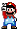
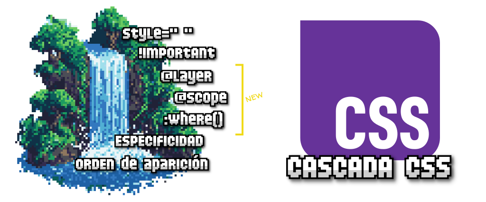

<!-- _class: cover -->
<style scoped>
section {
  --cover: url(../assets/img_00057_.png);
}
</style>
# CSS Avanzado
## Contenidos
- Trucos de CSS
- Responsive Design
- Cascada CSS
- Máscaras y recortes CSS
- Lógica CSS


> Inspirado en el bootcamp de <br><strong>Manz.dev</strong> todos los créditos a el.

---
## Colores derivados

- Con ``color-mix()`` puedes mezclar varios colores (uno puede ser ``transparent``).
- Con ``from`` puedes crear colores derivados (y no sólo ``rgb()`` → ``hsl()``, ``oklch()``, ``oklab()``...)

```css
.element {
  --color: #ff0000;   /* Rojo */

  /* Mezcla de colores */
  --soft-color: color-mix(in srgb, var(--color), white 80%);
  --dark-color: color-mix(in srgb, var(--color), white 20%);

  /* Colores relativos */
  --same-color: rgb(from var(--color) r g b);    /* Mismo color: rgb(255 0 0) */
  --pink-color: rgb(from var(--color) r g 255);  /* Color rosa: rgb(255 0 255) */
}
```


---

## Utilidades para imágenes

- Uso de fallbacks con ``image-set`` (si soporta, no descarga el resto)

<div class="grid">

```css
.element {
  background: image-set(
    url("image1.avif") type("image/avif"),
    url("image1.webp") type("image/webp"),
    url("image1.jpg") type("image/jpeg")
  );
}
```
```html


<style>
img {
  width: 256px;  /* Cambiar a 128px */
  height: 256px;
  /* object-fit: cover; /* cover / contain */
  /* object-position: top right; */
  /* object-view-box: inset(15%); */
  /* &:hover { object-view-box: inset(0); } */
}
</style>
```

</div>

---
<style scoped>
   .resize {
    width: 256px;
    height: 256px;
    &.pix {
      image-rendering: pixelated;
    }
  }
</style>
## Renderización de imágenes

- Imagen original tamaño 18x18
- Imagen redimensionada 256x256

<div class="grid">

```html


<style>
  img {
    width: 256px;
    height: 256px;
    image-rendering: pixelated;
  }
</style>
```
<div>



</div>

</div>


---
<style scoped>
   .resize {
    width: 256px;
    height: 256px;
    &.pix {
      image-rendering: pixelated;
    }
  }
</style>
## Filtros y modos de fusión

- ``filter:`` contrast(200%)
- ``background-color:`` blue
- ``background-blend-mode:`` darken

<div class="grid">

```css
img {
  background-color: red;
  background-image: url("duck.png");
  filter: grayscale(100%);
}
```


---
<!-- _class: cover -->
<style scoped>
section {
  --cover: url(../assets/img_00070_.png);
}
</style>
# Responsive
- Media Queries
- Media Features
- Preferencias de usuario
- Container Queries
---

## Filosofía del responsive

- Elige estrategia: ``Mobile-first`` / ``Desktop-first``, Olvídate del «pixel perfect»
- Intenta reducir contenido en media queries (si puedes usar variables CSS, mejor)
- Establece tus breakpoints y crea las [media queries modernas](https://lenguajecss.com/css/responsive-web-design/media-queries/) que necesites


```css
/* Estilos comunes que no cambian de desktop a mobile */
.element {
  background: indigo;
}

/* Casos particulares: cambios de direccionalidad, paddings, etc... */
/* (Bloques @media siempre al final, para aprovechar herencia) */
@media ... {
  /* ... */
}

```

---
## Filosofía del responsive

- Elige estrategia: ``Mobile-first`` / ``Desktop-first``, Olvídate del «pixel perfect»
- Intenta reducir contenido en media queries (si puedes usar variables CSS, mejor)
- Establece tus breakpoints y crea las [media queries modernas](https://lenguajecss.com/css/responsive-web-design/media-queries/) que necesites

```css
/* Estilos aplicados a pantallas entre 640px y 1024px */

@media screen and (min-width: 640px) and (max-width: 1024px) { }   /* ❌ LEGACY */

@media (width >= 640px) and (width <= 1024px) { }                  /* ✅ MEJOR */

@media (640px <= width <= 1024px) { }                              /* ✅✅ AÚN MEJOR */
```


```css
.element {
  --pad: 2rem;
  background: indigo;
  padding: var(--pad);
  display: flex;

  @media (width <= 1024px) {
    --pad: 0.5rem;
    flex-direction: column;
  }
}
```

---
## No sólo de width vive el dev

- Puedes usar height, aspect-ratio, orientation u otros
- Hay muchos [media features](https://lenguajecss.com/css/responsive-web-design/media-features/)
- También hay @media basados en las preferencias de usuario


```css
@media (aspect-ratio <= 6/2) { }        /* 6/2 === 3/1 === 3 */
@media (orientation: landscape) { }     /* Landscape (apaisado) o portrait (retrato) */
@media (scripting: none) { }            /* El usuario no tiene Javascript */
@media (any-hover: none) { }            /* El usuario no tiene cursores (ratón) */
@media (any-pointer: none) { }          /* Usuario sin táctil (coarse) ni ratón preciso (fine) */
@media print { }                        /* Se aplica sólo cuando se imprime (físico o PDF) */
```
```css
@media (prefers-reduced-motion: reduce) { }        /* Usuario prefiere sin animaciones */
@media (prefers-reduced-transparency: reduce) { }  /* Usuario prefiere sin transparencias */
@media (prefers-reduced-data: reduce) { }          /* ⚠ Usuario prefiere ahorrar datos */
@media (prefers-color-scheme: dark) { }            /* Usuario prefiere modo oscuro (light=claro) */

/* Forma alternativa (compacta y directa) */
body {
  background: light-dark(white, black);
  color: light-dark(black, white);
}
```


---
## Container queries

```css
.container {
  background: grey;
  display: flex;
  gap: 1rem;
  container: parent / inline-size;      /* ⬅ Establecemos padre */
  width: 600px;                         /* ⬅ Cambiar a 300px */

  .item {
    background: blue;
    width: 200px;
    height: 200px;
    @container parent (width <= 500px) { background: red }  /* ⬅ Container query */
  }
}
```

---
<!-- _class: cover -->
<style scoped>
section {
  --cover: url(../assets/img_00071_.png);
}
</style>
# Cascada CSS
- Especificidad CSS
- Capas de cascada @layer
- :where() vs !important
- Alcance con @scope
- Shadow DOM declarativo


---
## Especificidad CSS

- CSS tiene varias reglas → Cascada
- NO FUNCIONAN como la programación
- Hay que entenderlas (no memorizarlas)

Reglas

- Herencia: Quien tiene preferencia
- Estructura: Como se lee el CSS
- Especificidad: Resolver conflictos
- Alcance: Hasta donde se aplica el CSS




---

## Herencia
- [Propiedades heredables](https://lenguajecss.com/cascada-css/herencia/que-es/#propiedades-heredables): ``color``, ``font-family``, ``font-size``, etc...
- Valores de herencia: ``inherit``, ``initial`` o ``unset`` (``inherit``/``initial`` según caso)
- Resets si quieres algo ya hecho

<div class="grid">
  
  ```html
  <div class="parent">
  Hello from parent!
  <p class="child">Hello from child!</p>
</div>

<style>
.parent {
  background: black;
  color: gold;
}
</style>
```
```css
.parent {
  border: 2px solid deeppink;

  .child {
    border: inherit;
  }
}
```

</div>

---
<style scoped>
spoiler {
  color: transparent
}
</style>
## Estructura (tradicional)
- Fuente: [-] ``<link>`` → ``<style>`` → ``style=""`` [+]
- Orden (mismo selector): herencia + ``!important``
- Selector: Especificidad (A,B,C) → Calculadoras: [keegan](https://specificity.keegan.st/) / [wallace](https://www.projectwallace.com/specificity-calculator?selectors=.kid+%3Ahas%28.friend%29+%7E+%3Awhere%28.treehouse%29+%3Ais%28%23gross%29)

<div class="grid">
  
  ```html
  <div id="element" class="text">
    Texto del elemento
  </div>

  <style>
  div { background-color: red; }
  #element { background-color: steelblue; }
  .text { background-color: green; }
  </style>
```


- El selector div tiene especificidad... <spoiler>0,0,1 (es un elemento)</spoiler>
- El selector #element tiene especificidad... <spoiler>1,0,0 (es un id)</spoiler>
- El selector .text tiene especificidad... <spoiler>0,1,0 (es una class)</spoiler>


</div>

---

## Estructura (moderna)
- Estilos globales ↔ Estilos locales (Shadow DOM)
- Evita !important a favor de :where() (especificidad 0)
- Usa @layer (capas, estilo «Photoshop», de especificidad)

<div class="grid">
  
  ```html
 <div class="text">       <!-- CSS inyectado -->
  Texto del elemento
</div>

<style>
:where(.text) { background-color: indigo }   ⬇
.text { background-color: deeppink }         ⬆
</style>
```
```css
@layer base, theme;

.primary {
  @layer theme {
    background: indigo;
    color: white;
  }
  @layer base {
    background: grey;
    width: 250px;
    height: 200px;
    padding: 1rem;
  }
}
```

</div>

---
## Alcance (scope)
- Nomenclatura BEM, ahora: ``@scope``

<div class="grid">
  
  ```html
 <!-- Estilos acotados al div padre -->
<div class="parent">

  <style>
    @scope {
      h1 { color: purple }
    }
  </style>
  <h1>Hola a todos</h1>

</div>
<h1>Texto fuera</h1>
```
```css
/* Nomenclatura BEM */
.parent__element--modifier {
  /* ... */
}
/* A partir de <div class="parent"> */
@scope (.parent) {
  div { color: red }
}
/* De div.parent a div.child */
@scope (.parent) to (.child) {
  div { color: blue }
}
```

</div>

---
<!-- _class: cover -->
<style scoped>
section {
  --cover: url(../assets/img_00072_.png);
}
</style>
# Máscaras y recortes
- Formas
- Recortes (clip-path)
- Shape (SVG-in-CSS)
- Máscaras

---

## Formas CSS (Aplicadas con clip-path)

<div class="grid">
  
<div class="shape-buttons">
<ul>
<li><button class="none">Sin recorte</button></li>
<li>Rectángulos: <button>rect()</button>, <button>inset()</button> e <button>xywh()</button></li>
<li>Círculos y elipses: <button>circle()</button> y <button>ellipse()</button></li>
<li>Trayectos: <button>polygon()</button>, <button>path()</button> y <button>shape()</button></li>
</ul>
<p><output class="mask-status">clip-path: none</output></p>
</div>
<div class="mask-example-container">
  
</div>
</div>

<script>
const image = document.querySelector("#mask-example");
const buttons = document.querySelectorAll(".shape-buttons button");
const output = document.querySelector("output.mask-status");

const update = (prop, value) => {
  image.style.setProperty(prop, value);
  output.textContent = `${prop}: ${value}`;
}

// Sin recorte
buttons[0].addEventListener("click", () => update("clip-path", `none`));

// rect
buttons[1].addEventListener("click", () => update("clip-path", `rect(50px 475px 240px 230px)`));

buttons[2].addEventListener("click", () => update("clip-path", `inset(10% 10% 10% 10%)`));

buttons[3].addEventListener("click", () => update("clip-path", `xywh(0 0 450px 250px)`));

buttons[4].addEventListener("click", () => update("clip-path", `circle(30% at 50% 55%)`));

buttons[5].addEventListener("click", () => update("clip-path", `ellipse(30% 30% at 50% 50%)`));

buttons[6].addEventListener("click", () => update("clip-path", `polygon(0 0, 100% 0, 50% 100%)`));

buttons[7].addEventListener("click", () => update("clip-path", `path("m 228 127 l 93 0 l 29 -84 l 29 84 l 93 0 l -76 52 l 29 84 l -76 -52 l -76 52 l 29 -84 l -76 -52 Z")`));

buttons[8].addEventListener("click", () => update("clip-path", `shape(from 0 0, hline to calc(30% - 50px), arc by calc(350px) 0 of 50px, hline to 100%, vline to 100%, hline to 0, close)`));
  </script>

---
<style scoped>
  #mask-1 {
    mask-image:
      radial-gradient(circle 50px at 50px 50px,
        black 75%, transparent 78%),
      radial-gradient(circle 400px,
        black 50%, transparent 50.5%);
    mask-repeat: repeat, no-repeat;
    mask-size: 100px 100px, cover;
    mask-composite: add;
  }
</style>
## Máscaras

- Tenemos una imagen y aplicamos máscara compuesta
- Un gradiente repetido y otro sin repetir

<div class="grid">

```css
.element {
  mask-image:
    radial-gradient(circle 50px at 50px 50px,
      black 75%, transparent 78%),
    radial-gradient(circle 400px,
      black 50%, transparent 50.5%);
  mask-repeat: repeat, no-repeat;
  mask-size: 100px 100px, cover;
  mask-composite: add;
}
```


</div>

---
<!-- _class: cover -->
<style scoped>
section {
  --cover: url(../assets/img_00073_.png);
}
</style>
# Lógica CSS
- ¿CSS es programación?
- if en CSS
- function en CSS
- Tipos de datos en CSS

---
## Condicionales en CSS

- ``@media (...)`` según features del dispositivo
- ``@media (prefers-*)`` según preferencias de usuario
- ``@support (...)`` según soporte/compatibilidad
- ``@container (...)`` según contenedor padre
- ``var(..., fallback)`` según si existe variable
- ``if(...; else: ...)`` según valor de variable

```css
@media (width <= 800px) { /* ... */ }
@media (prefers-color-scheme: dark) { /* ... */ }
@supports not (object-view-box: none) { /* ... */ }
@container name (width <= 800px) { /* ... */ }
.element { background: var(--color, grey) }
.element {
  --name: "ManzDev";
  background: if(
    style(--name: "ManzDev"): indigo;
    style(--name: "CyberManzDev"): red;
    else: grey
  );
}
```

---
## Funciones en CSS

<div class="grid">

```css
@function --gradient(--colors) {
  --shape: circle 150px;
  --position: 100% 50%;
  result: radial-gradient(
    var(--shape) at var(--position), var(--colors)
  );
}

.box {
  --colors: black, indigo, deeppink;
  width: 200px;
  height: 75px;
  background: --gradient(var(--colors));
}
```
- En CSS tenemos la regla ``@function``
- Se usan como las variables CSS pero con paréntesis
- Las funciones devuelven resultados
- Permiten parámetros
- Hacen más semántico y reutilizable el CSS

</div>

---
## Funciones random

- Con cache ``random()`` / ``random-item()``
- Sin cache (usando ``per-element``)
- Con cache selectivo (usando ``--id``)

<div class="grid">

```css
.container {
  width: random(100px, 500px);                /* Con cache: */
  height: random(100px, 500px);               /* Mismo input, mismo valor aleatorio */

  width: random(--id, 100px, 500px);          /* Con cache: Mismo valor aleatorio en mismo --id */
  width: random(per-element, 100px, 500px);   /* Sin cache: Valor aleatorio */

  width: random(100px, 500px, by 50px);       /* Con saltos de 50px en 50px */
  background: random-item(indigo, deeppink, tomato);  /* Elige un valor aleatorio de la lista */
}
```

</div>

---
## Tipos de datos en CSS

- Ejemplo → en regla ``@property``
- Ejemplo → en función ``attr()``
- Hay muchos tipos de datos

<div class="grid">

```css
@property --x {        /* La variable --x */
  syntax: "<length>";  /* Es de tipo longitud */
  inherits: true;      /* Es heredable */
  initial-value: 0     /* Y tiene este valor por defecto */
}

.element {
  display: inline flow-root;
  padding: 4px 8px;
  background: attr(data-color type(<color>));
  color: white;
}
```
```html
<!-- El color se toma del atributo -->
<div class="element"
     data-color="indigo">Manz</div>
```

</div>

---
## Transpilar código CSS

<div class="grid">

```css
.element {
  background: color-mix(...);
  color: light-dark(...);

  &:is(...) { /* ... */ }

  .child { /* ... */ }
}

```
```css
.element {
  background: #848833;    /* Color procesado y "aplanado" */
  color: var(--light-dark); /* Versión compatible si no soporta light-dark() */
}

.parent .child-1,
.parent .child-2,
.parent .child-3 { /* ... */ }   /* Versión compatible si no se soporta :is() */

.parent  .child { /* ... */ }    /* Sin CSS nesting (navegadores muy antiguos) */
```
</div>

- [PostCSS](https://postcss.org/)
- [LightningCSS](https://lightningcss.dev/)

---
## Referencias

- [CheatSheet CSS](https://lenguajecss.com/css/cheatsheets/)
- [bootcamp.manz.dev](https://bootcamp.manz.dev/)

