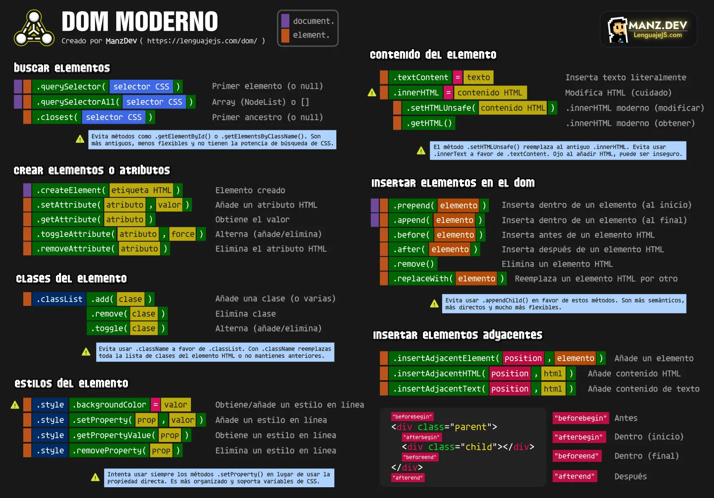

<!-- _class: cover -->
<style scoped>
section {
  --cover: url(../assets/img_00001_dom.png);
}
</style>
# DOM Moderno (Javascript)
## Contenidos
- DOM: Document Object Model
- Búsquedas en el DOM
- HTML/CSS desde el DOM
- APIs interesantes de DOM


> Inspirado en el bootcamp de <br><strong>Manz.dev</strong> todos los créditos a el.

---
<!-- _class: cover -->
<style scoped>
section {
  --cover: url(../assets/img_00005_dom.png);
}
</style>
# Document Object Model
## ¿Qué es el DOM?
- HTML visto desde Javascript
- Árbol de elementos HTML
- Podemos modificarlo a nuestro gusto
- Permite cambios dinámicos: «cuando el usuario...»
- Muy subestimado (por usuarios de frameworks)


---

## DOM moderno

- Buscar elementos
- Crear elementos desde el DOM
- CSS (Clases/styles) desde el DOM
- Contenido desde el DOM
- Insertar HTML desde el DOM



---
## Buscar en el DOM

- ✅ Métodos modernos de selección: .querySelector*()
- ❌ Métodos «legacy» tradicionales: .getElement*() (limitado por ID, colecciones vivas...)

<steps>
<step>

```js
document           // Representa al árbol completo: el documento HTML

const element = document.getElementById("presentation");  // ❌ Legacy (limitado a IDs)
const element = document.querySelector("#presentation");  // ✅ Equivalente (y más potente)

const elements = document.getElementsByTagName("div");    // ❌ Devuelve HTMLCollection
const elements = document.querySelectorAll("div");        // ✅ Equivalente (NodeList)
const elements = document.getElementsByClassName("pato"); // ❌ Devuelve HTMLCollection
const elements = document.querySelectorAll(".pato");      // ✅ Equivalente (NodeList)
```
</step>
<step>

```js
const element = document.querySelector(".container");  // ✅ Busca/selecciona el PRIMER elemento
// 🟥 Si no encuentra, devuelve null

const elements = document.querySelectorAll("div");     // ✅ Busca/selecciona TODOS los elementos
// 🟥 Si no encuentra, devuelve []

// Puedes hacer búsquedas acotadas (no sobre todo el documento)
element.querySelector("p");
```
</step>
<step>

```js
// Imágenes que no tienen atributo "alt" (obligatorio)
const errorImg = document.querySelectorAll("img:not([alt])");

// Enlaces que lleven a una imagen PNG
const linkToImage = document.querySelectorAll("a[href$='png']");

// Enlaces que estén hechos sobre una imagen
const imageWithLink = document.querySelectorAll("a:has(img)");

// Las celdas de la segunda fila de cada tabla de la página
const cells = document.querySelectorAll("table tr:nth-child(2) td");
```
</step>
<step>

```js
// Buscamos un elemento HTML concreto
const container = document.querySelector(".container");

// Ahora queremos continuar buscando pero hacia los padres, no hacia los hijos

// Busca el elemento más cercano (hacia arriba)
const ancient = container.closest(".page");
```
</step>
</steps>

---
<!-- _class: cover -->
<style scoped>
section {
  --cover: url(../assets/img_00002_dom.png);
}
</style>

# Modificar contenido

---

## Modificar texto de la web

- ✅ Preferir propiedad .textContent
- ❌ Evitar .innerText (más lento, oculta partes no renderizadas)

<steps>
<step>

```js
const paragraph = document.querySelector(".container .post p");

paragraph.textContent             // Devuelve el contenido de texto actual
paragraph.textContent = "Hola";   // Modifica el contenido actual por "Hola"

// 🔒 Esto es muy importante en temas de seguridad
paragraph.textContent = "<div>Hola</div>";    // Inserta código HTML literalmente
```
</step>
<step>

```js
const paragraph = document.querySelector(".container .post");

// Sirve tanto para leer como para modificar
paragraph.innerHTML              // '<p>Esto es un párrafo de texto</p>'
paragraph.innerHTML = "<p>Hola, soy <strong>Alonso</strong>.</p>";

// Confusa en ciertas situaciones. No soporta ciertos detalles modernos.
```
</step>
<step>

```js
const paragraph = document.querySelector(".container .post");

// Métodos modernos (más intuitivos)
paragraph.getHTML();          // '<p>Esto es un párrafo de texto</p>'
paragraph.setHTMLUnsafe("<p>Hola, soy <strong>Alonso</strong></p>");

// Deja claro que puede insertar HTML inseguro (innerHTML también lo es)
```
</step>
<step>

```js
const options = {
  sanitizer: new Sanitizer({
    comments: true,                           // Elimina comentarios HTML
    removeElements: ["script", "iframe"]      // Elimina scripts e iframes
  })
}

document.body.setHTMLUnsafe("<p onmouseenter='alert(1)'>Hola amigo mío.</p>");     // Inseguro
document.body.setHTML("<p onmouseenter='alert(1)'>Hola amigo mío.</p>", options);  // Seguro
```
</step>
</steps>

---

## Atributos HTML

- ❌ Mediante propiedades .id, .style → Ojo, una propiedad != un atributo
- ✅ Mediante métodos .setAttribute(), getAttribute() o .style.setProperty()
- ✅ Extras: .toggleAttribute() y .removeAttribute()

<steps>
<step>

```js
const element = document.querySelector(".element");

element.nodeName                  // Esto es una propiedad (la etiqueta HTML en mayúsculas)
element.getAttribute("nodeName")  // Esto SI es un atributo HTML
// Si tuvieramos el atributo nodeName, tendríamos valores diferentes

const presentation = document.querySelector("#presentation");
element.id                        // "presentation"
element.getAttribute("id")        // "presentation"
// Es la misma porque ciertos atributos HTML los REFLEJA AUTOMÁTICAMENTE
```
</step>
<step>

```js
const element = document.querySelector(".element");

// ❌ Forma rápida
element.id = "name";
element.style.backgroundColor = "indigo";   // Cambia la propiedad CSS background-color (inline style)

// ✅ Forma metódica
element.setAttribute("id", "name");
element.setAttribute("style", "background-color: red");
element.style.setProperty("background-color", "red");
```
</step>
<step>

```js
// Caso especial: Booleanos
const video = document.querySelector("video");

video.controls = true;
video.setAttribute("controls", "");     // Atributo HTML booleano: false = no existe atributo

video.removeAttribute("controls");
video.toggleAttribute("controls");      // Si existe, lo elimina. Si no existe, lo añade
```
</step>
</steps>

---
## Las clases HTML
- ❌ La propiedad .style (inline styles) y .className (clase como texto)
- ✅ El objeto .classList con métodos de clases

```js
element.className = "parent element";           // ❌ Debes añadirlas directamente

element.classList.length                        // 2
element.classList.item(2);                      // "element"
element.classList.contains("rounded");          // false
element.classList.add("rounded");               // Añade la clase
element.classList.remove("rounded");            // Elimina la clase
element.classList.toggle("rounded");            // Añade (si no existe) o elimina (si existe)
element.classList.replace("rounded", "hide");   // Cambia "rounded" por "hide"

```

---
<!-- _class: cover -->
<style scoped>
section {
  --cover: url(../assets/img_00003_dom.png);
}
</style>
# Crear elementos con el DOM


---
## Crear elementos
- El método document.createElement()
- Podemos crear un sistema para simplificar
- [Fragmentos](https://lenguajejs.com/dom/crear/fragmentos/) en casos especiales (no queremos contenedor)

<steps>
<step>

```js
const div = document.createElement("div");
div.classList.add("duck-element");
div.textContent = "Protip: Don't use Tailwind!";

div.isConnected               // false (no está en el DOM, está en memoria)
document.body.append(div);
div.isConnected               // true (si está en el DOM)
```
</step>
<step>

```js
const createTag = (className = "element", tag = "div", options = {}) => {
  const element = document.createElement(tag);
  element.classList.add(className);
  if (options.text) element.textContent = options.text;
  if (options.html) element.setHTMLUnsafe(options.html);
  return element;
}

createTag("container", "p", { text: "Hello!" });    // <p class="container">Hello!</p>
```
</step>
</steps>

---
## APIs inserción
- ❌ [API de Nodos](https://lenguajejs.com/dom/crear/node-api/): La más vieja, clásica y genérica
- ✅✅ [API de Element](https://lenguajejs.com/dom/crear/element-api/): La intermedia: Corta y práctica
- ✅ [API de inserción adyacente](https://lenguajejs.com/dom/crear/insertadjacent-api/): La más flexible 

<steps>
<step>

```js
const parent = document.querySelector(".parent");
// <div class="parent">Mensaje: </div>

const tag = createTag("welcome", "p", { text: "¡Bienvenido, usuario!" });
// <p class="welcome">¡Bienvenido, usuario!</p>

parent.appendChild(tag);
//                             ↓ Lo inserta aquí (poco flexible)
// <div class="parent">Mensaje: </div>

```
</step>
<step>

```js
const parent = document.querySelector(".parent");
const tag = createTag("welcome", "p", { text: "¡Bienvenido, usuario!" });

parent.before(tag);     // (↓) <div class="parent">Mensaje:</div>
parent.prepend(tag);    // <div class="parent">(↓) Mensaje:</div>
parent.append(tag);     // <div class="parent">Mensaje: (↓) </div>
parent.after(tag);      // <div class="parent">Mensaje:</div> (↓)

tag.remove();           // Elimina el elemento del documento HTML
```
</step>
<step>

```js
const tag = createTag("welcome", "p", { text: "¡Bienvenido, usuario!" });

// API de inserción adyacente
parent.insertAdjacentElement("beforeend", tag);
parent.insertAdjacentHTML("beforeend", `<p>Puedes insertar el HTML directamente</p>`);
parent.insertAdjacentText("beforeend", `O insertar textos directamente sin etiquetas HTML`);
```
</step>
</steps>

---
## Plantillas HTML
- Etiqueta ``<template>`` de HTML → [template](https://lenguajehtml.com/html/interactivas/etiqueta-html-template/)

<split-slide style="--left: 30%; --right: 70%;">

```html
<template>
  <div class="card">
    <h1></h1>
  </div>
</template>

<div class="page">
  <!-- Contenido -->
</div>
```
```js
const cats = [
  "Lea", "Grisu", "Rocky",
  "Giacomino Guardiano Dell Iperspazio", "Pimpi"
];
const page = document.querySelector(".page");
const template = document.querySelector("template");

cats.forEach(cat => {
  const html = template.content.cloneNode(true);
  html.querySelector("h1").textContent = cat;
  page.append(html);
});

```

</split-slide>

---
<!-- _class: cover -->
<style scoped>
section {
  --cover: url(../assets/img_00004_dom.png);
}
</style>
# APIs relacionadas


---
## Tipos de DOM
- DOM: El «DOM real», el documento general que solemos utilizar siempre
- Virtual DOM: Un DOM en memoria que utilizan librerías como React
- [Shadow DOM](https://lenguajejs.com/dom/shadow/attachshadow/): Caso particular del DOM → Shadow DOM

```js
const element = document.querySelector(".container");

// Creamos un Shadow DOM en el elemento (se oculta el DOM real)
element.attachShadow({ mode: "open" });

// Ahora podemos modificar el DOM real (que se cambia pero no se ve)
element.setHTMLUnsafe(`<p>Contenido del Light DOM (DOM real)</p>`);

// ...y modificar el Shadow DOM (el que se ve actualmente)
element.shadowRoot.setHTMLUnsafe(`<p>Contenido del Shadow DOM</p>`);

```

---
## API de Animaciones del DOM
- Animaciones CSS (pero desde Javascript) → [WebAnimations](https://lenguajecss.com/animaciones/webanimations/que-es/)

<split-slide>

```js
const element = document.querySelector(".element");

element.animate({
  opacity: [1, 0],
  height: ["25px", "0"]
}, 2000);

element.animate({ /* ... */ }, {
  duration: 2000,
  fill: "forwards"
});
```
```css
/* Animaciones CSS */
@keyframes hide {
  0% { opacity: 1 }
  100% { opacity: 0 }
}

@keyframes reduce {
  0% { height: 25px; }
  100% { height: 0; }
}
```
</split-slide>

---
## API de CSS Highlight
- Posibilidad de dar estilo a fragmentos sin usar DOM → [CSS Highlight API](https://lenguajejs.com/javascript/web-apis/css-highlight/)

<steps>
<step>
<split-slide style="--font-size: 1rem;">

```html
<pre><code class="language-css">
  @keyframes reduce {
    0% { height: 25px; }
    100% { height: 0; }
  }
</code></pre>
<style>
  .language-css .css-at-rule {
    background: indigo;
    color: white;
    padding: 2px 6px;
  }
</style>
```
```html
<!-- En códigos grandes, DOM crece MUCHÍSIMO -->
<pre><code class="language-css">
  <span class="css-at-rule">@keyframes</span>
  <span class="css-id">reduce</span> {
    <span class="css-percent">0%</span> {
      <span class="css-property">height</span>:
      <span class="css-number">25</span>
      <span class="css-unit">px</span>; }
    <span class="css-percent">100%</span> {
      <span class="css-property">height</span>:
      <span class="css-number">0</span>; }
  }
</code></pre>
```
</split-slide>
</step>
<step>
<split-slide style="--font-size: 1rem;">

```html
<pre><code class="language-css">
  @keyframes reduce {
    0% { height: 25px; }
    100% { height: 0; }
  }
</code></pre>
<style>
  ::highlight(css-at-rule) {
    --color: indigo;
    background: color-mix(in srgb, var(--color), white 60%);
    color: var(--color);
    padding: 2px 6px;
  }
</style>
```
```js
// Obtenemos el elemento <code>
const code = document.querySelector("pre code");

// Obtenemos el nodo de texto (a bajo nivel)
// "\n  @keyframes..." <- Observa
const textNode = code.childNodes[0];

// Creamos el rango que nos interesa
const range = new Range();
range.setStart(textNode, 3);
range.setEnd(textNode, 13);

// Le damos nombre
CSS.highlights.set("css-at-rule", new Highlight(range));
```
</split-slide>
</step>
</steps>

---

## API de mutaciones del DOM
- Observar mutaciones con la API de MutationObserver

```js
const container = document.querySelector(".container");

const addRandomMessage = () => {
  const time = 1000 + Math.floor(Math.random() * 3000);
  container.textContent = `¡Mensaje recibido: ${time}!`;
  setTimeout(() => addRandomMessage(), time);
}

const observer = new MutationObserver(() => console.log("Cambio detectado en el contenedor."));
observer.observe(container, { childList: true });

setTimeout(() => addRandomMessage(), 3000);
```

---
## Plantillas HTML (con Lit)
- Sistema de plantillas ultraligero, núcleo de [Lit](https://lit.dev/) → pnpm install lit-html
- v3.3.2: 💾 → 1.71 MB 🌍 → 7.2KB 🔩 → 3.24KB

<steps>
<step>

```js
import { html, render } from "https://unpkg.com/lit-html";  // o "lit-html" si usas pnpm

const app = document.querySelector("#app");

const template = (name) => html`<h1>Hola, soy <strong>${name}</strong></h1>`;

render(template("Alonso"), app);   // renderiza el contenido en el DOM
render(template("Patito"), app);    // re-render (no sobreescribe, solo detecta lo que cambia)
```
</step>
<step>

```js
import { html, render } from "https://unpkg.com/lit-html";

const app = document.querySelector("#app");

const addButton = (text, action) => html`<button @click=${action}>${text}</button>`;

render(addButton("Click me", () => alert("Clicked!!")), app);
```
</step>
<step>
<split-slide style="--font-size: 1rem;">

```js
import { html, render } from "https://unpkg.com/lit-html";

const app = document.querySelector("#app");

// Estado
let isOpen = true;

// Modificación + render/re-render
const toggle = () => {
  isOpen = !isOpen;
  renderApp(); // Re-render
};
```
```js
// Renderizado de la app
// Ojo, es una función
const renderApp = () => render(html`
  <button @click=${toggle}>Toggle</button>
  <p>Status: ${isOpen ? "Open" : "Closed"}</p>
`, app);

renderApp(); // Render inicial
```
</split-slide>
</step>
<step>

```js
import { html, render } from "https://unpkg.com/lit-html";

const app = document.querySelector("#app");
const tasks = [
  "Dejar un comentario en este video de Youtube",
  "Dejar un hype desde los comentarios de móvil",
  "Dejar un like al video de Youtube",
  "Unirte al servidor de Discord",
  "Escuchar las canciones de music.manz.dev"
];

const setItem = (name) => html`<li>${name}</li>`;
const setList = (items) => html`<ol>${ items.map((item) => setItem(item)) }</ol>`;

render(setList(tasks), app);
```
</step>

</steps>


---
## Referencias

- [CheatSheet Javascript](https://lenguajejs.com/javascript/cheatsheets/)
- [bootcamp.manz.dev](https://bootcamp.manz.dev/)


<script src="../assets/steps.js"></script>