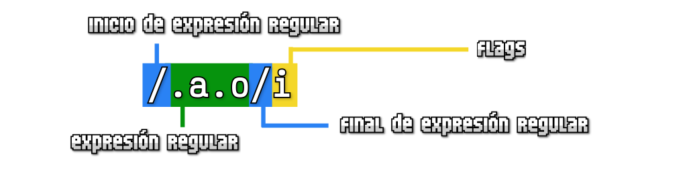

<!-- _class: cover -->
<style scoped>
section {
  --cover: url(../assets/img_00017_.png);
}
</style>
# Eventos (Javascript)
## Contenidos
- Eventos en Javascript
- Propagación/optimización de eventos
- API modernas relacionadas
- Expresiones regulares


> Inspirado en el bootcamp de <br><strong>Manz.dev</strong> todos los créditos a el.

---

## Evento Javascript

- ¿Qué es un evento? Es un suceso, algo que ocurre en una página
- Generalmente, provocado por el usuario (aunque no siempre)
- Ocurre evento → se ejecuta una función asociada
- Ejemplos clásicos: click de ratón, pulsación de una tecla, descarga de una imagen, etc...
- [Cheatsheet Javascript](https://lenguajejs.com/javascript/cheatsheets/) (última página)


---

## Formas de escuchar eventos

- ❌ Desde HTML (fácil): Atributo HTML prefijado con on
- ❌ Desde DOM/BOM (legacy): Propiedad ``.on*``
- ✅ Desde listeners de JS: Método ``.addEventListener()``

<steps>
<step>

```html
<button onClick="warning()">Warning!</button>

<script>
  function warning() {
    alert("¡Me has pulsado, sacrilegio!");
  }
</script>
```
</step>
<step>

```html
<button class="warning">Warning!</button>

<script>
  const warning = document.querySelector(".warning");
  warning.onclick = function() {
    alert("¡Me has pulsado, sacrilegio!");
  }
</script>
```
</step>
<step>

```html
<button class="warning">Warning!</button>
<script>
  const warning = document.querySelector(".warning");
  🟥 warning.addEventListener("click", alert("¡Me has pulsado, sacrilegio!"));
  🟧 warning.addEventListener("click", function() { alert("¡Me has pulsado, sacrilegio!") });
  🟩 warning.addEventListener("click", () => alert("¡Me has pulsado, sacrilegio!")); // arrow function
</script>
```
</step>
</steps>

---
## El método .removeEventListener()

- ✅ El problema: MISMA función
- ❌ Magias arcanas: ``bind()``, ``call()`` o ``apply()``
- 🕑 Fugas de memoria (ver más adelante)

<steps>
<step>

```html
<button class="warning">Warning!</button>

<script>
  const warning = document.querySelector(".warning");
  const action = () => alert("¡Me has pulsado, sacrilegio!");

  warning.addEventListener("click", action);      // Añade un listener
  warning.removeEventListener("click", action);   // Elimina el listener
</script>
```
</step>
<step>

```html
<button class="warning">Warning!</button>

<script>
  const warning = document.querySelector(".warning");

  warning.addEventListener("click", () => alert("¡Me has pulsado, sacrilegio!"));      // ❌
  warning.removeEventListener("click", () => alert("¡Me has pulsado, sacrilegio!"));   // ❌
  // ❌ No es la misma función, por lo que no la retira
</script>
```
</step>
</steps>

---
## Forma «automágica» de gestionar eventos

- La función mágica ``handleEvent()`` a nivel global, de objeto o clase

<steps>
<step>

```js
const button = document.querySelector("button");

function handleEvent(ev) {
  if (ev.type === "click") alert("Click detectado!");
  else if (ev.type === "mouseleave") alert("MouseLeave detectado!");
}

button.addEventListener("click", globalThis);
button.addEventListener("mouseleave", globalThis);
```
</step>
<step>

```js
const button = document.querySelector("button");

const eventControl = {
  handleEvent: (ev) => {
    if (ev.type === "click") alert("Click detectado!");
    else if (ev.type === "mouseleave") alert("MouseLeave detectado!");
  }
}
button.addEventListener("click", eventControl);
button.addEventListener("mouseleave", eventControl);
```
</step>
<step>

```js
class EventControl {
  constructor() {
    const button = document.querySelector("button");
    button.addEventListener("click", this);
    button.addEventListener("mouseleave", this);
  }

  handleEvent(ev) {
    if (ev.type === "click") alert("Click detectado!");
    else if (ev.type === "mouseleave") alert("MouseLeave detectado!");
  }
}

const ec = new EventControl();
```
</step>
</steps>

---
## Parámetros de .addEventListener()

- 🕑 El parámetro capture (ver más adelante, Propagación de eventos)
- ✅ El parámetro once: Sólo se ejecua la primera vez
- ✅ El parámetro passive: No se puede cancelar su funcionalidad por defecto (mejora rendimiento)
- 🕑 El parámetro signal (ver más adelante, Interceptar señales)

```js
element.addEventListener("click", action, options);

element.addEventListener("click", () => {
  /* Aquí el código a ejecutar */
}, {
  once: true,
  passive: true
});
```

---
<!-- _class: cover -->
<style scoped>
section {
  --cover: url(../assets/img_00017_.png);
}
</style>

# Eventos

---

## Información en eventos

- Objeto ``Event`` en eventos (cada tipo de evento tiene un objeto asociado)
- Evento ``click`` → Objeto ``PointerEvent``
- No olvides la accesibilidad.

<split-slide>

```html
<button>Click me!</button>

<script type="module">
const button = document.querySelector("button");

button.addEventListener("click", (ev) => {
  console.log(ev);
});
</script>
```
```js
// PointerEvent (Antiguamente MouseEvent) → Event
{
  clientX: 42,
  clientY: 48,
  detail: 1,
  target: button,
  type: "click",
  pointerType: "mouse",
  ctrlKey: false,
  altKey: false,
  shiftKey: false,
  ...
}
```
</split-slide>

---

## Eventos de teclado

- Evento ``keydown`` / ``keyup``
- Escuchar un elemento o en la página completa ``document``

<split-slide>

```html
<input type="text">

<script type="module">
const input = document.querySelector("input");

input.addEventListener("keydown", (ev) => {
  console.log(ev);
});
</script>
```

<div>

- Objeto KeyboardEvent
- Propiedades → ✅ code (keyF), ✅ key (f)
- Deprecated → ❌ keyCode (70), ❌ which (70)
### Otros ejemplos:
- Ejemplo de [SuperMario](https://codepen.io/manz/pen/pvbOZLY)
- Ejemplo de [KeyDrummer](https://manzdev.github.io/twitch-keydrummer/)
- Ejemplo de [Keyboard](https://lenguajejs.com/eventos/eventos-navegador/keyboard-event/#ejemplo-con-keydownkeyup)

</div>

</split-slide>

---

## Eventos en ratón

- Evento ``mouseEnter`` / ``mouseLeave``

<split-slide>

```html
<div class="box">0</div>

<script type="module">
const box = document.querySelector(".box");

box.addEventListener("mousedown", (ev) => {
  const oldNumber = Number(box.textContent);
  const isLeft = ev.button === 0;
  const isRight = ev.button === 2;
  box.textContent = oldNumber + (isLeft ? +1 : -1);
});
</script>
```

<div>

- Recuerda: ``Number()`` es un typecast (fuerza a otro tipo)
- Propiedad ``.button`` → Devuelve que botón de ratón se pulsó
- Ternario → ``condición ? true : false`` → ``if`` compacto
- Eventos relacionados: ``mouseUp``, ``mouseOver``, ``mouseMove``, etc...
- Para ocultar menú contextual: evitar evento ``menucontext``
- Ejemplo con ``mouseEnter`` → [Move Enter](https://codepen.io/alons182/pen/ZYpPvmW)

</div>

</split-slide>

---

## Evitar acción por defecto

- Método ``.preventDefault()``
- Propiedad booleana ``.defaultPrevented`` (false, por defecto)

```js
const details = document.querySelector("details");

details.addEventListener("click", (ev) => {
  ev.preventDefault();                            // Cancela la acción por defecto
  // Aquí puede ir nuestra lógica
  details.open = details.open ? false : true;     // Reimplementamos o modificamos la lógica
});
```

---

## Eventos multimedia

<split-slide style="--left: 60%; --right: 40%; --font-size: 1rem;">

```html
<audio controls src="./bootcamp.mp3"></audio>
<div class="status"></div>

<script type="module">
  const audio = document.querySelector("audio");
  const status = document.querySelector(".status");

  const register = (text) => {
    status.setHTMLUnsafe(`Evento disparado: ${text}<br>${status.getHTML()}`);
  };

  audio.addEventListener("play", (ev) => register("start play"));
  audio.addEventListener("pause", (ev) => register("pause"));
  audio.addEventListener("ended", (ev) => register("start end"));
  audio.addEventListener("seeking", (ev) => register("seeking"));
  audio.addEventListener("seeked", (ev) => register("seeked"));
  audio.addEventListener("volumechange", (ev) => register("change volume"));
  audio.addEventListener("ratechange", (ev) => register("change speed rate"));
</script>
```
<div>
<iframe width="100%" height="200" src="../assets/audio.html"></iframe>

- Evento ``play`` / ``pause`` / ``ended``
- Evento ``seeking`` / ``seeked``
- Evento ``volumechange`` / ``ratechange``
</div>
</split-slide>


---

## Eventos de input (foco)

<split-slide style="--left: 60%; --right: 40%;">

```html
<input type="text">
<div class="status"></div>

<script type="module">
  const input = document.querySelector("input");
  const status = document.querySelector(".status");

  const register = (text) => {
    status.setHTMLUnsafe(`
      Evento disparado: ${text}
      <br>${status.getHTML()}
    `);
  };

  input.addEventListener("focus", (ev) => register("focus"));
  input.addEventListener("blur", (ev) => register("blur"));
</script>
```
<div>
<iframe width="100%" height="200" src="../assets/focus.html"></iframe>

- Un elemento tiene el foco → pasa a estar activo
- Un elemento pierde el foco → pasa a estar inactivo
</div>
<split-slide>


---

## Eventos de Drag & Drop

<split-slide style="--left: 50%; --right: 50%; --font-size: 0.9rem;">

```html
<section>
  
  
  <div class="box"></div>
</section>
<div class="status"></div>

<script type="module">
  const duck = document.querySelector(".duck");
  const cat = document.querySelector(".cat");
  const box = document.querySelector(".box");
  const status = document.querySelector(".status");

  const register = (text) => { /* ... */ };

  duck.addEventListener("dragstart", () => register("Moving duck..."));
  cat.addEventListener("dragstart", () => register("Moving cat..."));
  box.addEventListener("dragenter", () => register("Enter on box"));
  box.addEventListener("dragover", (ev) => ev.preventDefault());
  box.addEventListener("drop", () => register("Drop on box"));
</script>
```
<div>
<iframe width="100%" height="300" src="../assets/dragdrop.html"></iframe>
</div>
</split-slide>

---
<!-- _class: cover -->
<style scoped>
section {
  --cover: url(../assets/img_00018_.png);
}
</style>
# Propagación de eventos


---
## Propagación de eventos
- ¿Cómo funciona la propagación?
- Capture: Desde raíz al elemento / Bubbles: Desde elemento al raíz
- Ejemplo en vivo → ``DOMEvents``
<video width="800" autoplay="" loop="" src="https://lenguajejs.com/eventos/control/propagacion-eventos/propagacion-eventos-capture-bubbles.mp4"><br>
</video>

---

## Eventos nativos (click)
- Ejemplo más adelante, primero entendamos el código:

<split-slide style="--left: 50%; --right: 50%; --font-size: 1rem;">

```html
<div class="container"> <!-- ← Listener aquí -->
  <div class="element">
    <div class="red"></div>
  </div>
</div>

<script type="module">
const container = document.querySelector(".container");
const status = document.querySelector(".status");

const update = (ev) => {
  console.log("Target: ", ev.target.className);
  console.log("currentTarget: ", ev.currentTarget.className);
}

container.addEventListener("click", (ev) => update(ev));
</script>
```

<steps>
<step>

- Escuchamos evento ``click`` en ``.container``
- Importa si pulsamos ``.container``, ``.red`` o ``.element``
- Si pulsas ``.container``, sólo pulsas ese
- Si pulsas ``.red``, estás pulsando el resto también
- En la función ``update()``:
  - ``ev.target`` → Origen del evento
  - ``ev.currentTarget`` → Elemento actual (``bubbles`` DOM)
  - ``ev.relatedTarget`` → Sólo en eventos como ``mouseEnter`` (procedencia/destino)

</step>
<step>

- 🖱 Hacemos click en ``.container``:
(evento 🫧 pero aquí no importa, no se ve, escuchamos directamente)
  - ``ev.target`` → ``.container``
  - ``ev.currentTarget`` → ``.container``
- 🖱 Hacemos click en ``.red``
(evento 🫧 → ``.element`` → ``.container`` → ``body`` → ``document`` → ``window``)
  - ``ev.target`` → ``.red``
  - ``ev.currentTarget`` → ``.container``

</step>
<step>

```js
const update = (ev) => {

  console.log(ev.composedPath());
  // [.red, .element, .container, section, body, html, document, window]

}
```
- Con ``.composedPath()`` obtienes el camino del evento
- Ejemplo de [propagación de eventos](https://codepen.io/manz/pen/XJKxbeY)

</step>
</steps>

</split-slide>

---
## Eventos personalizados (Custom Events)
- Custom Events → ``new CustomEvent()``
- Enviar eventos con ``.dispatchEvent()`` y escucharlos con ``.addEventListener()``
- Se recomienda usar namespaces para controlar mejor: ``control:received``

```js
const options = {
  bubbles: true,                    /* Por defecto, false */
  composed: true,                   /* Por defecto, false (muy importante en el futuro) */
  cancelable: true,                 /* Por defecto, false */
  detail: { /* Información */ }     /* Por defecto, null */
};
const event = new CustomEvent("messagereceived", options);
element.dispatchEvent(event);

container.addEventListener("messagereceived", (ev) => { /* ... */ });

```

---
<!-- _class: cover -->
<style scoped>
section {
  --cover: url(../assets/img_00019_.png);
}
</style>
# Optimización
- Delegación de eventos
- Interceptar eventos
- Disparar por visibilidad
- Otro tipo de eventos

---
## Delegación de eventos
- [Delegación de eventos](https://lenguajejs.com/eventos/performance/delegacion-eventos/): En lugar de muchos listeners, solo uno desde el padre

```html
<ul class="tasks">
  <li>Task #1 <button class="delete">×</button></li>
  <li>Task #2 <button class="delete">×</button></li>
</ul>

<script>
const tasks = document.querySelector(".tasks");
tasks.addEventListener("click", (ev) => {
  if (ev.target.classList.contains("delete"))
    ev.target.parentElement.remove();
});
</script>
```

---
## Interceptar eventos
- [AbortController](https://lenguajejs.com/eventos/performance/abortcontroller/): Cancelar eventos mediante señales

```js
const controller = new AbortController();
const options = {
  signal: controller.signal
};

document.addEventListener("click", () => console.log('Click detectado'), options);

// Esta función se lanza cuando interesa cancelarlo (ej: timer a los 30 seg)
const cancelEvent = () => {
  controller.abort();
  console.log("Listener removido");
};
```

</div>

---
## Disparar eventos por redimensión
- ``ResizeObserver``: Detecta cuando se redimensiona la ventana y quieres ejecutar código más eficientemente.

<split-slide style="--left: 30%; --right: 70%; --font-size: 1.1rem;">

```html
<div class="element"></div>

<style>
.element {
  background: deeppink;
  min-height: 200px;
}

.compact {
  background: indigo;
}
</style>
```
<steps>
<step>

```js
const element = document.querySelector(".element");

// ❌ Antes: "resize" (Se dispara muchas veces)
globalThis.addEventListener("resize", () => {
  const { width } = element.getBoundingClientRect();

  if (width < 400)
    element.classList.add("compact");
  else
    element.classList.remove("compact");
});
```
</step>
<step>

```js
const element = document.querySelector(".element");

// ✅ Ahora: "ResizeObserver" (se agrupa y dispara de forma más controlada)
const observer = new ResizeObserver((entries) => {
  entries.forEach(entry => {
    const { width } = entry.contentRect;

    if (width < 400)
      element.classList.add("compact");       // El elemento es estrecho
    else
      element.classList.remove("compact");    // El elemento tiene espacio
  });
});

observer.observe(element);
```
</step>
</steps>
</split-slide>

---
## Disparar eventos por visibilidad
- IntersectionObserver: Detectar cuando elementos son visibles eficientemente → Mira la clase en el inspector

<split-slide style="--left: 30%; --right: 70%; --font-size: 1.1rem;">

```html
<div class="element"></div>

<style>
body { height: 2000px }

.element {
  width: 200px;
  height: 200px;
  background: deeppink;
  position: absolute;
  top: 1000px;
}
</style>
```
<steps>
<step>

```js
const element = document.querySelector(".element");

// ❌ Antes: "scroll" (Se dispara muchas veces)
globalThis.addEventListener("scroll", () => {
  const rect = element.getBoundingClientRect();
  if (rect.top < window.innerHeight) { /* ... */ }
});
```
</step>
<step>

```js
const element = document.querySelector(".element");

// ✅ Ahora: "IntersectionObserver" (se agrupa y dispara de forma más controlada)
const observer = new IntersectionObserver((entries) => {
  entries.forEach(entry => {
    if (entry.isIntersecting)
      element.classList.add("visible");       // El elemento es visible
    else
      element.classList.remove("visible");    // El elemento deja de ser visible
  });
});

observer.observe(element);
```
</step>
</steps>
</split-slide>


---
<!-- _class: cover -->
<style scoped>
section {
  --cover: url(../assets/img_00020_.png);
}
</style>
# APIs modernas
- Storage
- SpeechSynthesis
- BroadcastChannel
- WebSockets

---

## Storage API
- Storage API → dos apis ``localStorage`` y ``sessionStorage``
- Acceso a un almacenamiento por dominio / sólo en la pestaña actual en ``sessionStorage``
- Duración → Persistentes en ``localStorage`` / Sólo en sesión actual en ``sessionStorage``
- Capacidad → ``~10MB`` (puede variar dependiendo del navegador)
- Evento tipo ``StorageEvent``

<steps>
<step>

```js
localStorage.length                       // 0 (información almacenada)
localStorage.setItem("name", "Alons");  // Guarda información en la key "name"
localStorage.key(0);                      // Devuelve la key número 0 → "name"
localStorage.getItem("name");             // Obtiene la key "name" → "Alons"
localStorage.removeItem("name");          // Elimina la key "name"
localStorage.clear();                     // Vacía el almacén de ese dominio

// Usando "sessionStorage" en lugar de "localStorage" → se guarda sólo durante la sesión actual
```
</step>
<step>

```js
// Se dispara cuando cambian almacénn desde otra pestaña...
globalThis.addEventListener("storage", (ev) => {
  console.log(ev.key);        // key implicada
  console.log(ev.newValue);   // valor nuevo
  console.log(ev.oldValue);   // valor anterior
});
```
</step>
</steps>

---
## SpeechSynthesis API
- [SpeechSynthesis](https://lenguajejs.com/javascript/web-apis/speechsynthesis/): Sintetizar texto a voz (TTS)
- Dependiendo del navegador, puedes tener más o menos voces

<steps>
<step>

```js
const text = "¿Aún no has dejado un comentario en Youtube?";
const message = new SpeechSynthesisUtterance(text);
speechSynthesis.speak(message);

const voice = speechSynthesis.getVoices().find(voice => voice.name.includes("Google español"));
message.voice = voice;
speechSynthesis.speak(message);

message.pitch = 0.5; // 0 - 2
message.rate = 0; // 0 - 2
speechSynthesis.speak(message);
```
</step>
<step>

```js
const text = "¿Aún no has dejado un comentario en Youtube?";
const message = new SpeechSynthesisUtterance(text);

message.addEventListener("boundary", (ev) => {
  const isWord = ev.name === "word";
  const start = ev.charIndex;
  const end = ev.charIndex + ev.charLength;
  if (isWord) console.log(message.text.substring(start, end));
});
speechSynthesis.speak(message);
```
</step>
</steps>


---

## BroadcastChannel API
- [BroadcastChannel](https://lenguajejs.com/eventos/tiempo-real/broadcastchannel/): Envío de eventos entre ventanas/pestañas del navegador → [Ejemplo](https://x.com/ahzam_shahnil/status/1937582661955997872)
- Necesario: Abierto con el mismo navegador.

```js
// Creamos un canal con un nombre único
const channel = new BroadcastChannel("channel");
channel.postMessage({ type: "logout" });

// En las otras pestañas, escuchamos ese canal
const channel = new BroadcastChannel("channel");
channel.addEventListener("logout", () => {
  /* ... */
});
```

---

## Websockets API
- [Websockets](https://lenguajejs.com/eventos/tiempo-real/websocket/): Envío de eventos de alto rendimiento en tiempo real


```js
import { client } from "https://unpkg.com/mtmi@0.0.8/dist/mtmi.js";

client.connect({ channels: ["alons"] });

client.on("message", ({ username, channel, message }) => {
  console.log(`${channel} [${username}]: ${message}`);
});
```


---

## RESUMEN: ¿Por qué eventos?
- Los eventos son una forma poco intrusiva de comunicarse.
- Si comunicas directamente, al eliminar uno de los componentes, rompes todo.
- Los eventos se transmiten y sólo los toma al que le interesa.
- En caso contrario, se descartan.

---
## Expresiones regulares

- Sirven para buscar, capturar o reemplazar textos utilizando patrones.
- Sintaxis de la RegExp → sintaxis
- [Flags de RegExp](https://lenguajejs.com/javascript/regexp/flags/)

<split-slide>

```js
const regexp = new RegExp("A.ns");
const regexp = /A.ns/; // . significa 
// "cualquier carácter"

regexp.test("Hola");       // false
regexp.test("Alons");       // true
regexp.test("Alonso");    // true
regexp.test("ALONS");       // false

/A.ns/i.test("ALONS");      // true  
// (flag "i" ignora minus/mayus)

```



</split-slide>

---
## Comprobación con/sin RegExp
- Sistema de validación de nombres que empiezan por ``s`` o ``p`` y acaben en ``o`` o ``a``.

<steps>

<step>

```js
const names = ["Pedro", "Sara", "Miriam", "Nestor", "Adrián", "Sandro"];

// Sin usar Regexp
names.forEach((name) => {
  const firstLetter = name.at(0).toLowerCase();
  const lastLetter = name.at(-1).toLowerCase();

  if ((firstLetter === "p" || firstLetter === "s") &&
    (lastLetter === "o" || lastLetter === "a")) {
    console.log(`El nombre ${name} cumple las restricciones.`);
  }
});
```

</step>

<step>

```js
// Usando Regexp
names.forEach((name) => {
  const regex = /^(p|s).+(o|a)$/i;

  if (regex.test(name)) {
    console.log(`El nombre ${name} cumple las restricciones.`);
  }
});
```

</step>

<step>

```js
const names = ["Pedro", "Sara", "Miriam", "Nestor", "Adrián", "Sandro"];

// Sin usar Regexp (apoyo en Booleanos)
names.forEach((name) => {
  const firstLetter = name.at(0).toLowerCase();
  const lastLetter = name.at(-1).toLowerCase();
  const startsOk = "ps".includes(firstLetter);
  const endsOk = "oa".includes(lastLetter);
  const isValidName = startsOk && endsOk;

  if (isValidName)
    console.log(`El nombre ${name} cumple las restricciones.`);
});
```

</step>

</steps>

---
## Ejecutar búsquedas con RegExp
- Aprende más sobre [Expresiones regulares](https://lenguajejs.com/javascript/regexp/crear-expresiones-regulares/)
- Juego para aprender expresiones regulares con pattern de HTML → [Pattern People](https://manzdev.github.io/regex-people/)

<split-slide style="--left: 50%; --right: 50%; --font-size: 1rem;">

```js
const text = `
2026-04-24 Estudiar contenido de Javascript.
2026-05-12 Dejar comentarios en su Youtube.
2026-09-03 Hacer una aplicación web con Opencode.
2027-03-19 Desplegarlo a GitHub Pages.
2028-08-22 Descansar.
`;

1️⃣ const regexp = /([0-9]{4})-([0-9]{2})-([0-9]{2})/g;

2️⃣ const regexp = /([0-9]{4})-([0-9]{2})-([0-9]{2})/gd;

3️⃣ const regexp =
  /(?<year>[0-9]{4})-(?<month>[0-9]{2})-(?<day>[0-9]{2})/g;
```

<steps>

<step>

```js
// Caso 1
// Ejecuta una iteración de búsqueda
regexp.exec(text);

['2026-04-24', '2026', '04', '24']  // Parentizar
→ index: 1  // Posición donde aparece

// Una nueva iteración
regexp.exec(text);

['2026-05-12', '2026', '05', '12']
→ index: 55

// Tras varias iteraciones, devuelve null
regexp.exec(text);

```

</step>

<step>

```js
// Caso 2 (flag d, indices)
// Ejecuta una iteración de búsqueda
regexp.exec(text);

['2026-04-24', '2026', '04', '24']  // Igual
→ indices: [
    [1, 11],   // Fecha completa (desde, hasta)
    [1, 5],    // Año (desde, hasta)
    [6, 8],    // Mes (desde, hasta)
    [9, 11]    // Día (desde, hasta)
  ];

// Puedes continuar ejecutando...

```

</step>

<step>

```js
// Caso 3 (parentización nombrada)
// Ejecuta una iteración de búsqueda
regexp.exec(text);

['2026-04-24', '2026', '04', '24']  // Igual
→ groups: {
  day: "24",
  month: "04",
  year: "2026"
};

// Puedes continuar ejecutando...

```

</step>

</steps>

</slit-slide>


---
## Referencias

- [CheatSheet Javascript](https://lenguajejs.com/javascript/cheatsheets/)
- [bootcamp.manz.dev](https://bootcamp.manz.dev/)

<script src="../assets/steps.js"></script>
