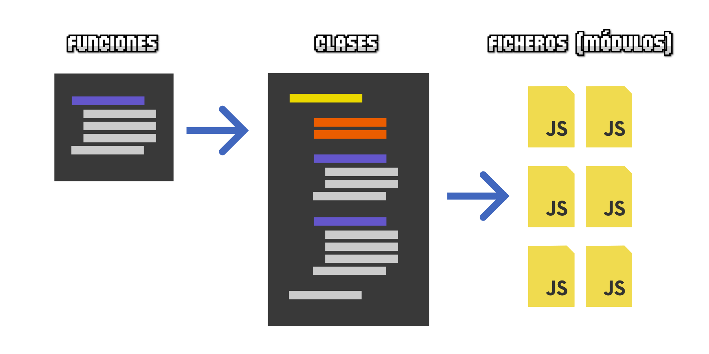

<!-- _class: cover -->
<style scoped>
section {
  --cover: url(../assets/img_00026_.png);
}
</style>
#  Javascript (Módulos)
## Contenidos
- Módulos Javascript
- Importación y exportación de módulos
- Otros módulos (CSS/JSON/...)
- Estructura y organización de lógica


> Inspirado en el bootcamp de <br><strong>Manz.dev</strong> todos los créditos a el.

---

## Javascript

- En una web, tenemos dos formas de ejecutar Javascript:

<split-slide>

 ```html
 <script>
  // Javascript tradicional
  const message = "Hola Alons!";
  console.log(message);
</script>

<!--
 🛑 Navegador bloquea la lectura de HTML
 ➡ Navegador atiende al JS inmediatamente
 ✅ Al terminar, continua con HTML
-->
```
```html
<script type="module">
  // Como módulo Javascript
  const message = "Hola Alons!";
  console.log(message);
</script>

<!--
 ⬇ Navegador descarga JS (pero no ejecuta)
 ✅ Navegador continua leyendo el HTML
 ✅ Al terminar todo el HTML, ejecuta el JS
-->
```

</split-slide>

- Ya no es necesario usar eventos ``DOMContentLoaded`` / ``$(document).ready()`` (jquery) o añadir el ``<script>`` antes del ``</body>``.


---

## ¿Qué es un módulo?

- Históricamente, Javascript no se podía separar en varios archivos
- Los módulos solucionan este problema desde 2015 → [Módulos ESM](https://lenguajejs.com/javascript/modulos/que-es-esm/)


---
## Un poco de historia para tener contexto...


<steps>
<step>
<split-slide>

```js
var module = (function () {
  /* Data */
  /* Methods */

  // Revealing module
  return {
    /* Public data/methods */
  };
})();

module.data;        // Acceder a datos
module.method();    // Acceder a métodos
```
<div>

## Antes de 2015
- Antes de los módulos, se popularizó un patrón
- El patrón **Módulo revelador**
- Se basa en una **IIFE** (Función ejecutada inmediatamente)
- Una clausura mantiene los datos y métodos en ese módulo
- Devuelves sólo la información que te interesa
- Es algo así como una clase (cuando no existían)
</div>
</split-slide>
</step>
<step>
<split-slide>

```js
define(['dep1', 'dep2'], function (dep1, dep2) {
  /* ... */

  return {
    /* ... */
  };
});
```
<div>

## AMD: Asynchronous Module Definition
- Se define el nombre de las dependencias (parámetro 1)
- Se define la función a ejecutar (parámetro 2)
- Implementaciones como las de [require.js](https://requirejs.org/)
- Era prometedor, pero llegó tarde
- Los módulos ESM lo dejaron obsoleto
</div>
</split-slide>
</step>
<step>
<split-slide>

```js
// Importar
const module = require("./module-name.js");
const package = require("package");

module.method();

// Exportar
module.exports = {
  /* ... */
}


```
<div>

## CommonJS (CJS)
- La que terminó adoptando Node
- Usa ``require()`` para cargar / ``module.exports`` para exportar
- Librerías antiguas las siguen usando y la «ocultan» con bundlers
- [npmx.dev](https://npmx.dev/package/react) / [node-modules.dev](https://node-modules.dev/)
- ❌ No la sigas usando
- Historia de Javascript → [CommonJS vs ESM](https://lenguajejs.com/nodejs/fundamentos/commonjs-vs-esm/)
</div>
</split-slide>
</step>
</steps>


---
## Módulos ESM

- ¿Cómo se usan los módulos Javascript? (ESM)


```js
// Importaciones
import { data } from "./file.js";

// Exportaciones
export const LIFE_UNIVERSE_ANSWER = 42;
export class Human { /* ... */ }
export const method = () => {
  /* ... */
}
```


---
## Importar un módulo

- Siempre en la parte superior del archivo ``.js`` (o ``<script>``)

```html
<script>
  import { LIFE_UNIVERSE_ANSWER } from "./module.js";   // ❌ No funciona
</script>
```

- **ERROR**: Uncaught SyntaxError: Cannot use import statement outside a module

```html
<script type="module">
  import { LIFE_UNIVERSE_ANSWER } from "./module.js";   // ✅ Funciona
</script>
```

---
## Más opciones de importación

```js
// Importamos y renombramos
import { LIFE_UNIVERSE_ANSWER as lifeAnswer } from "./module.js";

// Importamos varios elementos
import { one, two, three } from "./module.js";

// Importamos en un "namespace"
import * as data from "./file.js";

/* Equivale a... */
const data = {
  one: /* ... */,
  two: /* ... */,
}
```


---
## Importaciones por defecto
- El nombre se elige en el ``import``. Ejemplo: Usamos ``Data`` pero puede ser otro.
- Pueden parecer cómodas, pero están ligeramente mal vistas (son menos intuitivas).
- Úsalas sólo si las otras importaciones (nombradas) no te sirven

<split-slide>

```js
import Data from "./module.js";

// Data = () => 42;
```
```js
// export default 42;

export default () => {
  /* ... */
  return 42;
}

export const HELLO = () => "Hello world";
```
</split-slide>

---
## Ruta de los módulos
- Siempre deben empezar por ``.`` o por ``/``.
- Rutas relativas → empiezan por ``./`` o ``../``
- Rutas absolutas → empiezan por ``/``
- También puede indicarse una URL/CDN: empezar por ``http`` → (✅ Browsers ✅ Deno ❌ Bun ❌ Node)

```js
import { element } from "./module.js";                  // Ruta actual
import { element } from "../module.js";                 // Ruta anterior
import { element } from "/module.js";                   // Ruta raíz
import { element } from "https://alons.dev/module.js";   // Ruta absoluta
import { element } from "package";                      // Bare imports (ver más adelante)
import { element } from "node:module";                  // Backend (ver tema de NodeJS)
```

---
## Uso de CDN
- [unpkg](https://unpkg.com/), que trae un paquete o librería de NPM
- [JSDelivr](https://www.jsdelivr.com/), open source, de NPM también
- [CDNjs](https://cdnjs.com/), de Cloudflare
- Cuidado al usar desde URL de terceros → Dependencia de esa web

```js
import { Howl } from "https://unpkg.com/howler?module";
/* Se redirecciona a: https://unpkg.com/howler@2.2.4/dist/howler.js?module */

import { Howl } from "https://cdn.jsdelivr.net/npm/howler@2.2.4/+esm";

/* ⚠ Algunas puede que no funcionen si la librería no está hecha con módulos ESM */
import { Howl } from "https://cdnjs.cloudflare.com/ajax/libs/howler/2.2.4/howler.min.js";
```

---
## Bare imports
- Importaciones "desnudas" → [Bare imports](https://lenguajejs.com/javascript/modulos/import-map/#qu%C3%A9-es-un-bare-import)
- No son estándar (recordemos que fue un invento de NodeJS)

```js
// Esto generalmente significa que va a buscar el paquete en la carpeta `howler`,
// dentro de la carpeta `node_modules/`
import { Howl } from "howler";

```

- ✅ Cómodo de escribir
- ❌ Dependes de NodeJS (si no tienes Node, no funciona)
- ❌ No funciona en browsers directamente (salvo que uses un transpilador)

---
## Import Maps

<split-slide>
<div>

```js
import { element } from "package";

```
- Si usamos Node, busca el paquete en la carpeta ``node_modules/``.
- [Import Maps](https://lenguajejs.com/javascript/modulos/import-map/) sirven como índices.
- Se puede redireccionar a ficheros concretos, URL/CDN, carpetas o incluso alias.
- JSON **externos** aún no soportados. [¿O si?](https://lea.verou.me/blog/2026/external-import-maps-today/)
  - No uses ``src``, no está soportado aún
  - Usa ``import`` o ``fetch`` + DOM
</div>

```html
<script type="importmap">
  {
    "imports": {
      "package": "/node_modules/package_folder/index.js",
      "other": "https://unpkg.com/package-name/index.js",
      "folder/": "https://unpkg.com/package-name/",
      "./rename.js": "https://unpkg.com/package-name/index.js"
    }
  }
</script>
```

</split-slide>


---
<!-- _class: cover -->
<style scoped>
section {
  --cover: url(../assets/img_00027_modules.png);
}
</style>

# Barrels


---

## Barrel imports
- ¡Evitarlos! (o al menos ser muy cuidadoso si usas transpiladores) → [Razones](https://lenguajejs.com/javascript/modulos/barrel-imports/)
- ✅ Ventajas: Rutas cortas, centralizado todo en un "barrel".
- ❌ Desventajas: Herramientas automáticas no pueden optimizar con **tree-shaking** (Ver más adelante)
<split-slide>

```js
// index.js
import { module1, module2, module3 } from "./modules/barrel.js";
```
```js
// /modules/barrel.js
export { module1 } from "./module1.js";
export { module2 } from "./module2.js";
export { module3 } from "./module3.js";
```
</split-slide>

---

## Import estáticos
- Hasta ahora, lo que hemos visto son los ``import`` estáticos

<split-slide>

```js
import { fx } from "./module.js";        // ✅

if (isValid) {
  import { element } from "./file.js";   // ❌
  import { other } from `./${name}.js`;  // ❌
}
```
<div>

- ❌ Deben hacerse al principio
- ❌ No puedes interpolar datos
- ⚠️ Siempre carga el módulo completo, se use o no
- ❌ No puedes importar si depende de otra cosa (síncrono)
- ❌ Sólo válidos en un ``<script type="module">``
</div>
</split-slide>

---

## Import dinámicos

<split-slide>

```js
if (isValid) {
  const mod = await import("./file.js");    // ✅
  const mod = await import(`./${name}.js`); // ✅
}

// ✅ Lazy load (sólo cuando ocurre el evento)
button.addEventListener("click", async () => {
  const module = await import("./bigModule.js");
  module.init();
});
```
<div>

- ✅ No es necesario que estén al principio
- ✅ Puedes interpolar datos
- ✅ Se puede importar de forma condicional
- ✅ Es asíncrono
- ✅ Se puede ejecutar en un ``<script>``
(en una IIFE autoejecutable)
</div>
</split-slide>

---

## ¡No sólo módulos Javascript!
- ¡Se vienen nuevos módulos! → [Otros módulos](https://lenguajejs.com/javascript/modulos/import-with-type/)

<steps>
<step>
<split-slide style="--left: 50%; --right: 50%; --font-size: 1rem;">

```js
import songs from "./songs.json" with { type: "json" };

// Equivalente a:
const songs = [
  { name: "No quiero cambiar", author: "Alons" },
  { name: "Resolví el problema", author: "Alons" }
];
```
<div>

- Módulos JSON
- Equivale a leer un ``.json`` + parsearlo
- ✅ Soporte completo → [CanIUse](https://caniuse.com/wf-json-modules)
</div>
</split-slide>
</step>
<step>
<split-slide style="--left: 50%; --right: 50%; --font-size: 1rem;">

```js
// No funciona en browsers
import styles from "./songs.css";

// Equivalente a:
const styles = `
body {
  background: indigo;
  color: white;
}`;
```
<div>

- Importar estilos (usado en frameworks)
- ❌ No son módulos (lentos, ineficientes)
- ❌ Requieren transpiladores (vite, webpack, etc...)
- 📄 Importan strings (cadenas de texto)
</div>
</split-slide>
</step>
<step>
<split-slide style="--left: 50%; --right: 50%; --font-size: 1rem;">

```js
import styles from "./songs.css" with { type: "css" };

document.adoptedStyleSheets.push(styles);
element.shadowRoot.adoptedStyleSheet.push(styles);

// Equivalente a:
const styles = new CSSStyleSheet();
styles.replaceSync(`body {
  background: indigo;
  color: white;
}`);
document.adoptedStyleSheets.push(styles);
```
<div>

- Módulos CSS
- ✅ Importan un objeto CSSStyleSheet
- ✅ Funciona en el browser
- ✅ Permite modificarlo en tiempo real
- ✅ Eficiente, usa un objeto CSS
- 🟨 Soporte: Todos menos Safari
</div>
</split-slide>
</step>
<step>
<split-slide style="--left: 50%; --right: 50%; --font-size: 1rem;">

```js
import { container } from "./template.html" with { type: "html" };

document.body.append(container);

// Equivalente a:
const container = document.createElement("div");
div.classList.add("container");
div.textContent = "Hola, soy un container";   /* ... */
document.body.append(container);
```
<div>

- Módulos HTML
- ✅ Importan un objeto del DOM
- ✅ Funciona en el browser
- ✅ Te ahorra toda la gestión del DOM
- ✅ Ideal como motor de plantillas
- 🟥 Soporte: Aún en fase de propuesta
</div>
</split-slide>
</step>
<step>
<split-slide style="--left: 50%; --right: 50%; --font-size: 1rem;">

```js
import text from "./robots.txt" with { type: "text" };
import html from "./index.html" with { type: "text" };
import css from "./index.css" with { type: "text" };

// Equivalente a:
const text = `Disallow: /legal`;
```
<div>

- Módulos de texto
- ✅ Importa un fichero como texto plano
- ✅ Funciona en el browser
- ✅ Ideal para tratar contenido
- 🟥 Soporte: Aún en fase de propuesta
</div>
</split-slide>
</step>
<step>
<split-slide style="--left: 50%; --right: 50%; --font-size: 0.9rem;">

```js
import image from "./image.png" with { type: "bytes" };

// Equivalente en dynamic import()
const image = await import("./image.png", { with: { type: "bytes" }});

// Equivalente a (Deno):
const file = new URL("./image.png", import.meta.url);
const content = await Deno.readFile(file);
const image = new Uint8Array(content);

// Base64 → data:text/plain;base64,
const b64 = btoa(String.fromCharCode(...image));
console.log(b64);
```
<div>

- Módulos binarios
- ✅ Importa los bytes del fichero
- ✅ Funciona en el browser
- ✅ Ideal para contenido binario
- ✅ Deno ya lo soporta
- 🟥 Soporte: Aún en propuesta
</div>
</split-slide>
</step>
</steps>

---

## Patrón "nomodule"
- Si necesitas soporte para navegadores muy antiguos...
- Los navegadores modernos ejecutan ``modern.js`` e ignoran los ``<script nomodule>``
- Los navegadores antiguos no entienden el ``type="module"`` pero si cargan ``<script nomodule>``

```html
<script type="module" src="modern.js"></script>
<script nomodule src="legacy.js"></script>
```

---

## Recordemos:

<table>
<thead>
<tr>
<th>Script</th>
<th>Parsea HTML (sin bloquear)</th>
<th>Respeta orden</th>
<th>Cuándo ejecuta</th>
</tr>
</thead>
<tbody>
<tr>
<td><code>&lt;script&gt;</code> clásico</td>
<td></td>
<td></td>
<td>Inmediato</td>
</tr>
<tr>
<td><code>defer</code></td>
<td></td>
<td></td>
<td>Tras parsear HTML</td>
</tr>
<tr>
<td><code>async</code></td>
<td></td>
<td></td>
<td>Al terminar descarga</td>
</tr>
<tr>
<td><code>type="module"</code></td>
<td></td>
<td></td>
<td>Tras parsear HTML</td>
</tr>
<tr>
<td><code>type="module" async</code></td>
<td></td>
<td></td>
<td>Al terminar descarga</td>
</tr>
<tr>
<td><code>nomodule</code></td>
<td></td>
<td></td>
<td>Inmediato (si no soporta ESM)</td>
</tr>
</tbody>
</table>

- ⚠️ El parseo de HTML se puede bloquear si se descarga antes el Javascript.
- Los ``<script nomodule>`` se ignoran en navegadores modernos.
- Los ``<script>`` con ``defer`` o ``async`` sólo funcionan con ``src`` (no inline).
- El ``<script type="module" defer>`` es redundante.


---

## Módulo como gestor de estados

<split-slide style="--left: 50%; --right: 50%; --font-size: 1rem;">

```js
// Estado global (a nivel de módulo)
let state = { count: 0 };

// Se ejecuta cuando cambia (reactividad casera)
const subscribers = new Set();
export const getState = () => state;

// Actualiza estado y notifica a suscriptores
export const setState = (partial) => {
  state = { ...state, ...partial };
  subscribers.forEach(fn => fn(state));
}

// Suscribe función (se llama cuando cambia estado)
export const subscribe = (fn) => {
  subscribers.add(fn);
  return () => subscribers.delete(fn);  // Fn → cancela sub
}
```
```js
// ***** counter.js *****
import { getState, setState } from "./store.js";

// Actualiza el estado actual (incrementa en uno)
setState({ count: getState().count + 1 });

// ***** ui.js **********
import { subscribe } from "./store.js";

// Suscripción: Cuando haya cambios en el estado, ejecuta
subscribe(state => {
  console.log("Nuevo estado: ", state);
});
```
</split-slide>


---

## Módulos como bus de eventos
- Los módulos son un **singleton natural**. Sólo una instancia en memoria.

<steps>
<step>
<split-slide style="--left: 50%; --right: 50%; --font-size: 1rem;">

```js
// Módulo: EventBus.js

// Estructura para almacenar los eventos escuchados
const listeners = new Map();  // Map<ev, Set<funcion>>

// Obtiene el set de listeners de un evento
// (Si no existe, lo crea)
const getSet = (ev) => {
  let set = listeners.get(ev);
  if (!set) {
    set = new Set();
    listeners.set(ev, set);
  }
  return set;  // Siempre lo devuelve
}
```

```js
// Asocia una función a un evento
export const on = (ev, fn) => {
  const set = getSet(ev);
  set.add(fn);
  return () => set.delete(fn);  // Para dejar de escuchar
}

// Emite un evento (ejecuta todos sus listeners)
export const emit = (ev, payload) => {
  const set = listeners.get(ev);
  if (!set) return;

  for (const fn of set) {
    fn(payload);
  }
}
```

</split-slide>
</step>
<step>


```js
// A la hora de utilizar nuestro BUS de eventos:

// ***** user.js **********
import { emit } from "./eventBus.js";

emit("login", { user: "Alons" });

// ***** analytics.js *****
import { on } from "./eventBus.js";

on("login", (data) => {
  console.log("Usuario logueado: ", data.user);
});
```

---

## Estructura de carpetas

<steps>
<step>

```bash
📁 project-name
 ├── 📁 src
 │    ├── 🟧 index.html
 │    ├── 🟨 main.js
 │    ├── 📁 modules
 │    │    ├── 🟨 UserCard.js       # Tarjeta de usuario
 │    │    └── 🟨 ListUsers.js      # Lista de tarjetas de usuario
 │    │
 │    :
 :
```
- Hay que comenzar a separar en archivos individuales.
- Intenta que cada archivo tenga, como máximo, ~**150-300** líneas.

</step>

<step>

```bash
📁 project-name
 ├── 📁 src
 │    ├── 🟧 index.html
 │    ├── 🟨 main.js
 │    ├── 📁 modules
 │    │    ├── 🟨 UserCard.js       # Tarjeta de usuario
 │    │    ├── 🟥 UserCard.test.js  # Tests del módulo
 │    │    ├── 🟨 ListUsers.js      # Listas de usuarios
 │    │    └── 🟥 ListUsers.test.js # Tests del módulo
 │    :
 :
```

- Más adelante, añadiremos archivos para testear nuestro código.

</step>

<step>

```bash
📁 project-name
 ├── 📁 src
 │    ├── 🟧 index.html
 │    ├── 🟨 main.js
 │    ├── 📁 components   # De momento, módulos (más adelante también componentes)
 │    │    ├── 📁 UserCard
 │    │    │    ├── 🟨 UserCard.js       # Componente de tarjeta de usuario
 │    │    │    ├── 🟪 UserCard.css      # Estilos CSS del usuario
 │    │    │    └── 🟥 UserCard.test.js  # Tests del módulo
 │    │    └── 📁 ListUsers
 │    │         ├── 🟨 ListUsers.js      # Componente de lista de usuarios
 │    │         ├── 🟪 ListUsers.css     # Estilos CSS de la lista
 │    :         └── 🟥 ListUsers.test.js # Tests del módulo
 :
```
</step>

<step>

```bash
📁 project-name
 ├── 📁 src
 │    ├── 🟧 index.html
 │    ├── 🟨 main.js
 │    ├── 📁 components   # Aquí irán los componentes
 │    ├── 📁 modules      # Aquí módulos con features específicas
 │    :
 :
```
- Es buena práctica mantener los componentes sólo para la parte visual.
- En ``modules/`` o ``features/`` puedes añadir lógica separable y reutilizable.
- Existen muchas variaciones de estas arquitecturas.

</step>

<step>

```bash
📁 project-name
 ├── 📁 src
 │    ├── 📁 user-profiles   # Aquí todo lo relacionado con los usuarios
 │    │    ├── 📁 UserCard
 │    │    │    ├── 🟨 UserCard.js
 │    │    │    ├── 🟪 UserCard.css
 │    │    │    ├── 🟥 UserCard.test.js
 │    ├── 📁 listing         # Aquí todo lo relacionado con las listas de usuarios
 │    │    ├── 📁 ListUsers
 │    │    :
 │    :
 :
```

- Ej: **Screaming Architecture**, «grita» directamente carpetas con **lo que hace** en lugar de separar por tecnologías

</step>
</steps>


---
## Referencias

- [CheatSheet Javascript](https://lenguajejs.com/javascript/cheatsheets/)
- [bootcamp.manz.dev](https://bootcamp.manz.dev/)
- [Módulos ESM](https://lenguajejs.com/javascript/modulos/que-es-esm/)
- [CommonJS vs ESM](https://lenguajejs.com/nodejs/fundamentos/commonjs-vs-esm/)
- [require.js (AMD)](https://requirejs.org/)
- [npmx.dev](https://npmx.dev/)
- [node-modules.dev](https://node-modules.dev/)
- [Bare imports / Import Maps](https://lenguajejs.com/javascript/modulos/import-map/)
- [External Import Maps hoy](https://lea.verou.me/blog/2026/external-import-maps-today/)
- [Otros módulos (CSS/JSON/...)](https://lenguajejs.com/javascript/modulos/import-with-type/)
- [unpkg CDN](https://unpkg.com/)
- [JSDelivr CDN](https://www.jsdelivr.com/)
- [CDNjs (Cloudflare)](https://cdnjs.com/)


<script src="../assets/steps.js"></script>
