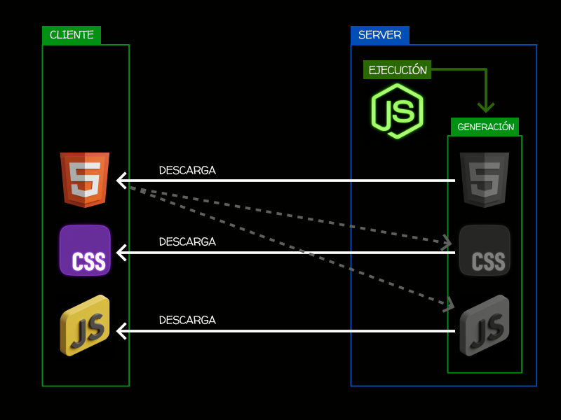

<!-- _class: cover -->
<style scoped>
section {
  --cover: url(../assets/img_00046_.png);
}
</style>
#  NodeJS
## Contenidos
- Primeros pasos
- Scripts con Node
- Trabajo con ficheros
- Servidor HTTP simple


> Inspirado en el bootcamp de <br><strong>Manz.dev</strong> todos los créditos a el.

---

<!-- _class: cover -->
<style scoped>
section {
  --cover: url(../assets/img_00047_.png);
}
</style>
#  Javascript (browser) vs NodeJS
## Contenidos
- Javascript: El lenguaje
- Browser: JS Cliente
- Node: JS Server
- Alternativas Node: Bun o Deno


---

## Asegurarnos que tenemos el entorno funcionando
- Necesitamos tener instalado [pnpm](https://lenguajejs.com/npm/introduccion/instalacion-node-con-pnpm/)
- Necesitamos tener instalado Node (con [pnpm](https://lenguajejs.com/npm/introduccion/instalacion-node-con-pnpm/#instalaci%C3%B3n-de-node-con-pnpm))

<split-slide style="--left: 50%; --right: 50%;">
<div>

```bash
# Comprobamos la version que tenemos
pnpm --version
node --version

# Creamos una carpeta para empezar
cd ~/workspace
mkdir node-examples
cd node-examples
code hello.js
```
</div>
<div>

1️⃣ En el hello.js escribimos:
```js
#!/usr/bin/env node
console.log("Hello world!!!");
```
2️⃣ Guardamos y ejecutamos:
```bash
node hello.js
Hello world!!!
```
</div>
</split-slide>


---

## Módulos de NodeJS

- Los módulos internos de node se prefijan con "``node:``"
Por ejemplo, si usamos el módulo [``os``](https://nodejs.org/api/os.html) escribimos ``node:os``
No te olvides → <spoiler>pnpm init --init-type module</spoiler>

<split-slide style="--left: 50%; --right: 50%; --font-size: 1rem;">

```js
import { hostname, type } from "node:os";

const greet = "¡Hola mundo!";
const message = `Ejecutando en ${hostname()} bajo ${type()}`;

console.log(`${greet} ${message}`);
```
<steps>
<step>

```bash
node info.js
(node:5847) [MODULE_TYPELESS_PACKAGE_JSON] Warning: Module type of file:///.../info.js is not specified and it doesn't parse as CommonJS.
Reparsing as ES module because module syntax was detected. This incurs a performance overhead.
To eliminate this warning, add "type": "module" to /.../package.json.
(Use `node --trace-warnings ...` to show where the warning was created)
¡Hola mundo!
Ejecutando en ALO bajo Windows
```
</step>
</steps>
</split-slide>

---
## Otro ejemplo usando os
- Utilizamos el método [``uptime()``](https://nodejs.org/api/os.html#osuptime) del paquete ``os`` de Node (sólo en back-end)
- Utilizamos la API [RelativeTimeFormat](https://lenguajejs.com/javascript/fechas/fechas-relativas-con-intl/), de ``Intl`` de Javascript (en front-end + back-end)

```js
import { uptime } from "node:os";

const uptimeSeconds = uptime();
const hours = Math.floor(uptimeSeconds / 60 / 60);
const RTF = new Intl.RelativeTimeFormat("es-ES");
const time = RTF.format(-hours, "hours");

console.log(`¡Hola mundo! Ejecutando en un sistema encendido ${time}`);
```

---
## Colorear terminal
- Antiguamente esto se hacia con ``chalk``, ``picocolors``. Hoy en día, nativo con ``styleText`` (de ``util``)
- [Leyenda de formato de colores](https://lenguajejs.com/nodejs/introduccion/coloreando-terminal/#opciones-de-formato)

```js
import { styleText } from "node:util";

// Color de texto
console.log(styleText("red", "Error: ") + "No se ha realizado ninguna operación.");
console.log(styleText("blue", "Aviso: ") + "Mensaje de anuncio o enunciativo.");
console.log(styleText(["green", "italic"], "Correcto: ") + "Todo ha salido bien.");

// Color de fondo
console.log(styleText(["bgRed", "white"], " Error ") + " No se ha realizado ninguna operación.");
console.log(styleText(["bgBlue", "white"], " Aviso ") + " Mensaje de anuncio o enunciativo.");
console.log(styleText(["bgGreen", "black"], " Correcto ") + " Todo ha salido bien.");
```

---
## Trabajar con scripts
- [Comandos y parámetros](https://lenguajejs.com/nodejs/introduccion/comandos-y-parametros/) en Node

```js
import { argv } from "node:process";

// argv = argument vector
// argv[0] = ruta de node
// argv[1] = ruta del script
// argv[2] = primer parámetro
// argv[3] = segundo parámetro

const argc = argv.length - 2; // argument counter
const args = argv.slice(2);   // arguments

console.log(`Has escrito ${argc} parámetros:`);
args.forEach((arg, index) => {
  console.log(`${index}: ${arg}`);
});
```

---
## Parseando argumentos

```js
import { parseArgs } from "node:util";
import { argv } from "node:process";

const args = argv.slice(2);
const options = {
  name: { type: "string", short: "n" },       // --n dato ó --name dato
  version: { type: "boolean", short: "v" },   // --v ó --version
  help: { type: "boolean", short: "h" }       // --h ó --help
};

const { values } = parseArgs({ args, options, strict: false });

if (values.help)
  console.log("Help");
if (values.version)
  console.log("Version");
 if (values.name)
  console.log(values.name);
```

---
## Leyendo y guardando ficheros

<steps>
<step>
<split-slide style="--font-size: 1rem;">

```js
import { readFileSync } from "node:fs";
import { styleText } from "node:util";

const FILE = "./file.txt";

const contents = readFileSync(FILE, { encoding: "utf-8" });
const lines = contents.trim().split("\n");

console.log(styleText("magenta", "El contenido del fichero: "));
console.log(lines);
```
```bash
Hola a todos. Lorem lorem.
Esto es un test.

Más datos.
Lineas.

Y lineas.

Y yaestá.
```
</split-slide>
</step>
<step>

```js
import { readFile } from "node:fs/promises";
import { styleText } from "node:util";

const FILE = "./file.txt";

const contents = await readFile(FILE, { encoding: "utf-8" });
const lines = contents.trim().split("\n");

console.log(styleText("magenta", "El contenido del fichero: "));
console.log(lines);
```
</step>
<step>

```js
import { readFile, writeFile } from "node:fs/promises";
import { styleText } from "node:util";

const FILE = "./file.txt";
const OUTPUT = "./summary.txt";

const contents = await readFile(FILE, { encoding: "utf-8" });
const lines = contents.trim().split("\n");

console.log(styleText("magenta", "El contenido del fichero: "));
console.log(lines);

await writeFile(OUTPUT, `Lineas leídas: ${lines.length}`, { encoding: "utf-8" });
```

</steps>

---
## Ejecutar con otros runtimes

### Recuerda
- Javascript es el núcleo (core) del lenguaje, compatible con todos
- Hay características que sólo funcionan en **browser**: DOM, speechSynthesis, localStorage, etc...
- Hay características que sólo funcionan en **node**
- Hay características que sólo funcionan en **deno**
- Hay características que sólo funcionan en **bun**
- El ejemplo anterior usa código bastante compatible (funciona en los tres anteriores)
- Con el shebang ``#!/usr/bin/env node`` puedes ejecutarlo con ``node``
- Con ``#!/usr/bin/env -S deno run --allow-read --allow-write`` puedes ejecutarlo con ``deno``
- Con ``#!/usr/bin/env bun`` puedes ejecutarlo con ``bun``

---
<!-- _class: cover -->
<style scoped>
section {
  --cover: url(../assets/img_00052_node.png);
}
</style>
# Ejercicio: Clon del ``ls``


---

## Trabajo en sistema de ficheros

<steps>
<step>

```js
import { cwd } from "node:process";

console.log("lz v1.0 - By Alons");

const path = cwd();
console.log(path);
```
</step>
<step>

```js
import { cwd } from "node:process";
import { glob } from "node:fs/promises";

console.log("lz v1.0 - By Alons");

const path = cwd();
const files = await glob(`${path}/*`);

console.log(`Contenido de ${path}`);

for await (const file of files) {
  console.log(file);
}
```
</step>
<step>

```js
import { cwd } from "node:process";
import { glob, stat } from "node:fs/promises";

console.log("lz v1.0 - By Alons");

const path = cwd();
const files = await glob(`${path}/*`);

console.log(`Contenido de ${path}`);

for await (const file of files) {
  const fstat = await stat(file);
  const icon = fstat.isDirectory() ? `` : ``;
  const time = new Date(fstat.mtime);
  const size = fstat.size;
  console.log(icon, file, time, size);
}
```
</step>
<step>
<split-slide style="--font-size: 1rem;">

```js
import { cwd } from "node:process";
import { glob, stat } from "node:fs/promises";

console.log("lz v1.0 - By Alons");

const path = cwd();
const files = await glob(`${path}/*`);

console.log(`Contenido de ${path}`);

for await (const file of files) {
  const fstat = await stat(file);
  const icon = fstat.isDirectory() ? `` : ``;
  const time = new Date(fstat.mtime);
  const size = formatSize(fstat.size);  // ⬅ formatSize()
  console.log(icon, file, time, size);
}

```
```js
const formatSize = (bytes) => {
  if (bytes === 0) return "0B";

  const units = ["B", "KB", "MB", "GB", "TB"];
  const k = 1024;

  const i = Math.floor(Math.log(bytes) / Math.log(k));
  const value = bytes / Math.pow(k, i);

  return `${value < 10 ? value.toFixed(1) : Math.round(value)}${units[i]}`;
}
```
</step>
<step>

```js
import { cwd } from "node:process";
import { glob, stat } from "node:fs/promises";
import { basename } from "node:path";
import { styleText } from "node:util";

console.log("lz v1.0 - By Alons");
const path = cwd();
const files = await glob(`${path}/*`);
console.log(`Contenido de ${path}`);

for await (const file of files) {
  const fstat = await stat(file);
  const icon = fstat.isDirectory() ? styleText("blue", ``) : styleText("green", ``);
  const time = new Date(fstat.mtime).toISOString().slice(0, 10);
  const size = styleText("magenta", formatSize(fstat.size));
  console.log(icon, basename(file), time, size);
}
```
</steps>


---
<!-- _class: cover -->
<style scoped>
section {
  --cover: url(../assets/img_00050_.png);
}
</style>
# Ejercicio: Clon de un compresor

---

## ¡Hagamos un compresor!
- Descarga [quijote.txt](https://babel.upm.es/~angel/teaching/pps/quijote.txt) ``~2.1MB``


<steps>
<step>
<split-slide style="--font-size: .9rem;">

```js
import { readFileSync, writeFileSync } from "node:fs";
import { argv, exit } from "node:process";
import { basename } from "node:path";

// Inicialmente, vamos a crear un diccionario con los primeros
// 256 carácteres individuales. A medida que avanzaremos leyendo
// un fichero, aprenderemos combinaciones repetidas y les iremos
// asignando códigos nuevos.

// Crea Map(256) ['\x00' => 0, '\x01' => 1, ...]
// ...o Map(256) [0 => '\x00', 1 => '\x01', ...]
const initDict = (forward) => new Map(
  Array.from({ length: 256 }, (_, i) => forward   // forward → T or F
    ? [String.fromCharCode(i), i]                 // T → hex -> index
    : [i, String.fromCharCode(i)]                 // F → index -> hex
  )
);

// Cuanto más se repitan los textos, mejor compresión →
```
```js
// Comprimir → `node mzip.js compress quijote.txt quijote.mzip`
// Descomprimir → `node mzip.js decompress quijote.mzip out.txt`
const [, exe, cmd, input, output] = argv;

// Si no se especifican los 3 parámetros, abortamos
if (!cmd || !input || !output) {
  console.error(`Uso:\n
  ${basename(exe)} compress <quijote.txt> <quijote.manzip>\n
  ${basename(exe)} decompress <quijote.manzip> <quijote.txt>`);
  exit(1);
}

const isCompress = cmd === "compress";
const isDecompress = cmd === "decompress";
```
</split-slide>
</step>
<step>
<split-slide style="--font-size: .9rem;">

```js
// Compresión LZW: Texto → lista de códigos usando dict. ampliable
const compress = (text) => {
  const dict = initDict(true);    // Carácter -> Número
  const codes = [];
  let w = "", nextCode = 256;

  for (const ch of text) {                    // Recorre char a char
    const wc = w + ch;                        // Forma cadenas
    if (dict.has(wc)) { w = wc; continue; }   // Si está en dict.
                                              // ...la extiende
    codes.push(dict.get(w));                  // ...si no, la guarda
    dict.set(wc, nextCode++);
    w = ch;
  }

  if (w) codes.push(dict.get(w));
  return codes;                               // Array de números
};
```
```js
// Uint32Array: Array de números enteros (4 bytes cada uno)
const codesToBuffer = (codes) => {
  const data = new Uint32Array([codes.length, ...codes]);
  return Buffer.from(data.buffer);
}

if (isCompress) {
  const text = readFileSync(input, "utf8");
  const buf = codesToBuffer(compress(text));
  writeFileSync(output, buf);

  // Calcula el porcentaje
  const bufSize = Buffer.byteLength(text, "utf8");
  const percent = ((1 - buf.length / bufSize) * 100).toFixed(1);

  const msg = `Original: ${text.length} chars → ${buf.length} bytes`;
  const compression = `${percent}% reducción`;
  console.log(`${msg} ${compression}\n✅ ${output}`);
  exit(1);
}
```

</split-slide>
</step>
<step>
<split-slide style="--font-size: 1rem;">

```js
// Igual que tenemos un compresor, tenemos un descompresor
const decompress = (codes) => {
  const dict = initDict(false); // Número → Carácter
  let nextCode = 256,
      w = dict.get(codes[0]),
      result = w;

  for (const code of codes.slice(1)) {
    if (!dict.has(code) && code !== nextCode)
      throw new Error(`Código inválido: ${code}`);

    const entry = dict.get(code) ?? w + w[0];
    result += entry;
    dict.set(nextCode++, w + entry[0]);
    w = entry;
  }
  return result;
};
```
```js
const bufferToCodes = (buf) => {
  const data = new Uint32Array(buf.buffer, buf.byteOffset);
  return [...data].slice(1);  // Descartamos la longitud
}

if (isDecompress) {
  const contents = bufferToCodes(readFileSync(input));
  const text = decompress(contents);
  writeFileSync(output, text, "utf8");
  console.log(`Descomprimido: ${text.length} chars\n✅ ${output}`);
  exit(1);
}

console.error(`Comando desconocido: ${cmd}`);

// → node mzip.js compress quijote.txt quijote.mzip
// → node mzip.js decompress quijote.mzip out.txt
// → diff quijote.txt out.txt
```

</split-slide>
</step>
</steps>

---
<!-- _class: cover -->
<style scoped>
section {
  --cover: url(../assets/img_00051_node.png);
}
</style>
# Ejercicio: Servidor web simple

---

## Esquema de servidor


<split-slide style="--left: 55%; --right: 50%; --font-size: 1rem;">

<div>


</div>

<div>

### Front-end
- Los archivos están en el servidor
- Se descargan al navegador (cliente)
- Se renderizan en el cliente
### Back-end
- Los archivos están en el servidor
- Se ejecutan en el servidor antes de descargarse
- Pueden realizar tareas en el servidor
- Pueden generar archivos y descargarse al cliente
</div>
</split-slide>


---
## Servidor HTTP
- Con este ejemplo, podemos acceder al servidor ``http://localhost:4321``
- Observa que al acceder, la terminal reacciona pero el navegador se queda «colgado»


<split-slide style="--left: 60%; --right: 40%; --font-size: 1rem;">

```js
import { createServer } from "node:http";

const PORT = 4321;
const HOST = "localhost";   // 127.0.0.1

const server = createServer((req, res) => {
  console.log("Petición recibida...");
});

server.listen(PORT, HOST, () => {
  console.log(`Servidor escuchando: http://${HOST}:${PORT}`);
});
```
<div>

- Por cada petición, ejecutamos ``(req, res) => {}``
  - ``req`` = request
  - ``res`` = response

```bash
Servidor escuchando: http://localhost:4321
Petición recibida...
```

</div>

</split-slide>

---
## Variables de entorno
- Antiguamente, para esto se usaba una librería llamada ``dotenv``, pero se puede hacer nativamente
- El fichero ``.env`` es el que contiene información sensible (o no sensible). Ignorarlo en ``.gitignore``
- Hay dos formas de hacerlo... con el parámetro ``--env-file=.env``

<steps>
<step>
<split-slide style="--font-size: 1rem;">

```js
import { env } from "node:process";

const { HOST, PORT } = env;

console.log(HOST);    // Obtiene el valor del .env
console.log(PORT);    // Obtiene el valor del .env
```
```bash
cat .env
HOST=localhost
PORT=1234

# Es necesario pasarle el fichero que tiene los datos
node --env-file=.env file.js
```
</split-slide>
</step>
<step>
<split-slide style="--font-size: 1rem;">

```js
import { env, loadEnvFile } from "node:process";

// La otra forma es cargarlo desde el código
loadEnvFile("./.env");

const { HOST, PORT } = env;

console.log(HOST);    // Obtiene el valor del .env
console.log(PORT);    // Obtiene el valor del .env
```
```bash
cat .env
HOST=localhost
PORT=1234

# No requiere pasarle el fichero aquí
node file.js
``` 
</split-slide>  
</step>

---
## Servidor HTTP
- Obtenemos información sensible al entorno en el .env

<split-slide style="--left: 60%; --right: 40%; --font-size: 1rem;">

```js
import { createServer } from "node:http";
import { env } from "node:process";

const { HOST, PORT } = env;

const server = createServer((req, res) => {
  console.log("Petición recibida...");

  res.setHeader("Content-Type", "text/html");   // Cabecera HTTP
  res.writeHead(200);                           // HTTP 200 OK
  res.write("<h1>Hello world!</h1>");           // Envía datos HTML
  res.end();
});

server.listen(PORT, HOST, () =>
  console.log(`Servidor escuchando: http://${HOST}:${PORT}`));
```
<div>

- Esto nos permitirá tener un ``.env`` para local
- Y un ``.env`` diferente para servidores de producción
- ...usando el mismo código fuente


- En este caso no sólo recibimos la petición
- Establecemos una cabecera
- Enviamos un código de error
- Enviamos una respuesta en HTML
- Finalizamos la operación
</div>
</split-slide>

---
## Enviar datos dinámicos
- En la URL vamos a pasar la variable name con el valor Alons

<split-slide style="--left: 60%; --right: 40%; --font-size: 1rem;">

```js
/* ... */
const DEFAULT_NAME = "Nombre desconocido";

const server = createServer((req, res) => {
  console.log("Petición recibida...");

  const url = new URL(`http://${HOST}:${PORT}${req.url}`);
  const name = url.searchParams.get("name") ?? DEFAULT_NAME;

  /* ... */
  res.write(`<h1>Hello ${name}!</h1>`);
  res.end();
});

server.listen(PORT, HOST, () =>
  console.log(`Servidor escuchando: http://${HOST}:${PORT}`));
```
<div>

- ``http://localhost:1234?name=Alons``
- Ahora construimos la URL actual con ``new URL()``
- Y extraemos la variable ``name``
- Tenemos una variable ``DEFAULT_NAME`` por defecto


- Mostramos los datos de variable en la página
- CUIDADO, el valor ``name`` proviene del usuario
- NUNCA confíes en información del usuario
- ``http://localhost:1234?name=<em>Hola</em>``
</div>
</split-slide>

---
## Sanitizar datos
- Como ya sabemos, **nunca hay que confiar** en los datos que provienen del usuario

<steps>
<step>
<split-slide style="--font-size: 1rem;">

```js
/* ... */
const DICT = {
  "&": "&amp;",
  "<": "&lt;",
  ">": "&gt;",
  '"': "&quot;",
  "'": "&#39;"
};

const escapeHTML = (text) => {
  const regexp = /[&<>"']/g;
  return text.replace(regexp, (char) => DICT[char]);
}
/* ... */
```
```bash
escapeHTML("Hola")
'Hola'

// Escape de etiquetas HTML
escapeHTML("<hola>amigo</hola>")
'&lt;hola&gt;amigo&lt;/hola&gt;'

// Escape de entidades HTML
escapeHTML("Hola &lt;iframe src=''&gt;")
'Hola &amp;lt;iframe src=&#39;&#39;&amp;gt;'

escapeHTML("")
''
```
</split-slide>
</step>
<step>
<split-slide style="--font-size: 1rem;">

```js
/* ... */
import { sanitizeUri } from "micromark-util-sanitize-uri";

const getSanitizedParam = (req, key, defaultName = "Desconocido") => {
  const url = new URL(`http://${HOST}:${PORT}${req.url}`);
  const value = url.searchParams.get(key);
  return !value ? defaultName : sanitizeUri(value);
}

const server = createServer((req, res) => {
  /* ... */
  const name = getSanitizedParam(req, "name");
  const name = getSanitizedParam(req, "name", "default value");
  /* ... */
});
```
<div>

- Usamos lib [micromark-util-sanitize-uri](https://npmx.dev/package/micromark-util-sanitize-uri)
- Creamos la función ``getSanitizedParam()``
- Analiza los valores y los sanitiza

- Si no se envía el parámetro → DEFAULT
- Si se envía vacío → DEFAULT
- Si se envían datos con HTML → se escapan
</div>
</split-slide>
</step>
</steps>

---
## Servidor de páginas
- La propiedad ``req.url`` devuelve la URL pedida por el usuario

<split-slide style="--left: 60%; --right: 40%; --font-size: 1rem;">

```js
import { readFile } from "node:fs/promises";

const FILE = "./index.html";

const server = createServer(async (req, res) => {
  const isHome = req.url.startsWith("/home");
  const isAbout = req.url.startsWith("/about");

  if (isHome) {
    const contents = await readFile(FILE, { encoding: 'utf-8' });
    res.setHeader("Content-Type", "text/html");
    res.writeHead(200);
    res.end(contents);    // write + end
  } else if (isAbout) {
    /* ... */
  }
});
```
<div>

- Con ``readFile`` leeremos un ``index.html`` (plantilla)
- En ``createServer`` analizamos la URL
- Lo que estamos haciendo es enrutar peticiones
- Esto es el funcionamiento base de [Express](https://expressjs.com/)
</div>
</split-slide>

---
## Referencias

- [CheatSheet Javascript](https://lenguajejs.com/javascript/cheatsheets/)
- [bootcamp.manz.dev](https://bootcamp.manz.dev/)
- [NodeJS](https://lenguajejs.com/nodejs/)
- [NodeJS API](https://nodejs.org/api/)


<script src="../assets/steps.js"></script>
<script src="../assets/image-modal.js"></script>
