<!-- _class: cover -->
<style scoped>
section {
  --cover: url(../assets/img_00035_.png);
}
</style>
#  Rendimiento Web
## Contenidos
- Dev Tools
- Optimización de código
- Minificación de recursos
- Testing


> Inspirado en el bootcamp de <br><strong>Manz.dev</strong> todos los créditos a el.

---

## ¿Qué es la optimización?
- Un sistema **debe** funcionar. Es el primer paso.
- Hay varios **niveles** a los que puede funcionar: 🟥 mal, 🟧 regular, 🟨 normal, 🟩 muy bien, 🟩🟩 excelente...
- Normalmente esto no preocupa... hasta que **falla** y se vuelve un problema **grave**.
- No siempre hay que aplicarlo. Pero anticiparse suele ser una buena forma de prevenir problemas graves.

### Optimización
- **Memoria**: Cuanta menos RAM se use, mejor. Evitar páginas lentas o «congelamiento».
- **Tiempo**: Reducir el tiempo que tarda en realizar tareas. Evitar páginas lentas.
- **Transferencia**: Reducir el tiempo que tarda en descargar recursos. Evitar páginas lentas.
- **Paquetes**: Reducir la cantidad de dependencias que usamos. Más código que procesar, más lentitud.
- **Medición**: Sin datos, no sabes que optimizar, donde está fallando o si lo que cambias está funcionando.

**Resumen**: Evitar páginas lentas.

---

## Chrome Dev Tools

- Una etiqueta HTML propia, de la forma más sencilla

<split-slide style="--left: 60%; --right: 40%;">
<div>

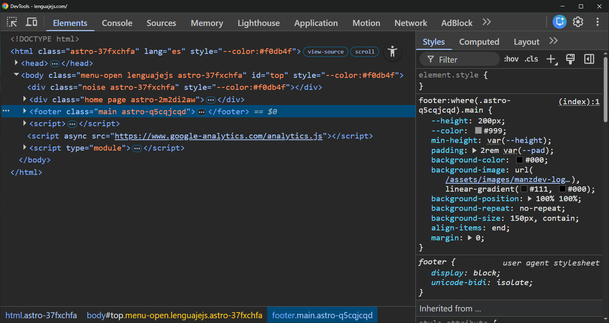
</div>
<div>

### Puntos clave
- Inspección del DOM en tiempo real
- **Icono flecha**: Seleccionar un elemento
- **Icono devices**: Modo responsive
- **Elements**: Ver o editar el HTML
- **Styles**: Ver o editar el CSS
  - Forzar ``:hover``, ``:focus``, ``:active``
  - Widgets interactivos
  - **Computed**: CSS computado
- **Console**: Abrir consola de Javascript
</div>
</split-slide>

---
## Network Dev Tools

<split-slide style="--left: 60%; --right: 40%;">
<div>

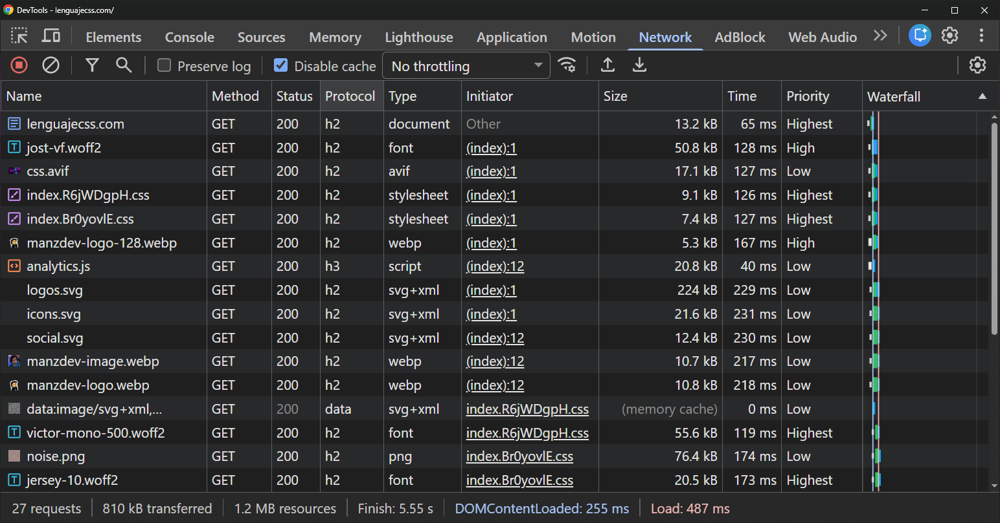
</div>
<div>

- Nombre de ficheros
- Método (GET, POST, HEAD...)
- Estado HTTP → [HTTP.Cat](https://http.cat/)
- Protocolo → ``HTTP1.1`` < ``h2`` < ``h3``
- Tipo y donde se inicia la petición
- Tamaño del fichero / cacheado
- Tiempo de descarga + Prioridad
- Abajo: Peticiones, tamaño y tiempos
- ``Disable cache`` / ``Throttling``
</div>
</split-slide>

---
<!-- _class: cover -->
<style scoped>
section {
  --cover: url(../assets/img_00036_.png);
}
</style>
# Uso de memoria
- Garbage Collector
- Memory leaks
- Listeners huérfanos
- Windowing

---

## Garbage Collector
- Es un proceso automático del lenguaje que **libera memoria**

<split-slide style="--left: 60%; --right: 40%;">

<steps>
<step>

```js
const data = [/* Array con muchos datos */];

function method() {
  /* ... */
}

// ANTES: Memoria ocupada -→ 🟩🟩🟥🟥
method(); // Memoria ocupada 🟩🟩🟥🟥
// LUEGO: Memoria ocupada -→ 🟩🟩🟥🟥

// data es global, ocupa durante todo el programa
```
</step>
<step>

```js
function method() {
  const data = [/* Array con muchos datos */];
  /* ... */
}

// ANTES: Memoria libre ---→ 🟩🟩🟩🟩
method(); // Memoria ocupada 🟩🟩🟥🟥
/* Si no quedan referencias a data */
// LUEGO: Memoria libre ---→ 🟩🟩🟩🟩

// data es local, ocupa sólo durante función
```
</step>
</steps>
<div>

- El GC decide **cuando** liberar memoria (no lo decides tú)
- El GC elimina cuando no son **alcanzables** (sin referencias)
### Recuerda:

- ``const a = b`` → Esto es una referencia, no una copia

- El objeto nace
- Si el objeto no tiene **ninguna** referencia a él...
- El motor lo marca como **inalcanzables** (0 ref)
- El **Garbage Collector** los recolecta para borrarlos
</div>
</split-slide>

---

## Memory leaks
- Si existen referencias a un objeto que **ya no necesitas**, GC **no puede liberar su memoria**
- Esa memoria no podrá reutilizarse hasta cerrar la aplicación o web (que se liberan sus recursos)

<steps>
<step>
<split-slide style="--font-size: 1rem;">

```js
// main.js
import { moduleVar } from "./module.js";

const global = []; // ❌ Global: siempre viva

function method() {
  const local = [];   // ✅ Local: Se limpia al terminar fx
}

// module.js
const moduleVar = []; // ❌ Global: Siempre viva
window.noRemove = []; // ❌ Global: Siempre viva
globalThis.same = []; // ❌ Global: Siempre viva
```
<div>

### 1️⃣ Variables globales / de módulo → 💧 leak
- ❌ Evita variables globales muy grandes
- ❌ Evita meter vars en ``window`` o ``globalThis``
- ⚠️ Variables de módulos ESM → son singletons
  - Se cargan una vez y viven toda la sesión

- 🗑 Cualquier objeto asignado así **nunca será recolectado**
</div>
</split-slide>
</step>
<step>
<split-slide style="--font-size: 1rem;">

```js
const cache = new Map();
cache.set(id, value); // LEAK: Nunca se elimina ❌

// LRU: Max. 500 (más antiguo sale) ✅
const cache = new QuickLRU({ maxSize: 500 });
cache.set(id, value);

// TTL: Expira por tiempo de vida ✅
const cache = new Map();
cache.set(id, { value, expires: Date.now() + 60_000 });
// Añadir lógica para comprobar TTL y borrar

// WeakMap: Autoborrado si "domNode" muere ✅
const cache = new WeakMap();
cache.set(domNode, value);
```
<div>

### 2️⃣ Caché sin límite → 💧 leak
- Un Map o Array que no se limita → leak (silencioso)
- No da error, simplemente consume más y más
- ✅ Un caché debería tener límite
### Soluciones:

- **LRU** → Least Recently Used → [lru-cache](https://isaacs.github.io/node-lru-cache/) o [quick-lru](https://github.com/sindresorhus/quick-lru)
- **TTL** → Revisa si supera tiempo de vida [ttlcache](https://github.com/isaacs/ttlcache) o [tiny-lru](https://github.com/avoidwork/tiny-lru)
- [WeakMap](https://lenguajejs.com/javascript/set-map/que-es-map-weakmap/#qu%C3%A9-son-los-weakmap) → Si key es objeto (DOM, clase...), la entrada desaparece cuando es recolectado
</div>
</split-slide>
</step>
<step>
<split-slide style="--font-size: 1rem;">

```js
// ❌ Leak clásico
let btn = document.querySelector(".button");  // global
btn.remove();
// Se elimina el .button del DOM (HTML)
// "btn" sigue referenciado por la variable global
// ❌ El GC no puede recolectarlo

// ✅ Correcto
{
  let btn = document.querySelector(".button");  // local
  btn.remove();
}
btn = null  // Si es global, fuerza a eliminar la referencia
// ✅ Ahora el GC puede recolectarlo
```
<div>

### 3️⃣ Detached node → 💧 leak
- Detached: Nodos eliminados **pero aún referenciados**
- ⚠️ Sigue referenciado → **GC** no puede recolectarlo
- ❌ Puede retener nodos hijos, listeners...

### Cómo buscarlos:
- Dev Tools / Memory / Buscar "Detached"
- Variables globales o de módulo
- Stores globales (montar componentes sin desmontarlos)
- Nodos globales en array "para procesar luego"
</div>
</split-slide>
</step>
</steps>

---
## Listeners huérfanos
- Un ``listener`` huérfano → Continua escuchando eventos desde un elemento que se ha eliminado del DOM
Como no se eliminó el evento, sigue escuchando y el **GC** no puede recolectarlo


<split-slide style="--left: 55%; --right: 50%; --font-size: 1rem;">
<steps>
<step>

```js
const mountModal() {
  const btn = document.querySelector(".close");
  /* ... */

  document.addEventListener("keydown", ev => {
    if (e.key === "Escape") closeModal();
  });
}

```
</step>
<step>

```js
function mountModal() {
  /* ... */

  const controller = new AbortController();
  const { signal } = controller;

  document.addEventListener("keydown", () => { ... }, { signal })
  document.addEventListener("click", () => { ... }, { signal })
  globalThis.addEventListener("resize", () => { ... }, { signal })

  return () => controller.abort() // elimina los tres de golpe
}
```
</step>
<step>

```js
// ❌ Se añade un listener por botón
const buttons = document.querySelectorAll(".button");
buttons.forEach(btn =>
  btn.addEventListener("click", () => { ... })
);

// ✅ Un listener padre para gobernarlos a todos 💍
const parent = document.querySelector(".parent");
parent.addEventListener("click", ev => {
  const btn = ev.target.closest(".button");
  if (btn) () => { ... }
});
```
</step>
</steps>
<div>

- 👁‍🗨 Cada vez que se monta, se añade listener nuevo
- 🔥 Si se monta/desmonta 10 veces → 10 listeners

### Soluciones:

- 1️⃣ ¿Puedes resolverlo sin Javascript? → ``<dialog>``
- 2️⃣ Añade un ``removeEventListener``
- 3️⃣ Usa ``AbortController`` para cancelar todos
- 4️⃣ Usa delegación de eventos en el padre
</div>
</split-slide>


---
## Windowing: Listas virtuales
- 📋 Tenemos una web con una tabla con MUCHOS datos/elementos (nodos) → [Windowing](../assets/virtual-scroll.png)


<split-slide style="--left: 50%; --right: 50%; --font-size: 1rem;">
<div>

### El problema
- 🧠 Aparentemente simple, pero problema complejo.
- Renderizar y mantener MUCHOS nodos vivos es costoso
- Cada elemento requiere tareas de renderización
- AL FINAL: El usuario sólo ve ~10-15 nodos
- ¿Cuando optimizar?
  - ☁️ ``< 100 nodos`` → ✅ No hace falta optimizar
  - ⚖️ ``100-500 nodos`` → ❌ Si son complejos, optimizar
  - 🧱 ``> 500 nodos`` → ❌ Optimizar siempre

</div>
<div>

### Soluciones
- Sólo renderizar los nodos en pantalla
- Añadir unos nodos «offset» (para evitar FOUC/saltos)
- JS: ``IntersectionObserver``
  - ❌ Rompe posición scroll, sólo es lazy rendering
- CSS: ``content-visibility``
  - ❌ Ahorra rendering, pero los nodos siguen en memoria
- Librerías:
  - [TanStack Virtual](https://tanstack.com/virtual/latest)
  - [virtua](https://github.com/inokawa/virtua)
  - [vlist](https://vlist.io/examples/)
</div>

</split-slide>

---
<!-- _class: cover -->
<style scoped>
section {
  --cover: url(../assets/img_00036_.png);
}
</style>
# Uso de ancho de banda (Transferencia)
- Resource Hints
- Lazy loading
- Tree shaking
- Sistemas de caché

---
## Resource Hints
- Etiquetas ``<link>`` que indican recursos que vas a necesitar
- Con ellas preparas al navegador antes de se soliciten y tengas que esperar a que se descarguen.

<steps>
<step>
<split-slide style="--font-size: 1rem;">

```html
<!-- Mejora conexión a otros dominios -->
<link rel="preconnect" href="https://fonts.googleapis.com">
<link rel="preconnect" href="https://api.dominio.com">
<!-- Úsalo para APIs, CDNs de fuentes, analytics -->
<!-- Máx: 4-6 (cada conexión consume recursos) -->

<!-- Precargar script que va a ser usado (baja prioridad) -->
<link rel="prefetch" href="/chunks/dashboard.js" as="script">
```
<div>

### 1️⃣ preconnect
- Realiza **Búsqueda DNS** + **Negocicación TCP/TLS**
  - **Cuando**: Antes de que se solicite el primer recurso
- 💡 Ahorras ``100–500ms`` en la primera petición a ese origen
### 2️⃣ prefetch
- Descarga un recurso con baja prioridad
  - **Cuando**: Descarga en **idle** + lo guarda en caché
- 💡 Úsalo si lo necesitas en la sig. navegación (no en la actual)
</div>
</split-slide>
</step>
<step>
<split-slide style="--font-size: 1rem;">

```html
<!-- Fuente crítica (dales siempre prioridad) -->
<link rel="preload" href="/fonts/outfit.woff2" as="font"
      type="font/woff2" crossorigin>

<!-- Imagen principal (en primer impacto visual) -->
<link rel="preload" href="/hero.webp" as="image">

<!-- Algo que sabes que se necesitará inmediatamente -->
<link rel="preload" href="/critical.js" as="script">

<!-- ⚠ Si precargas algo y no lo usas en 3s, warning -->
```
<div>

### 3️⃣ preload
- Descarga un recurso lo antes posible (precarga)
- **Cuando**: Descarga inmediatamente, ejecuta cuando lo necesite
- 💡 Sólo si lo necesitas inmediatamente
</div>
</split-slide>
</step>
<step>
<split-slide style="--font-size: 1rem;">

```html
<!-- Precarga el módulo y sus dependencias -->
<link rel="modulepreload" href="/js/app.js">
<link rel="modulepreload" href="/modules/vendor-react.js">
<link rel="modulepreload" href="/modules/router.js">
```
<div>

### 4️⃣ modulepreload
- Como ``preload`` pero para módulos (ESM).
- Descarga, parsea y procesa el módulo
- Crea grafo de dependencias (evita "efecto cascada")
- 💡 Efecto cascada → Cada ``import`` "descubre" el siguiente
</div>
</split-slide>
</step>
</steps>

---
## Lazy loading
- Técnica que no carga un recurso **hasta que se necesita**
- ...pero "necesita" puede tener significados distintos según el caso

<steps>
<step>
<split-slide style="--font-size: 1rem;">

```html
<!-- Carga la imagen al procesar este HTML -->


<!-- Precarga. Dentro del <head> -->
<link rel="preload" href="/img/foto.jpg" as="image">
<link rel="preconnect" href="https://cdn.manz.dev/">
<link rel="dns-prefetch" href="https://cdn.manz.dev/">

<!-- Bloquea render. Dentro del <head> -->
<link rel="expect" href="#nombre" blocking="render">
```
<div>

### 1️⃣ Eager (Acceso crítico)
- El atributo ``loading="eager"`` indica que realice la petición
- Es el valor por defecto

- El ``preload`` da [prioridad absoluta](https://lenguajehtml.com/html/recursos-externos/etiquetas-precarga-html/#por-recurso) → 💡 [Tipos](https://lenguajehtml.com/html/recursos-externos/etiquetas-precarga-html/#tipos-de-recursos) fonts
- El ``dns-prefetch`` [precarga dominios](https://lenguajehtml.com/html/recursos-externos/etiquetas-precarga-html/#por-dominio) → solo dns
- El ``preconnect`` → dns + tcp + tls (lo vimos antes)

⚠ El ``expect`` bloquea render hasta que un ``id`` se haya cargado
</div>
</split-slide>
</step>
<step>
<split-slide style="--font-size: 1rem;">

```html
<!-- Imágenes: Buen soporte -->


<!-- Iframe: Buen soporte -->
<iframe loading="lazy" src="https://manz.dev/"></iframe>

<!-- Video/Audio: Soporte reducido aún -->
<video loading="lazy" src="video.mp4"></video>
<audio loading="lazy" src="audio.mp3"></audio>
```
<div>

### 2️⃣ Lazy por viewport
- El atributo ``loading="lazy"`` pospone carga fuera del viewport
- El atributo ``width`` y ``height`` son obligatorios con lazy loading
  - Sin tamaño, navegador no sabe calcular y produce **CLS**
- No uses ``loading="lazy"`` en elementos por encima del «FOLD»
</div>
</split-slide>
</step>
<step>
<split-slide style="--font-size: 1rem;">
<div>

```html
<!-- Prefetch. Dentro del <head> -->
<link rel="prefetch" href="/img/foto.jpg" as="image">
```
```js
// Carga cuando el hilo está libre
requestIdleCallback(() => import(`/pages/dashboard.js`));
```
</div>
<div>

### 3️⃣ Lazy por idle
- El ``prefetch`` carga recurso cuando está en idle (lo vimos antes)
  - Indica en ``as`` el [tipo de recurso](https://lenguajehtml.com/html/recursos-externos/etiquetas-precarga-html/#tipos-de-recursos) del que se trata

- El ``requestIdleCallback()`` se llama cuando tiene tiempo libre
- En la función de callback se pueden realizar acciones como:
  - Añadir ``<link>`` al ``document.head``
  - Importar ficheros o recursos con ``import()``
</div>
</split-slide>
</step>
<step>
<split-slide style="--font-size: 1rem;">
<div>

```js
// Añade el <link rel="modulepreload"> cuando "hover"
button.addEventListener("mouseenter", () => {
  const link = document.createElement("link");
  link.rel = "modulepreload";
  link.href = `/pages/dashboard.js`;
  document.head.append(link);
}, { once: true });

// Se hace "click", importa recurso y ejecuta render()
button.addEventListener("click", async (ev) => {
  ev.preventDefault();
  const { render } = await import("/pages/dashboard.js");
  render();
});
```
</div>
<div>

### 4️⃣ Lazy por interacción
- Al hacer ``hover``, se añade el **resource hint**
  - El ``modulepreload`` → Descarga + parsea módulo ``.js``
  - Procesa las dependencias (``import``)
  - Lo deja listo para ejecutar

- Cuando se hace ``click``...
  - Se invalida la acción por defecto
  - Se importa el ``render`` ya descargado y parseado
  - Se ejecuta ``render()```
</div>
</split-slide>
</step>
</steps>

---
## Tree shaking
- El **bundler** (vite, webpack...) es capaz de eliminar código que se importa pero nunca se usa.
``El nombre viene de "sacudir el árbol" para que caigan las hojas muertas``

<steps>
<step>
<split-slide style="--font-size: 1rem;">

```js
// ✅ Usar ESM (necesario para saber que se usa)
import { format } from "date-fns";
import * as utils from "./utils.js";

// Si importas todo, no uses keys
utils.format();    // ✅ Hace tree-shaking
utils["format"](); // ❌ No tree-shakeable

// ❌ No usar CommonJS (no puede analizar)
const { format } = require("date-fns");
```
<div>

### 1️⃣ Tree Shaking
- ✅ Requisito fundamental: ESM puro → ``import`` / ``export``
- ✅ Preferir ``import`` nombrados selectivos con ``{`` y ``}``
- ❌ No usar keys si importas todo el módulo
- ❌ No sirve con CommonJS → ``require()`` / ``module.exports``
</div>
</split-slide>
</step>
<step>
<split-slide style="--font-size: 1rem;">

```js
// ❌ index.js re-exporta todo
export * from "./Button";      // Puede ser un archivo
export * from "./components";  // Es una carpeta
export * from "./Table";       // Pesa 50KB
// Bundler ve `export *` → incluye todo "por si acaso"

// ✅ Importa directamente del archivo fuente
import { Button } from "./components";        // ❌ No
import { Button } from "./components/Button"; // ✅ Sí

// ✅ O usa re-exports nombrados (sin comodines)
export * from "./Modal";            // ❌ No
export { Modal } from "./Modal";    // ✅ Sí
```
<div>

### 2️⃣ Evitar barrels
- Barrel: Entrypoint único que re-exporta todo desde otro lugar
- ❌ Evita re-exportaciones (o hazlas con cuidado)
- ❌ Un problema grave → re-exportar carpetas (común en TS)
- ✅ Si no usas bundler, no hay problema de tamaño del bundle
- ✅ Si usas barrels → directos y sin wildcards

Más información sobre los [Barrels](https://lenguajejs.com/javascript/modulos/barrel-imports/)
</div>
</split-slide>
</step>
</steps>

---
## Sistemas de caché
- El caché es un almacenamiento temporal para evitar repetir acciones y hacerlas más rápido → Cache

<steps>
<step>
<split-slide style="--font-size: 1rem;">

```bash
🅰 Sin caché (primera visita)
💻 Browser +-→ /index.html ←→ 🌍 Internet ←→ 💻 Server
               /index.css  ←→ 🌍 Internet ←→ 💻 Server
               /index.js   ←→ 🌍 Internet ←→ 💻 Server
               /logo.webp  ←→ 🌍 Internet ←→ 💻 Server

🅱 Con caché (segunda visita)
💻 Browser +-→ /page2.html ←→ 🌍 Internet ←→ 💻 Server
               /index.css  ☑ Cacheado. Ya lo tiene.
               /index.js   ☑ Cacheado. Ya lo tiene.
               /logo.webp  ☑ Cacheado. Ya lo tiene.
```
<div>

### 1️⃣ Cachea el «pasado»
- Aquí hablamos de **caché en el navegador**
- 🅰 Descargas **sin caché** de navegador
- 🅱 Descargas **con caché** de navegador
</div>
</split-slide>
</step>
<step>
<split-slide style="--font-size: 1rem;">

```bash
[⚡] Caché a nivel de navegador
💻 Browser [⚡] → 🌍 Internet → 💻 Server

[⚡] Caché a nivel de red (Internet)
💻 Browser → 🌍 Internet [⚡] → 💻 Server

[⚡] Caché a nivel de servidor
💻 Browser → 🌍 Internet → 💻 Server [⚡]
```
<div>

### 2️⃣ Niveles de caché
- 1️⃣ Caché de navegador
→ ``index.js``

- 2️⃣ Caché de red
→ 🛡 Uso de CDN (Ej: Cloudflare)
→ [Distribuidos geográficamente](../assets/cloudflare-datacenters.png)
→ ``index.a73b2f.js`` (Útil para evitar caché red)

- 3️⃣ Caché de servidor
→ Guarda copias, evita operaciones costosas
→ Bases de datos, calculos...
→ Ejemplos: Redis, caché SQL, etc...

</div>
</split-slide>
</step>
<step>
<split-slide style="--font-size: 1rem;">

```bash
HTTP/1.1:  GET /1 → ⌛ → 🟦 → GET /2 → ⌛ → 🟦 → ...

HTTP/2:    GET /1 ┐          ┌ 🟦
           GET /2 ├─ misma ──┤ 🟦  (todo a la vez)
           GET /3 ┘ conexión └ 🟦

HTTP/2 sobre TCP:
  stream A ──────────❌ (pérdida) ➡ todos ⌛
  stream B ──────────⏸ ⌛
  stream C ──────────⏸ ⌛

HTTP/3 sobre QUIC:
  stream A ──────────❌ (pérdida) ➡ solo A ⌛
  stream B ────────────────────── ✅ sigue
  stream C ────────────────────── ✅ sigue
```
<div>

### 3️⃣ Protocolos de red
- 1️⃣ HTTP/1.1
❌ Sólo una petición TCP a la vez
🟧 Navegadores usan 6 peticiones paralelas
🔥 Técnicas agresivas (todo en un bundle) 🆘

- 2️⃣ HTTP/2
✅ Multiplexing: Múltiples peticiones
✅ No es necesario bundling agresivo

- 3️⃣ HTTP/3
✅ Reemplaza TCP por QUIC/UDP
✅ Mejor rendimiento si se pierden paquetes

</div>
</split-slide>
</step>
<step>
<split-slide style="--font-size: 1rem;">

```js
<script type="speculationrules">
{
  "prefetch": [{
    "urls": ["/productos", "/sobre-nosotros"]
  }],
  "prerender": [{
    "where": { "href_matches": "/productos/*" },
    "eagerness": "moderate"
  }]
}
</script>
```
<div>

### 3️⃣ Cachear el «futuro»
- 🆕 Speculation Rules: API moderna
- Cachea/renderiza anticipadamente
- ``prefetch`` → Sólo descarga HTML (coste bajo)
- ``prerender`` → Descarga + Ejecuta JS + Renderiza (coste muy alto)
- ``eagerness`` → Controla CUANDO comienza:
  - 🟥 ``eager`` (urgente, desde parsear la regla)
  - 🟨 ``moderate`` (cursor se acerca a enlace)
  - 🟩 ``conservative`` (empieza a hacer clic)

</div>
</split-slide>
</step>
</steps>

---
<!-- _class: cover -->
<style scoped>
section {
  --cover: url(../assets/img_00036_.png);
}
</style>
# Uso de paquetes NPM
- Evaluar antes de instalar
- Analizando bundle
- Limitar tamaño (CI)
- Dependencias no usadas

---
## Análisis de paquetes NPM
- Los proyectos suelen tener y necesitar dependencias → [Visualizador de dependencias](https://npm.anvaka.com/#/)

<steps>
<step>
<split-slide style="--font-size: 1rem;">

<div>

### Coste de dependencias
- ✅ Hacen que sea más fácil y rápido desarrollar
- ⚠️ Tienen un **coste**:
  - 1️⃣ Tamaño → Debe descargarse
  - 2️⃣ Parseo → Debe leerse y procesarse
  - 3️⃣ Ejecución → Debe ejecutarse y actuar
- ⚠️ Tienen un **riesgo**:
  - 1️⃣ Mantenimiento → Debes mantenerla actualizada
  - 2️⃣ Seguridad → Es un posible vector de ataque
  - 3️⃣ Futuro → Debes adaptarte a su evolución
- 💔 Cada dependencia tiene **más dependencias**
</div>
<div>

### 🟥 ¿Qué podemos hacer?
- 🔥 Vigila bien si son imprescindibles
  - Ten siempre alternativas presentes y viables.
  - ¿Tiene alternativa nativa?
  - ¿Se puede reutilizar otra dependencia?
  - ¿Se puede buscar alternativas más ligeras?

- 📦 Detalles de las dependencias: [npmjs](https://www.npmjs.com/package/dayjs) vs [npmx](https://npmx.dev/package/dayjs)
- 👀 Evaluar antes de instalar
  - [packagephobia](https://packagephobia.com/)
  - [bundlephobia](https://bundlephobia.com/)
  - [package-size](https://npmx.dev/package/package-size) (instalable)
</div>
</split-slide>
</step>
<step>
<split-slide style="--font-size: 1rem;">

<div>

### Bundle (Todo el JS unido en un archivo final)
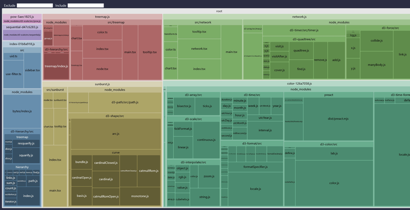

</div>
<div>

- 🔎 Analiza bundle (busca alternativas más ligeras)
  - [node-modules-inspector](https://github.com/antfu/node-modules-inspector) → [node-modules.dev](https://node-modules.dev/) → [ejemplo](https://everything.antfu.dev/chart)
  - [rollup-plugin-visualizer](https://github.com/btd/rollup-plugin-visualizer)
  - [source-map-explorer](https://npmx.dev/package/source-map-explorer)
- 🛑 Limitar tamaño bundle:
  - [size-limit](https://npmx.dev/package/size-limit)
  - [bundlesize](https://npmx.dev/package/bundlesize)
- 🕵️‍♀️ Dependencias no utilizadas:
  - [knip](https://knip.dev/)
  - [depcheck](https://npmx.dev/package/depcheck)
</div>
</split-slide>
</step>
</steps>

---
<!-- _class: cover -->
<style scoped>
section {
  --cover: url(../assets/img_00036_.png);
}
</style>
# Minificación de recursos
- Imágenes
- Multimedia
- Código (HTML/CSS/JS)

---
## Optimización de imágenes

<split-slide style="--left: 50%; --right: 50%; --font-size: 1rem;">
<steps>
<step>

```bash
sudo apt install imagemagick gmic
pnpm install -g sharp

sudo apt install optipng
cargo install oxipng

sudo apt install libjxl-tools
sudo apt install libavif-bin

sudo apt install svgo
cargo install oxvg
```
</step>
<step>

```bash
# Imagemagick / Sharp
convert input.png output.webp
sharp -i input.png -o output.webp

# Optimizadores
oxipng image.png
cjxl input.png output.jxl
avifenc input.png output.avif

# SVG
svgo input.svg -o output.svg
oxvg optimise input.svg -o output.svg
```
</step>
<step>


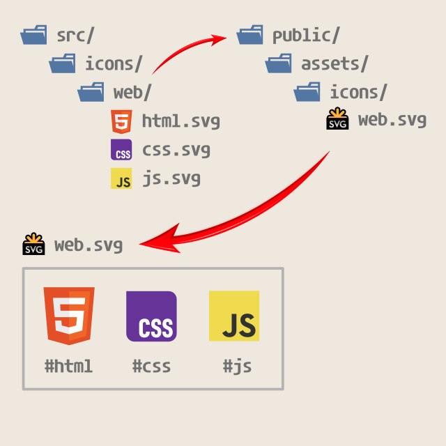

</step>
</steps>
<div>

- Conversores: ✅ [imagemagick](https://imagemagick.org/), ✅ [sharp](https://sharp.pixelplumbing.com/) y ✅ [gmic](https://gmic.eu/)
- ❌ [squoosh](https://squoosh.app/) (cli deprecated)
- Optimizadores:
  - PNG: ``optipng`` → 🆕 ``oxipng``
  - JXL: ``cjxl``
  - AVIF: ``avifenc``
  - SVG: ``svgo`` → ``oxvg``
- Plugin vite → [vite-plugin-supersvg](https://github.com/ManzDev/vite-plugin-supersvg)
</div>
</split-slide>

---
## Optimización multimedia

<split-slide style="--left: 50%; --right: 50%; --font-size: 1rem;">
<steps>
<step>

```bash
# Mostrar codecs concretos
ffmpeg -codecs

# Convertir de un formato a otro
ffmpeg -i input.mp4 output.webm

# Convertir usando codecs concretos
ffmpeg -i input.mkv -vcodec libx264 output.mp4
ffmpeg -i input.mkv -vcodec libx265 output.mp4
```
</step>
<step>

```bash
# Mediante ghostscript
sudo apt install ghostscript
gs -sDEVICE=pdfwrite -dCompatibilityLevel=1.4 \
   -dPDFSETTINGS=/ebook \
   -dNOPAUSE -dQUIET -dBATCH \
   -sOutputFile=output.pdf input.pdf

# Mediante qpdf
sudo apt install qpdf
qpdf --linearize --optimize-images \
   input.pdf output.pdf
```
</step>
</steps>
<div>

- Conversor multimedia: [ffmpeg](https://www.ffmpeg.org/)
- Sirve para video: ``.mp4`` (H.264), ``.webm`` (VP8/VP9/AV1)
- Sirve para audio: ``.mp3``, ``.aac``, ``.ogg``, ``.opus``, ``.flac`` o ``.wav``
- [Tutorial completo sobre ffmpeg](https://terminaldelinux.com/terminal/multimedia/ffmpeg/)

- Optimizar ficheros PDF con [GhostScript](https://ghostscript.com/)
- Calidades: ``/screen`` < ``/ebook`` < ``/printer``
- Optimizar ficheros PDF con [qpdf](https://github.com/qpdf/qpdf)
</div>
</split-slide>

---
## Optimización HTML/CSS/JS

- 1️⃣ Optimización HTML
  - [@minify-html/node](https://npmx.dev/package/@minify-html/node) → ``rust``
- 2️⃣ Optimización JS
  - [build.minify](https://vite.dev/config/build-options#build-minify) → ``oxc``, ``terser`` o ``esbuild``
- 3️⃣ Optimización CSS
  - [build.cssMinify](https://vite.dev/config/build-options#build-cssminify) → ``lightningcss`` o ``esbuild``

---
<!-- _class: cover -->
<style scoped>
section {
  --cover: url(../assets/img_00036_.png);
}
</style>
# Medición y análisis (Monitorización)
- Testing
- Core Web Vitals
- Lighthouse

---
## Vitest (Testing)

<split-slide style="--left: 60%; --right: 40%; --font-size: 1rem;">
<div>

- 🏆 Importancia del testing:
  - «¿Cómo sabes que tu código funciona?» Probando manualmente
  - «¿Cómo sabes que un cambio no va a romperlo?» No lo sabes
  - Tener tests **no garantiza** que no hayan bugs

- 🌀 Tipos de testing
  - **Estático**: Errores en editor (antes) → ``Typescript`` o ``ESLint``
  - **Unitarios**: Aislados (sin dependencias) → ``function`` o ``class``
  - **Integración**: Como colaboran varias piezas → Componente ► DOM
  - **End-to-end (e2e)**: Simulas usuario real del navegador → [Playwright](https://playwright.dev/)
</div>
<div>

  
</div>
</split-slide>

---
## Primeros pasos

<split-slide style="--left: 60%; --right: 40%; --font-size: 1rem;">
<div>

- [Jest](https://jestjs.io/es-ES/): framework de tests para Node.
- [Vitest](https://vitest.dev/): Jest para Vite, más moderno, rápido y actualizado.

```bash
pnpm install -D vite vitest happy-dom

```

- [Vitest Explorer](https://marketplace.visualstudio.com/items?itemName=vitest.explorer): Extensión para VSCode.

```js
import { defineConfig } from "vite";

export default defineConfig({
  root: "./src",
  test: {
    environment: "happy-dom",
    globals: true
  }
});
```

</div>

<steps>
<step>

- Desde una terminal:

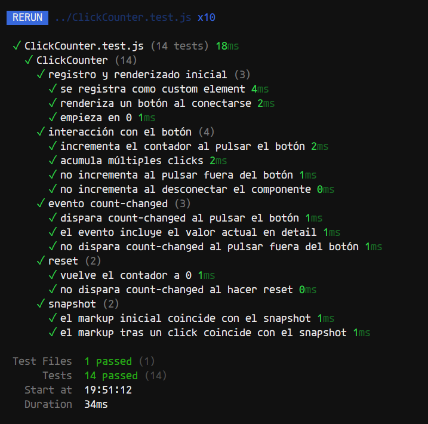

</step>
<step>

- Desde VSCode:

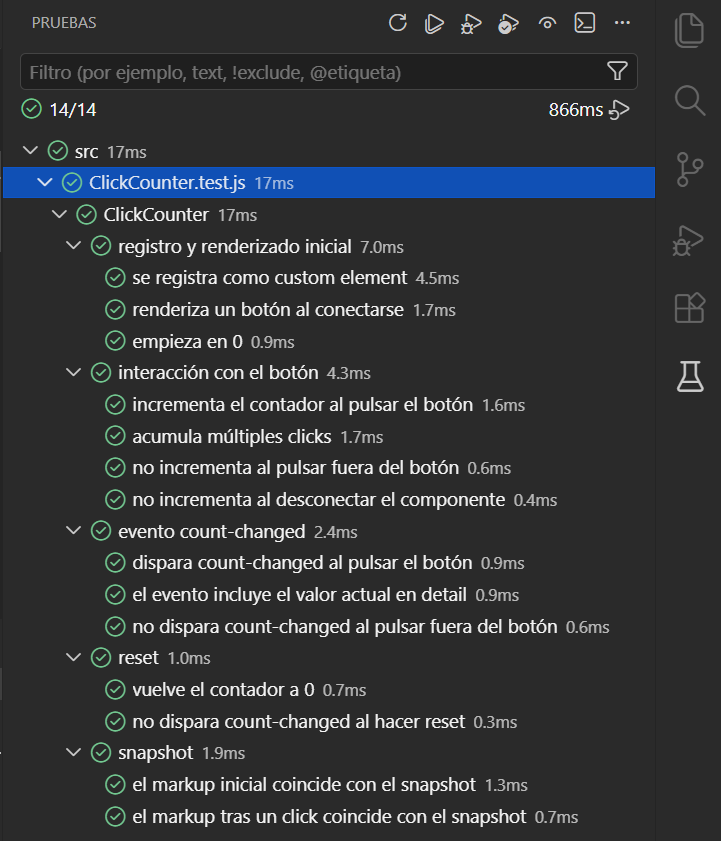

</step>
</steps>
</split-slide>

---
## Creando tests unitarios
- API básica: ``describe``, ``it``, ``test``, ``expect`` y matchers ``toBe``, ``toEqual``...

<split-slide style="--left: 30%; --right: 70%; --font-size: 1rem;">

```js
// Fichero add.js
export function add(a, b) {
  return a + b
}

/**
 *
 * add(1, 2) devuelve 3
 *
 * add(-1, -1) devuelve -2
 *
 * add(5, 0) devuelve 5
 *
 * add(2) devuelve
 *
 */
```
```js
// Fichero add.test.js
import { describe, it, test, expect } from "vitest";

describe("add", () => {
  it("suma dos números positivos", () => {
    expect(add(1, 2)).toBe(3)                // Si sumas 1 + 2, esperas 3
  })

  it("suma números negativos", () => {
    expect(add(-1, -2)).toBe(-3)             // Si sumas -1 + -2, esperas -3
  })

  test("suma cero", () => {                  // it() y test() son idénticos
    expect(add(5, 0)).toBe(5)                // Si sumas 5 + 0, esperas 5
  })
});
```

---
## Componente ClickCounter.js

<split-slide style="--left: 50%; --right: 50%; --font-size: 1rem;">

```js
class ClickCounter extends HTMLElement {
  #count = 0

  handleEvent(ev) {
    if (!ev.target.closest("button")) return;
    if (ev.type === "click") this.incr();
  }

  connectedCallback() {
    this.addEventListener("click", this);
    this.render();
  }

  disconnectedCallback() {
    this.removeEventListener("click", this);
  }

  reset() {
    this.#count = 0;
    this.render()
  }
```
```js
incr() {
    this.#count++;
    this.render();
    const event = new CustomEvent("count-changed", {
      detail: this.#count
    });
    this.dispatchEvent(event);
  }

  render() {
    this.innerHTML = /* html */`<button>
      Clicks: ${this.#count}
    </button>`;
  }
}

customElements.define("click-counter", ClickCounter);
```

- Repositorio de ejemplo: [click-counter](https://github.com/MultimediosSG/click-counter)

---
## Tests ClickCounter.test.js

```js
import { describe, it, expect, beforeEach, afterEach, vi } from "vitest";
import "./ClickCounter.js";

describe("ClickCounter", () => {
  let el;

  beforeEach(() => {
    el = document.createElement("click-counter");
    document.body.append(el);
  });

  afterEach(() => el.remove());

  describe("registro y renderizado inicial", () => {
    it("se registra como custom element", () => expect(customElements.get("click-counter")).toBeDefined());
    it("renderiza un botón al conectarse", () => expect(el.querySelector("button")).not.toBeNull());
    it("empieza en 0", () => expect(el.querySelector("button").textContent).toBe("Clicks: 0"));
  });

  /* ... */
});
```

---
## Core Web Vitals
- [Core Web Vitals](https://web.dev/articles/vitals?hl=es-419) → Métricas de Google para medir performance de una web

<split-slide style="--left: 65%; --right: 35%; --font-size: 1rem;">
<div>
  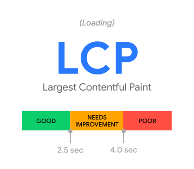
  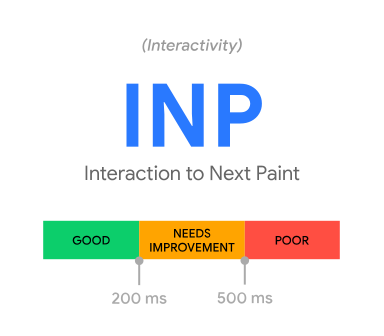
  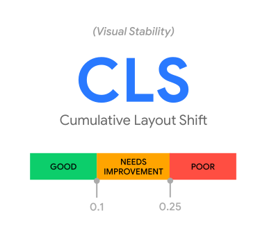
  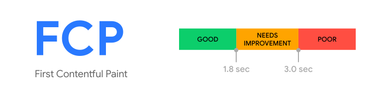
  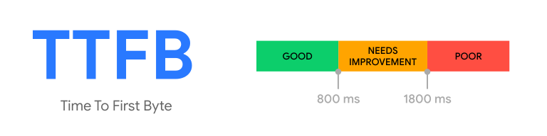
</div>
<div>

- ``LCP`` → El contenido más grande (ej: hero)
- ``INP`` → ``t`` desde interacción hasta respuesta
- ``CLS`` → Salto de layout acumulado
- ``FCP`` → ``t`` hasta aparecer el primer contenido visible
- ``TTFB`` → ``t`` hasta el primer byte
</div>
</split-slide>

---
## Lighthouse / PageSpeed

<split-slide style="--left: 30%; --right: 70%; --font-size: 1rem;">

<div>

- [PageSpeed Insights](https://pagespeed.web.dev/)
- Lighthouse (Dev Tools):
  - CLI [lighthouse-ci](https://googlechrome.github.io/lighthouse-ci/)

</div>

<steps>
<step>

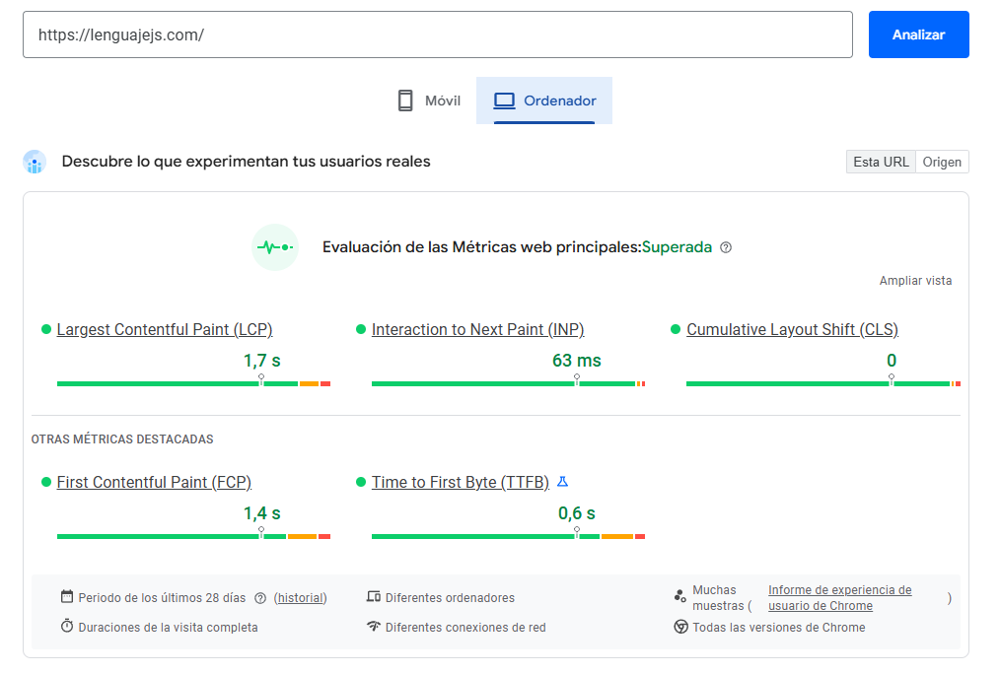

</step>
<step>

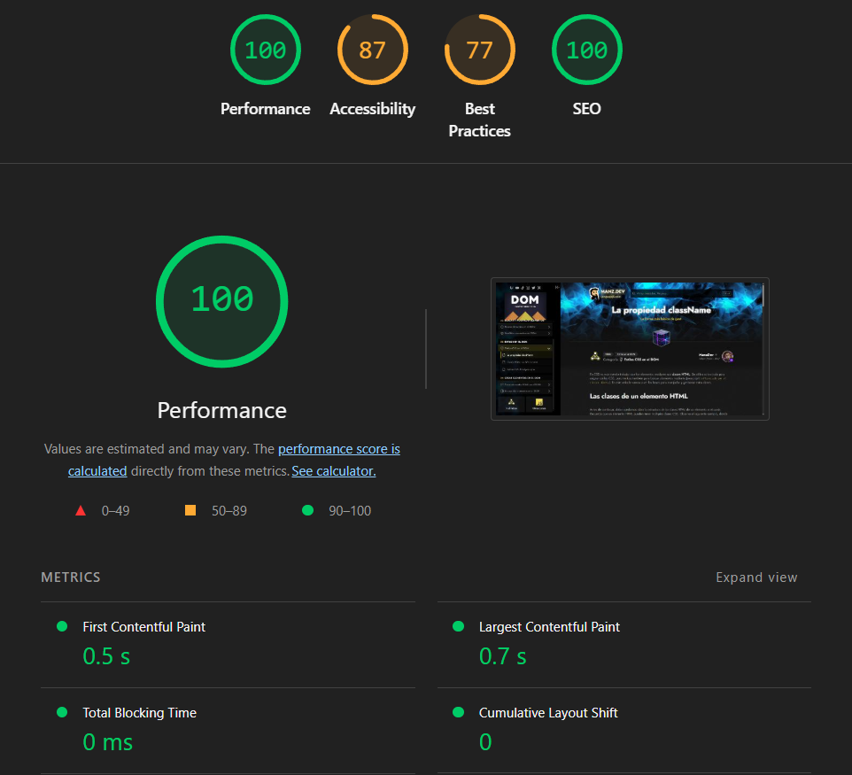

</step>
</steps>
</split-slide>

---
## Referencias

- [CheatSheet Javascript](https://lenguajejs.com/javascript/cheatsheets/)
- [bootcamp.manz.dev](https://bootcamp.manz.dev/)
- [MDN Web Docs: Performance](https://developer.mozilla.org/en-US/docs/Web/Performance)
- [web.dev: Core Web Vitals](https://web.dev/articles/vitals)
- [web.dev: LCP](https://web.dev/articles/lcp)
- [web.dev: INP](https://web.dev/articles/inp)
- [web.dev: CLS](https://web.dev/articles/cls)
- [web.dev: FCP](https://web.dev/articles/fcp)
- [web.dev: TTFB](https://web.dev/articles/ttfb)
- [PageSpeed Insights](https://pagespeed.web.dev/)
- [Lighthouse](https://developer.chrome.com/docs/lighthouse/overview)


<script src="../assets/steps.js"></script>
<script src="../assets/image-modal.js"></script>
