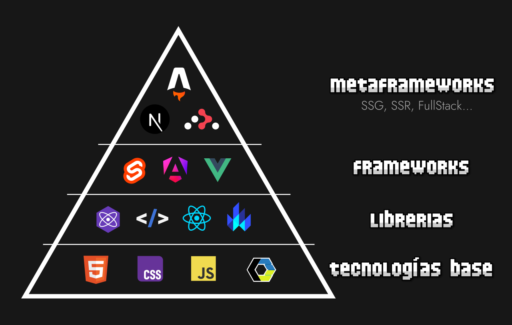

<!-- _class: cover -->
<style scoped>
section {
  --cover: url(../assets/img_00035_.png);
}
</style>
#  WebComponents
## Contenidos
- Custom Elements (HTML)
- DOM y WebComponents (JS)
- Shadow DOM (CSS)
- Comunicar componentes (JS)


> Inspirado en el bootcamp de <br><strong>Manz.dev</strong> todos los créditos a el.

---

## ¿Qué son los WebComponents?


<split-slide>
<div>


</div>
<div>

- **Metaframework**: Astro, Next.js, React Router...
- **Frameworks**: Svelte (compilador), Angular, Vue...
- **Librerías**: Preact, HTMX, React, Lit...
- **Tecnología base**: HTML, CSS, Javascript...
</div>
</split-slide>

---

## Custom Elements

- Una etiqueta HTML propia, de la forma más sencilla

<split-slide style="--left: 60%; --right: 40%;">

```html
<badge>Warning</badge>               <!-- ❌ Incorrecto -->
<warning-badge>Warning</warning-badge> <!-- ✅ Correcto -->

<script>
  const number = 42;
  const badge = document.querySelector("badge");
  const warning = document.querySelector("warning-badge");

  number.constructor.name     // Number
  badge.constructor.name      // HTMLUnknownElement
  warning.constructor.name    // HTMLElement
</script>
```
<div>

- ``<badge>`` **NO** es un custom element
- ``<warning-badge>`` **SI** es un custom element
- Los custom elements **deben** tener guión

### Trucos de naming
- Pueden tener más de un guión
- Siempre en minúsculas (norma de HTML)
- Aprovecha y usa nombres con sentido
- La primera palabra puede ser un **namespace**
- Podría ser mejor usar ``badge-warning``

</split-slide>

---
## Custom Elements simple
- Conceptos importantes: **Abstracción** y **Encapsulación**
- Custom Elements de ejemplo: [warning-badge](https://codepen.io/manz/pen/NPRryXw)

<split-slide style="--font-size: 1.1rem;">

```html
<warning-badge pulsing>En construcción</warning-badge>

<style>
  warning-badge {
    --stripe: 22px;
    --color: #FFE000;
    --glow: rgb(100% 90% 0 / 25%);

    font-family: 'Orbitron', sans-serif;
    font-weight: 900;
    color: var(--color);
    /* ... Estilos ... */
  }
</style>
```
```css
warning-badge::before {
  /* Exterior del badge */
}

warning-badge::after {
  /* Interior oscuro */
}

warning-badge[pulsing]::after {
  /* Animación de pantalla */
}
```
</split-slide>

---
## Custom Elements 💖 Clases JS
- Vamos a añadirle la **potencia** de Javascript con sus Clases (OOP)


---
## Ciclo de vida básico
- Ejecutar lógica al cargar componente / iniciar cada custom element

<split-slide>

```js
1️⃣ // Código al inicio del archivo

class WarningBadge extends HTMLElement {
  constructor() {
    super();
    console.log("Etiqueta cargada"); 2️⃣
  }
}

customElements.define("warning-badge", WarningBadge);
console.log("Componente cargado"); 3
```
<div>

### Inicio del archivo:

- 1️⃣ Se ejecuta cuando se importa el archivo
- Útil para tareas iniciales (constantes, tareas previas)

### Constructor:

- 2️⃣ Se ejecuta cuando se crea una etiqueta HTML
- Equivalente a ``new WarningBadge()``

### Inicialización:

- 3️⃣ Se ejecuta cuando carga el componente (1 vez)
- Similar a 1️⃣ pero ya has definido todo
</div>

---
## Ciclo de vida de un WebComponent
- Al añadir/eliminar del DOM el custom element
- Útil para tareas "lazy" de inicialización (al añadir al DOM)
- Útil para tareas de "limpieza" (al eliminar del DOM)

<split-slide>

```js
class WarningBadge extends HTMLElement {

  constructor() { /* ... */ }
  connectedCallback() { /* ... */ } 1️⃣
  disconnectedCallback() { /* ... */ } 2️⃣

}
```
<div>

### Connected:

- 1️⃣ Se añade al DOM, se llama ``connectedCallback()``
- Se dispara al hacer ``append()``, ``prepend()``, ``setHTML*()``, ...

### Disconnected:

- 2️⃣ Cuando se elimina del DOM, se llama disconnectedCallback()
- Se dispara al hacer ``remove()``, ``setHTML*()``, ...
</div>
</split-slide>

---

## Clases de Javascript
- Son clases, por lo que podemos usar sus características

<split-slide>

```js
class WarningBadge extends HTMLElement {
  #private = 42;
  public = "ManzDev";

  get value() {
    return `Data: ${this.#private}`;
  }

  method() { /* ... */ }
  #method() { /* ... */ }
}
```
<div>

- **Propiedades públicas**: Accesibles desde la clase y desde fuera
- **Propiedades privadas** (prefijo ``#``): Accesibles sólo desde la clase
  - Recuerda llamarlas con ``#`` incluido: ``this.#prop``
- **Getters/Setters**: Define método (``get`` o ``set``), uso como propiedad
  - Se define ``get value()``, se llama como ``this.value``
  - Cuidado con los bucles infinitos
- **Métodos**: Funciones de clase para simplificar y hacer legible
- **Métodos privados** (prefijo ``#``): Ejecutables sólo dentro de la clase
  - Recuerda llamarlas con ``#`` incluido: ``this.#method()``
</div>
</split-slide>

---
## Estructura de un WebComponent

<split-slide>

```js
class WarningBadge extends HTMLElement {
  constructor() {
    super();
  }

  connectedCallback() {
    this.render();
  }

  render() {
    this.setHTMLUnsafe(/* html */`
      <div class="container">
        ...
      </div>
    `);
  }
}
```
<div>

### Inicialización:

- El ``constructor`` define las tareas **urgentes** e iniciales.
- Intenta mantenerlo lo más ligero posible.

### Inicialización (lazy):

- El ``connectedCallback`` define acciones más costosas.
- El método ``render`` hace cambios visibles en el DOM.

- Puedes crear un Custom element y no insertarlo inmediatamente en el DOM
- Se puede usar el ``connectedCallback()`` para posponer ciertas tareas

---
## Ejemplo de ``<weather-time>``

<steps>
<step>
<split-slide>

```html
<!-- Definimos nuestro web component -->
<weather-time></weather-time>

<!-- Definimos estilos CSS globales -->
<style>

/* Se aplica al componente */
weather-time {
  display: flex;
  gap: 0.25rem;
}

</style>
```
```html
<style>
.loading {
  --size: 25px;

  width: var(--size);
  height: var(--size);
  background: indigo;
  border-radius: 50%;
  animation: bounce 1s infinite alternate;
}

@keyframes bounce {
  0% { translate: 0 -10px }
  100% { translate: 0 0 }
}
</style>
```
</split-slide>
</step>
<step>
<split-slide style="--font-size: 1.1rem;">

```js
const L = "liberia+guanacaste";
const URL = `https://goweather.xyz/v2/weather/${L}`;

class WeatherTime extends HTMLElement {
  data = {};

  constructor() {
    super();
    this.init();
  }

  async init() {
    const response = await fetch(URL);
    setTimeout(async () => {                  1️⃣
      this.data = await response.json();
      this.render();
    }, 2000);
  }

  connectedCallback() { this.render() }
}
```
```js
class WeatherTime extends HTMLElement {
  /* ... */

  render() {
    if (!this.data?.temperature) {            2️⃣
      console.log("Cargando datos...");
      this.setHTMLUnsafe(
        /* html */`<div class="loading"></div>`.repeat(3));
    }
    else {
      console.log("Datos cargados.");
      this.setHTMLUnsafe(
        /* html */`<main>${this.data?.temperature}</main>`);
    }
  }
}

customElements.define("weather-time", WeatherTime);
```
</split-slide>
</step>
<step>
<split-slide style="--font-size: 1.1rem;">

```js
const L = "liberia+guanacaste";
const URL = `https://goweather.xyz/v2/weather/${L}`;

class WeatherTime extends HTMLElement {
  data = {};

  constructor() {
    super();
    this.init();
  }

  async init() {
    const response = await fetch(URL);
    this.data = await response.json(); 1️⃣
    this.render();
  }

  connectedCallback() { this.render() }
}
```
```js
class WeatherTime extends HTMLElement {
  /* ... */

  get temperature() { 2️⃣
    return this.data?.temperature;
  }

  render() { 3️⃣
    const loading = `<div class="loading"></div>`.repeat(3);
    const loaded = `<main>${this.temperature}</main>`;
    this.setHTMLUnsafe(!this.temperature ? loading : loaded);
  }
}

customElements.define("weather-time", WeatherTime);
```
</split-slide>
</step>
</steps>


---
<!-- _class: cover -->
<style scoped>
section {
  --cover: url(../assets/img_00036_.png);
}
</style>
# DOM en WebComponents
- Atributos
- Reactividad
- Plantillas HTML
- Organizando componentes

---

## Atributos HTML en WebComponents

<split-slide style="--left: 60%; --right: 40%;">

```js
const DEFAULT_VALUE = 42;

class WarningBadge extends HTMLElement {
  constructor() {
    super();
  }

  connectedCallback() {
    this.value = this.getAttribute("value") ?? DEFAULT_VALUE;
    this.isOpen = this.hasAttribute("open") ?? false;
    this.render();
  }
}
```
<div>

- En el ``connectedCallback``:
  - Se leen atributos
  - Se guardan en propiedades
  - ↑ (Más fácil el acceso)

- Utilizar el ``??`` para definir un valor por defecto

- Separar en una constante el valor
  - Es más legible
  - Es más fácil de modificar en el futuro
</div>

---

## Recuerda: Propiedad != Atributo HTML
- Un atributo HTML siempre es ``String``, se modifica en el HTML
- Una propiedad JS no tiene porque ser ``String``, se modifica en JS

```js
const element = document.createElement("data-element");   // <data-element></data-element>

element.setAttribute("value", 42);                        // <data-element value="42"></data-element>

element.value = 100;                                      // Propiedad JS, no atributo HTML

element.getAttribute("value");                            // "42" (String, atributo HTML)
element.value;                                            // 100  (Number, propiedad JS)
```

- Hay algunas excepciones donde se **reflejan** (se modifican ambas) Ej: ``id``

---
## Reactividad en WebComponents

<split-slide style="--left: 60%; --right: 40%;">

```js
class WarningBadge extends HTMLElement {

  static get observedAttributes() {
    return ["src", "disabled"]
  }

  attributeChangedCallback(name, old, now) {
    console.log(`El atributo ${name}: ${old} → ${now}`);
  }
}

customElements.define("warning-badge", WarningBadge);
```
<div>

- ``static get observedAttributes()``
  - Definir los atributos que vamos a vigilar
- ``attributeChangedCallback()``
  - Se dispara cuando cambia un valor

Ejemplos:

- ``.setAttribute()`` ✅ Detectable
- ``.value = ...`` ❌ No cambias atributo
- Atributos HTML inician en valor ``null``
</div>
</split-slide>

---
## Plantillas HTML en WebComponents
- Forma alternativa de usar HTML → ``<template>``

<split-slide style="--left: 45%; --right: 55%; --font-size: 1rem;">
<steps>
<step>

```html
<!-- Plantilla -->
<template>
  <div class="card">
    
    <h1></h1>
  </div>
</template>

<!-- Tu HTML -->
<div class="content">
  <!-- ... -->
</div>

<script>
const template = document.querySelector("template");
</script>
```
</step>
<step>

```html
<!-- Versión Javascript -->
<script>
const template = document.createElement("template");

const html = /* html */`
  <div class="card">
    
    <h1></h1>
  </div>
`;

template.setHTMLUnsafe(html);
</script>
```
</step>
<step>

```html
<user-card name="ManzDev"></user-card>
<user-card name="Alons"></user-card>
<user-card name="Cat"></user-card>
<user-card name="DHarris"></user-card>
<user-card name="CatBallet"></user-card>
<user-card name="CatCool"></user-card>
<user-card name="Chicken"></user-card>
<user-card name="ItsSafe"></user-card>
<user-card name="DuckAliens"></user-card>
<user-card name="DuckNerd"></user-card>
<user-card name="DuckWar"></user-card>
<user-card name="Fish"></user-card>
<user-card name="GPTBot"></user-card>
<user-card name="HackerDuck"></user-card>
<user-card name="MonBot"></user-card>
<user-card name="RetroDuck"></user-card>
```
</step>
</steps>

```js
class UserCard extends HTMLElement {
  connectedCallback() {
    const name = this.getAttribute("name") ?? "DEFAULT_USER";
    const html = template.content.cloneNode(true);
    html.querySelector("h1").textContent = name;

    const $img = html.querySelector("img");
    $img.src = `https://manz.dev/avatars/${name.toLowerCase()}.png`;
    $img.alt = name;
    this.append(html);
  }
}

customElements.define("user-card", UserCard);
```

</split-slide>

---
## ¿Cómo organizar los componentes?
- 🛑 ¡ALTO! Empezamos a tener mucha información.
- Necesitamos que todo sea modular, predecible y fácil de extender.
- Empezaremos por meterlos en ``src/components/``

<split-slide>

```bash
📁 project-name
 ├── 📁 src
 │    ├── 🟧 index.html
 │    ├── 🟨 main.js
 │    ├── 📁 components
 │    │    ├── 🟨 UserCard.js     # <user-card>
 │    │    └── 🟨 WarningBadge.js # <warning-badge>
 │    :
 :
```
<div>

```html
<head>
  <!-- Opción 1: En un script inline -->
  <script type="module">
    import "/components/UserCard.js";
  </script>
  <!-- Opción 2: Mediante src -->
  <script type="module"
    src="/components/UserCard.js">
  </script>
</head>
```
```js
// Opción 3: Cargarlo desde "/main.js"
import "./components/UserCard.js";
```
</div>
</split-slide>

---
## Un momento... ¿Y el CSS?

<split-slide>
<steps>
<step>

```css
user-card {
  display: inline flex;
  corner-shape: bevel;
  border-radius: 0.75rem;
  padding: 0.5rem 1.5rem;
  background: #111;

  .card {
    display: flex;
    align-items: center;
    gap: 1rem;
  }
  img {
    --size: 64px;
    width: var(--size);
    height: var(--size);
    border-radius: 50%;
  }
  h1 {
    margin: 0;
    font-family: Outfit;
    color: white;
  }
}
```
</step>
<step>

```js
class UserCard extends HTMLElement {
  connectedCallback() {
    this.setHTMLUnsafe(/* html */`
      <style>
        user-card {
          /* ... */
        }
        .card {
          /* ... */
        }
        img {
          /* ... */
        }
        h1 { /* ... */ }
      </style>
      <div class="card">
        <!-- HTML -->
      </div>
    `);
  }
}

customElements.define("user-card", UserCard);
```
</step>
</steps>
<div>

- 1️⃣ Mediante **CSS global**
  - 💔 Desde fuera del componente
  - 💔 CSS es global
- 2️⃣ Mediante **DOM**
  - 💖 Desde dentro del componente
  - 💔 CSS es global

En ambos casos, los estilos son globales:

- ✅ Bueno si usas frameworks de CSS (necesitan ser globales)
- ❌ Malo si quieres hacer CSS local al componente (ideal, más escalable)

¿Solución?:

- Buscar formas de **encapsular el CSS** (sólo afecte al componente)

---
## CSS que funciona

<split-slide style="--left: 40%; --right: 60%; --font-size: 1rem;">
<steps>
<step>

```js
class UserCard extends HTMLElement {
  connectedCallback() {
    this.setHTMLUnsafe(/* html */`
      <style>
        @scope {                <---- 👀
          user-card {
            /* ... */
          }
          .card {
            /* ... */
          }
          img {
            /* ... */
          }
          h1 { /* ... */ }
        }
      </style>
      <div class="card">
        <!-- HTML -->
      </div>
    `);
  }
}

customElements.define("user-card", UserCard);
```
</step>
</steps>
<div>

- 1️⃣ Mediante ``@scope``
  - 💖 CSS interno
  - 💔 Afecta desde fuera
- 2️⃣ Mediante **Shadow DOM**
  - 💖 CSS interno
  - 💖 No afecta desde fuera

1️⃣ @scope:

- ✅ La regla ``@scope`` sólo aplica CSS desde el padre del ``<style>`` a sus hijos.
- ❌ El CSS de fuera afecta al componente (no protege del CSS de fuera)

2️⃣ Shadow DOM:

- ✅ El CSS sólo se aplica al componente
- ✅ El CSS de fuera no afecta al componente

---
<!-- _class: cover -->
<style scoped>
section {
  --cover: url(../assets/img_00037_.png);
}
</style>

# Shadow DOM
- Crear un Shadow DOM
- Light DOM
- Slots
- Aplicar CSS


---
## Referencias

- [CheatSheet Javascript](https://lenguajejs.com/javascript/cheatsheets/)
- [bootcamp.manz.dev](https://bootcamp.manz.dev/)


<script src="../assets/steps.js"></script>
<script src="../assets/image-modal.js"></script>
